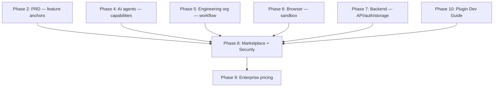
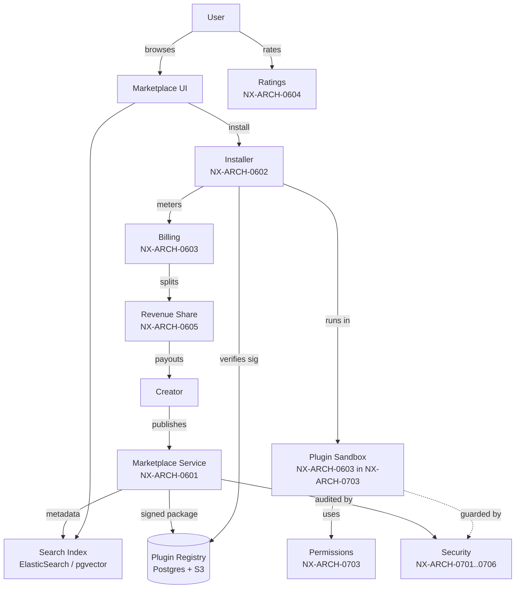

# NX-ARCH-0004 — Marketplace Architecture Overview

| Field | Value |
|-------|-------|
| **Document ID** | NX-ARCH-0004 |
| **Title** | Marketplace Architecture Overview |
| **Phase** | 8 — Marketplace |
| **Owner** | Backend AI (NX-AGENT-7055) + Security AI (NX-AGENT-7058) + Finance AI (NX-AGENT-7063) |
| **Status** | 🟢 Complete |
| **Version** | 0.1.0 |
| **Created** | 2026-07-03 |
| **Depends on** | NX-DOC-0002 (Vision), NX-DOC-0011 (Tech Principles), NX-FEAT-1500 (Marketplace anchor), NX-ARCH-0002 (Backend), NX-ARCH-0404 (Plugin Dev) |

---

## 1. Mission

Define the architecture of NEXUS's two-sided marketplace and the security substrate that makes it safe — how third-party agents and plugins are discovered, installed, executed, monetized, rated, and audited, and how NEXUS itself stays safe while running untrusted code in customer environments and on customer data.

## 2. What Phase 8 covers

Phase 8 has two halves. They are coupled: a marketplace is only as valuable as the trust the security model provides.

| Bucket | Directory | Question it answers | Doc count |
|--------|-----------|---------------------|----------:|
| **Marketplace** | `09_MARKETPLACE/` | How are agents/plugins listed, distributed, monetized, and rated? | 5 |
| **Security** | `08_SECURITY/` | How does NEXUS stay safe — at the threat-model, AI, permissions, privacy, encryption, and zero-trust layers? | 6 |

Total: 11 leaf documents + this overview = 12.

### Marketplace sub-bucket

| Doc | Title | Doc ID |
|-----|-------|--------|
| Agent Store | Listing, discovery, install, update | NX-ARCH-0601 |
| Plugin SDK | API contracts, packaging, distribution | NX-ARCH-0602 |
| Billing | Metering, invoicing, payment methods | NX-ARCH-0603 |
| Ratings | Reviews, trust signals, abuse prevention | NX-ARCH-0604 |
| Revenue Sharing | Creator earnings, payouts, tax | NX-ARCH-0605 |

### Security sub-bucket

| Doc | Title | Doc ID |
|-----|-------|--------|
| Threat Model | Attack surface, adversary classes, mitigations | NX-ARCH-0701 |
| AI Safety | Prompt-injection defense, jailbreaks, model red-team | NX-ARCH-0702 |
| Permissions | Capability model, user consent, runtime enforcement | NX-ARCH-0703 |
| Privacy | PII handling, data residency, retention | NX-ARCH-0704 |
| Encryption | At-rest, in-transit, key management | NX-ARCH-0705 |
| Zero-Trust | Identity, mTLS, microsegmentation | NX-ARCH-0706 |

## 3. The boundary with other phases

| Phase | Describes | Phase 8 does NOT cover |
|-------|-----------|-------------------------|
| 2 — PRD | What features the marketplace has (NX-FEAT-1500 etc.) | How those features are implemented (Phase 8) |
| 4 — AI Brain | How an individual agent is defined (NX-AGENT-7001) | How agents are *listed and distributed* (Phase 8) |
| 6 — Browser | How Cloud Browsers isolate per-profile state | How the *plugin runtime* sandboxes untrusted code (Phase 8) |
| 7 — Backend | The API, DB, auth, storage substrates | Marketplace-specific contracts and billing (Phase 8) |
| 9 — Enterprise | List price, tier packaging, sales motion | Marketplace commission, creator payouts, billing (Phase 8) |
| 10 — Plugin Dev | How a developer *writes* a plugin | How that plugin is *packaged, signed, listed, installed* (Phase 8) |

## 4. The marketplace as a system

## 5. The security model at a glance

NEXUS's security model has six layers, documented in `08_SECURITY/`:

1. **Threat model** (NX-ARCH-0701) — what we defend against and who we defend against. This is the foundation; the other five are implementations of specific threats.
2. **AI safety** (NX-ARCH-0702) — defenses against prompt injection, jailbreaks, indirect injection, model exfiltration. This is the *new* surface that didn't exist in classical browsers.
3. **Permissions** (NX-ARCH-0703) — the capability model: what every plugin, agent, and feature can do, as declared in manifests and enforced at runtime.
4. **Privacy** (NX-ARCH-0704) — PII handling, data residency, retention, GDPR/CCPA/LGPD compliance.
5. **Encryption** (NX-ARCH-0705) — at rest and in transit, including per-user Cloud Browser encryption keys.
6. **Zero trust** (NX-ARCH-0706) — assume breach, verify every request, microsegment, mTLS everywhere, signed artifacts.

These layers are not siloed. Encryption supports privacy. Permissions support AI safety. Zero trust underlies the whole thing.

## 6. Architectural principles for Phase 8

These are the doctrine the Phase 8 docs instantiate, derived from NX-DOC-0011 (Technical Principles).

1. **Trust is earned, not assumed.** Every plugin, agent, and request is treated as untrusted until proven otherwise. Plugins run in a sandbox; agents run in a worktree; cross-service calls use mTLS.
2. **The user is the principal.** Permissions are granted by the user (or the org admin) and enforced by NEXUS, not negotiated by the plugin. A plugin cannot escalate its own privileges.
3. **Safety is a feature, not a tax.** The user-visible security model (permissions, ratings, verification) is a product surface, not a back-end detail. It is in the UI, in plain language, every time.
4. **Borders are observable.** Every action that crosses a security boundary (plugin → host, user → tenant, agent → network) is logged, traced, and auditable. The audit log is a first-class product.
5. **No silent privilege escalation.** A plugin that needs more permissions mid-run must ask the user again. A user cannot accidentally grant "always allow" once and have it persist forever — scope is checked at every run.
6. **Money has provenance.** Every dollar in the marketplace is tracked from buyer → platform → creator. Disputes are resolvable from the ledger. The finance AI (NX-AGENT-7063) owns the marketplace ledger.
7. **Code is signed; manifests are verified.** Plugin packages are signed by the publisher. The signature is checked at install and at every update. The platform is the trust root for marketplace distribution.
8. **AI failures are a first-class surface.** Prompt injection, jailbreaks, model exfiltration, and agent runaway are explicit threats (NX-ARCH-0702). Red-team exercises are continuous (NX-WF-9002 §6).

## 7. The two workloads, again

NEXUS's backend serves three workloads (NX-ARCH-0002 §4). Phase 8 adds a fourth: **third-party code** that runs *inside* the user's environment.

| Workload | Runs in | Trust level | Authority |
|----------|---------|-------------|-----------|
| User | App, browser, cloud | Self | Owner of data |
| Agent (first-party) | NEXUS-controlled sandbox | First-party | Granted by NEXUS |
| **Plugin (third-party)** | **User-scoped sandbox** | **Untrusted** | **Granted by user, per install, revocable** |
| Partner integration | Per-partner scope | Partner | Granted by user, per OAuth flow |

The plugin workload is what makes Phase 8's security model non-trivial. First-party code can be trusted to follow the rules; third-party code cannot. NX-ARCH-0703 is the boundary.

## 8. Open questions

- **Sandbox isolation model**: do we use a separate OS process per plugin, a V8 isolate, a WebAssembly runtime, or a Cloud Browser per workspace? Decision in NX-ARCH-0703 §4 — currently a hybrid: Wasm for compute, Cloud Browser sub-context for DOM, OS process for FS.
- **AI agent verification**: the marketplace will list AI agents. How do we certify their safety given that the model itself is non-deterministic? NX-ARCH-0702 §7 proposes a multi-step verification (manifest review, red-team eval, runtime sandbox, user-driven rate limits).
- **Revenue share at the edge**: free / freemium / paid / usage-based all need different payout curves. NX-ARCH-0605 has a first cut; we'll iterate based on creator feedback.
- **Cross-border payouts**: Stripe Connect covers ~50 countries. What about creators in the rest? NX-ARCH-0605 §6 has the answer (Payoneer + crypto bridge as fallback), but legal review is pending.

## 9. Reading list

| Doc | Read if you want to understand… |
|-----|---------------------------------|
| NX-FEAT-1500 | The *what* of the marketplace (PRD anchor) |
| NX-AGENT-7001 | The contract every agent follows (the unit of distribution) |
| NX-ARCH-0404 | How a developer *writes* a plugin (Phase 10 developer view) |
| NX-ARCH-0002 | The backend that hosts the marketplace services (Phase 7) |
| NX-ARCH-0001 | The browser that runs the plugin runtime (Phase 6) |
| NX-DOC-0011 | The 14 technical principles every Phase 8 doc instantiates |
| NX-DOC-0012 | The business model that makes the marketplace a revenue stream |

---

*End NX-ARCH-0004.*
