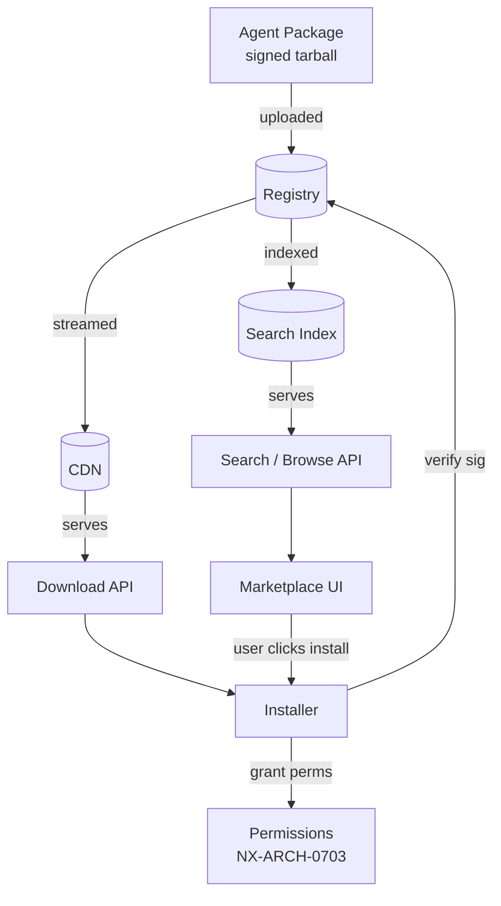
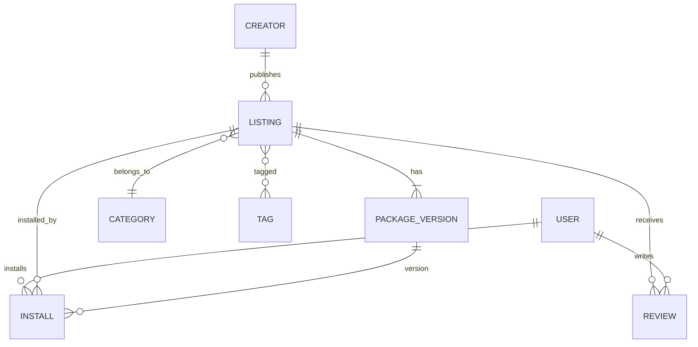

# NX-ARCH-0601 — Agent Store & Discovery

| Field | Value |
|-------|-------|
| **Document ID** | NX-ARCH-0601 |
| **Title** | Agent Store & Discovery |
| **Phase** | 8 — Marketplace |
| **Owner** | Backend AI (NX-AGENT-7055) + Frontend AI (NX-AGENT-7054) |
| **Status** | 🟢 Complete |
| **Version** | 0.1.0 |
| **Created** | 2026-07-03 |
| **Depends on** | NX-ARCH-0004, NX-FEAT-1500 (Marketplace anchor), NX-ARCH-0201 (API Surface), NX-ARCH-0203 (Database) |

---

## 1. Mission

Define how the NEXUS Marketplace is structured, how agents are listed, how users find them, and how install / update / uninstall flows work — so the marketplace is fast to browse, trustworthy by construction, and produces a network effect as creator and user counts grow.

## 2. The marketplace as a catalog

The marketplace is a read-optimized, write-audited catalog of *agent packages*. Each package is a versioned, signed, reviewable artifact with metadata that drives discovery, install, and trust signals.



| Concept | Definition |
|---------|------------|
| **Agent package** | A versioned, signed tarball containing the manifest, code, assets, and tests |
| **Manifest** | JSON/YAML declaring id, version, permissions, runtime, dependencies, pricing, screenshots, descriptions |
| **Version** | A specific semver of a package; semver-major updates require user consent |
| **Release channel** | `stable`, `beta`, `alpha`, `internal` — controls who sees and can install a version |
| **Listing** | The visible, marketable face of an agent (description, screenshots, ratings) |
| **Verified agent** | Listing that has passed NEXUS verification (code review + security review + perf test) |
| **Featured collection** | A curator-assembled bundle of listings (e.g. "Agents for Researchers") |

## 3. The data model

The marketplace has three primary entities.



| Table | Key columns | Notes |
|-------|-------------|-------|
| `creators` | id, user_id, display_name, kyc_status, payout_account_id, verified_at | One row per creator. `user_id` is the underlying NEXUS user (NX-ARCH-0202). |
| `listings` | id, creator_id, slug, name, short_desc, long_desc_md, category_id, pricing_model, base_price_cents, status, verified_at | One row per agent listing. `status` ∈ {draft, in_review, published, suspended, deprecated}. |
| `package_versions` | id, listing_id, version, channel, manifest_json, artifact_key, signature, size_bytes, sha256, requires_nexus_min, published_at, yanked_at | Append-only. `signature` is the publisher's detached signature over the artifact. |
| `tags` | id, name, slug | Many-to-many with listings. |
| `reviews` | id, listing_id, user_id, install_id, rating, body_md, helpful_count, status, created_at | `status` ∈ {published, hidden, removed}. `install_id` enforces "verified installer" rule. |
| `installs` | id, user_id, listing_id, package_version_id, scope_workspace_id, granted_permissions_json, status, installed_at, updated_at, uninstalled_at | One row per install event. `scope_workspace_id` may be null (user-global install). |
| `featured_collections` | id, slug, title, curator_user_id, summary_md, published_at | |
| `featured_collection_items` | collection_id, listing_id, position, added_at | Composite PK. |
| `categories` | id, slug, name, parent_id | Two-level hierarchy (e.g. "Developer > Code Review"). |

Indexes (subset):
- `listings(status, category_id)` for browse
- `listings USING gin(to_tsvector('english', name || ' ' || short_desc))` for full-text
- `listings USING ivfflat(embedding_vector)` for semantic search (pgvector; see §5)
- `installs(user_id, listing_id)` for "is installed?" queries
- `package_versions(listing_id, channel, published_at DESC)` for version listing

## 4. Discovery: search, browse, recommend

The marketplace exposes four discovery surfaces.

### 4.1 Browse / category
Category navigation, two levels deep. Each category page is SSR-rendered for SEO and indexed by the public search engines. Sort: relevance, top-rated, most-installed, newest, trending.

### 4.2 Keyword search
PostgreSQL full-text on `name`, `short_desc`, `long_desc`, `tags`. Server-side ranking using `ts_rank_cd` weighted by `installs` (popularity signal) and `verified_at IS NOT NULL` (trust signal). Returns in < 500ms for the full corpus (NFR from NX-FEAT-1500).

### 4.3 Semantic search (H1+)
Generate embeddings of `name + short_desc + long_desc` at index time (model: small open-weights embedding, e.g. `bge-small-en-v1.5`). At query time, embed the query and run `pgvector` cosine-similarity over `listings.embedding_vector`. Hybrid: combine lexical and semantic scores.

### 4.4 Personalized recommend
"Agents for you" — collaborative filtering on `installs` (users-who-installed-X-also-installed-Y) plus content similarity (same embedding as semantic search). Cold start: fall back to "trending in your workspaces". Refreshed daily; served from a precomputed table.

## 5. The install lifecycle

```mermaid
sequenceDiagram
    participant U as User
    participant W as Web/Desktop
    participant API as Marketplace API
    participant REG as Registry
    participant BILL as Billing
    participant SB as Sandbox

    U->>W: click "Install"
    W->>API: POST /installs {listing_id, version_range, scope}
    API->>REG: fetch manifest + latest matching version
    REG-->>API: manifest, signed artifact url
    API->>API: verify signature against creator pubkey
    API->>API: compare requested vs declared permissions
    alt permissions differ from user policy
        API->>W: prompt: "Agent needs X; allow?"
        U->>W: yes/no
    end
    API->>BILL: create entitlement (if paid)
    BILL-->>API: entitlement_id
    API->>SB: pre-flight: validate manifest, prepare sandbox
    API->>REG: stream artifact to sandbox
    SB-->>API: install ok
    API->>API: write installs row, log audit
    API-->>W: 201 {install_id}
    W-->>U: "Installed. Try it: /command"
```

Key invariants:
- **Idempotency**: `POST /installs` carries an `Idempotency-Key` (NX-ARCH-0201 §4); same key returns same `install_id`.
- **Signature verification** is mandatory. The install endpoint refuses artifacts whose signature doesn't verify against the creator's registered publishing key.
- **Permission diff** must be visible to the user. If the manifest declares new permissions not in the user's existing grants, the user is prompted.
- **Workspace scope** is recorded. A plugin installed to workspace A is not automatically available in workspace B unless the user installs again or sets "available everywhere".

## 6. Update and uninstall

### Update
- Creator publishes a new `package_version`; registry sends a "new version available" event to the event bus (NX-ARCH-0204).
- For each affected `installs` row: notify user (in-app) or auto-update (per user preference and channel).
- Major-version updates (semver) require user consent.
- Update writes a new `installs` row version-pointer; the old `package_version` row is never deleted (audit).

### Uninstall
- `POST /installs/{id}/uninstall` with optional `keep_data: boolean`.
- If `keep_data = false`, all per-install data (per NX-ARCH-0703 §9) is purged.
- The `installs.uninstalled_at` is set; the row is retained for audit.
- A creator cannot block uninstall.

## 7. Verified agents

A "verified" listing has passed:

1. **Code review** — Backend AI + Security AI jointly. Static analysis (Semgrep, CodeQL), dependency vulnerability scan (Trivy, Snyk), license check.
2. **Security review** — Security AI manual review. Threat-model walkthrough, permissions audit, AI safety check (NX-ARCH-0702).
3. **Performance test** — QA AI. Latency, memory, cost-per-task on a fixed workload.
4. **Manifest completeness** — Documentation AI. Description ≥ 200 words, screenshots, permissions in plain language, compatibility declared.

Verification is recorded in `listings.verified_at` and `listings.verified_by` (the AI agent IDs that signed off). Verification can be revoked if a regression is found; revocation is a published event.

## 8. Public API and CLI

The marketplace exposes a public REST API for power users and CI:

```
GET    /v1/marketplace/listings                 # list, paginated
GET    /v1/marketplace/listings/{id}            # detail
GET    /v1/marketplace/listings/{id}/versions   # version history
POST   /v1/marketplace/installs                 # install
DELETE /v1/marketplace/installs/{id}            # uninstall
GET    /v1/marketplace/installs                 # "my agents"
POST   /v1/marketplace/reviews                  # write a review
GET    /v1/marketplace/categories
```

Authentication: same as the rest of NEXUS (passkey or session). Rate limits per NX-ARCH-0201 §6.

CLI: `nexus marketplace install <slug>` — wraps the API for terminal use. Ships in the SDK (NX-ARCH-0403).

## 9. Trust signals on the detail page

The detail page (NX-UI-6202) shows trust signals prominently:

| Signal | Source | Notes |
|--------|--------|-------|
| **Verified badge** | `listings.verified_at` | Gold checkmark; tooltip explains what verified means |
| **Install count** | `COUNT(installs)` | Updated hourly |
| **Average rating** | `AVG(reviews.rating)` WHERE status=published | With review count |
| **Last updated** | `MAX(package_versions.published_at)` | |
| **Permissions summary** | Manifest, rendered in plain language | Per NX-ARCH-0703 §6 |
| **Creator info** | `creators` table, with link to creator's other listings | |
| **Compatibility** | Manifest `requires_nexus_min`, OS targets | |
| **Version history** | Paged list of versions with changelogs | |

A listing without a verified badge is not "unsafe" — it is "not yet verified". The UI distinguishes the two explicitly.

## 10. Failure modes and abuse

| Failure | Mitigation |
|---------|------------|
| **Listing spam** | Rate-limit creation per creator; KYC required to publish paid listings; reputation system; auto-suspend after N user reports |
| **Review bombing** | Reviews require verified install; moderation queue; weighted by reviewer reputation; cannot delete by creator |
| **Version hijack** | Manifest + artifact are signed by creator's key; only the creator can publish new versions of their listing |
| **Typosquatting** | Slug is unique and reserved on first use; canonical slug displayed; warnings on close matches |
| **Supply-chain attack** | Every package version records the exact dependencies and their hashes; verified agents are re-scanned on every dependency CVE |
| **Fake installs** | Install events go through the platform's install endpoint; client-side install counts are ignored |
| **Stolen creator identity** | Publishing requires login + (for paid) KYC; payout account must match creator's KYC; new payout-account change requires re-verification |
| **Abuse of free tier** | Rate-limit install per IP/user; quota for free listings per creator |

## 11. Performance budgets

| Metric | Target |
|--------|--------|
| Marketplace home page load (p95) | < 1.0s |
| Search latency p95 (corpus ≤ 10K) | < 500ms |
| Search latency p95 (corpus 10K–100K, H2) | < 800ms |
| Install completion p95 | < 10s |
| Update check p95 | < 200ms (per active install, batched) |
| Recommend refresh | Daily |

Backed by: read-replica Postgres, Redis cache for hot listings, CDN for artifact bytes, Elasticsearch (H2) for high-volume search.

## 12. Open questions

- **Federation**: do we want to support third-party marketplaces (e.g. a company's private marketplace pulling from the public one)? NX-FEAT-1500 §"Private marketplaces" implies yes; the API is designed for it but the UI is single-tenant today.
- **Versioning policy for AI agents**: AI agents are non-deterministic. A "fix" to an agent's prompt may not be a semver-minor change. We may add an `effectiveness_score` per version and surface it.
- **Deprecation grace period**: when a creator yanks a version, how long do existing installs keep working? Default 90 days; creators can request extensions.

## 13. Reading list

| Doc | Read if you want to understand… |
|-----|---------------------------------|
| NX-FEAT-1500 | The PRD anchor (what the marketplace is) |
| NX-ARCH-0004 | The marketplace architecture overview |
| NX-ARCH-0602 | The plugin SDK and API contracts (this doc's counterpart on the producer side) |
| NX-ARCH-0603 | How installs become billable events |
| NX-ARCH-0604 | How reviews and trust feed back into listing ranking |
| NX-ARCH-0703 | The permission model that backs install prompts |

---

*End NX-ARCH-0601.*
