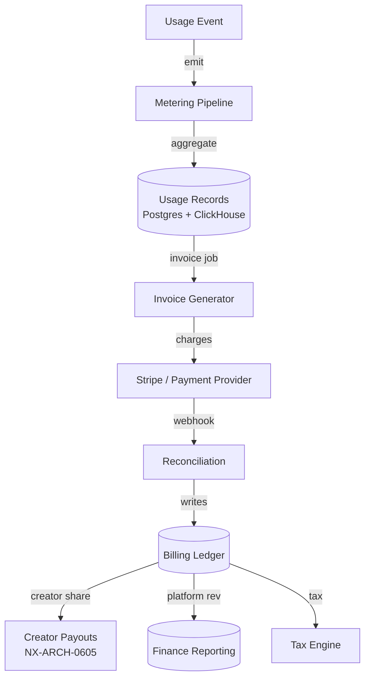
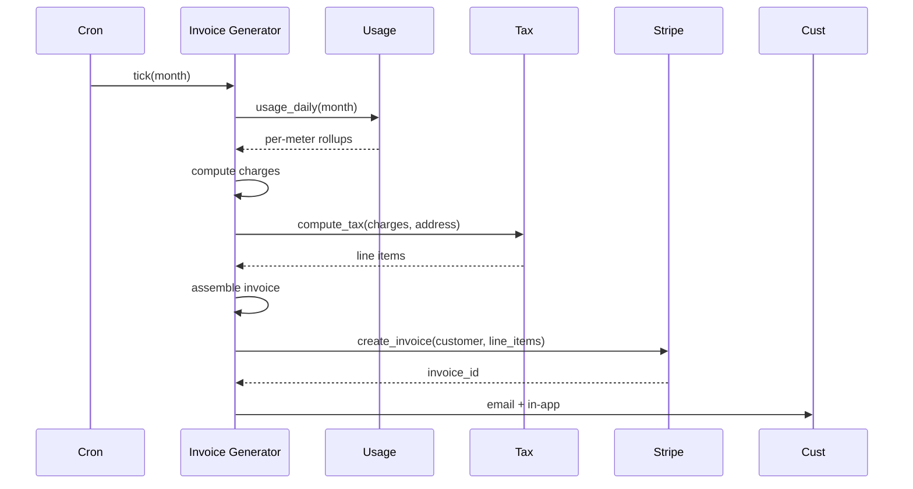

# NX-ARCH-0603 — Billing, Metering & Subscriptions

| Field | Value |
|-------|-------|
| **Document ID** | NX-ARCH-0603 |
| **Title** | Billing, Metering & Subscriptions |
| **Phase** | 8 — Marketplace |
| **Owner** | Backend AI (NX-AGENT-7055) + Finance AI (NX-AGENT-7063) |
| **Status** | 🟢 Complete |
| **Version** | 0.1.0 |
| **Created** | 2026-07-03 |
| **Depends on** | NX-ARCH-0004, NX-ARCH-0601 (Agent Store), NX-ARCH-0201 (API), NX-ARCH-0203 (Database), NX-ARCH-0605 (Revenue Share) |

---

## 1. Mission

Define the billing substrate for the NEXUS Marketplace: how every billable event is metered, how invoices are computed, how money is collected, how customers are billed, and how the platform reconciles its books. Pricing tiers and list price live in Phase 9 (NX-ARCH-0901). This document is the *plumbing* of money — the meters, the ledgers, the tax, the dunning, the receipts.



| Concept | Definition |
|---------|------------|
| **Metered event** | A billable action: agent run minute, cloud-browser hour, tool call, RAG document stored, premium credit consumed |
| **Plan** | The customer's current subscription (Free, Pro, Business, Enterprise) |
| **Entitlement** | What a plan includes (5 cloud browsers, 10k agent-min/mo, 100 RAG docs) |
| **Overage** | Usage beyond entitlement; billed per the rate card |
| **Invoice** | A monthly statement of charges, taxes, credits, and the amount due |
| **Credit** | A prepaid unit of value (premium credits, promotional credit, refund) |
| **Wallet** | A prepaid balance that meters draw from before charging the card |
| **Receipt** | Customer-facing proof of payment; immutable, signed, downloadable |
| **Creator earnings** | Portion of revenue owed to a third-party publisher (see NX-ARCH-0605) |

## 2. The five meters

Every billable action maps to one of five meters. The metering layer is the single source of truth for usage — every other system that wants to know "how much has this customer used?" reads from it.

| Meter | Unit | Examples | Storage |
|-------|------|----------|---------|
| **Agent runtime** | minute | Planner agent run, Coder agent run, third-party agent run | `usage_agent_minutes` |
| **Cloud browser** | browser-hour | Idle persistence, live remote view, scheduled task runtime | `usage_browser_hours` |
| **Tool calls** | count | `browser.click`, `email.send`, `web.search` | `usage_tool_calls` |
| **Storage** | GB-month | RAG documents, memory, file storage, screenshots | `usage_storage_gb` |
| **Premium model tokens** | token | GPT-4-class calls, Claude-class calls, image gen | `usage_tokens` |

Why these five: they cover the five underlying cost drivers (compute, infrastructure, third-party API, storage, model API). Every other line item on a customer's bill is a derived view over these meters.

## 3. Event emission

Usage events are emitted at the source — the agent runtime emits `agent.start`/`agent.end`, the tool broker emits `tool.invoke`, the storage service emits `storage.write` (bytes), and the model gateway emits `model.tokens`. Events are fire-and-forget at the source and durably persisted before the response is returned to the caller for the events that affect billing.

```typescript
// Usage event envelope
interface UsageEvent {
  id: string;                  // ulid
  org_id: string;
  workspace_id?: string;
  user_id?: string;
  meter: 'agent_minute' | 'browser_hour' | 'tool_call' | 'storage_gb' | 'token';
  quantity: number;            // 0.0167 (one minute), 1 (one call)
  resource_id?: string;        // agent_id, browser_id, tool_name
  cost_center?: string;        // for chargeback
  metadata?: Record<string, unknown>;
  idempotency_key: string;     // to dedupe retries
  emitted_at: string;          // ISO8601
  ingested_at: string;         // set by meter
}
```

| Property | Rule |
|----------|------|
| Idempotency | Every event carries `idempotency_key`; the meter dedupes within a 24-hour window |
| Backpressure | The meter buffers up to 60s of events in memory; if Kafka is unreachable, callers block and the system surfaces "billing is degraded" |
| Sampling | None. Every billable event is metered. Sampling is allowed only for non-billing analytics |
| Clock | All timestamps in UTC; the meter skew-checks incoming events and rejects events more than 5 min in the future |

## 4. Aggregation

Raw events are aggregated into **usage records** at five granularities:

| Granularity | Use case | Storage |
|-------------|----------|---------|
| **Real-time** (last 5 min) | Live dashboards, "X of Y used" warnings | ClickHouse |
| **Hourly** | Customer-facing usage graphs | ClickHouse |
| **Daily** | Internal cost reporting | Postgres `usage_daily` |
| **Monthly** | Invoice generation | Postgres `usage_monthly` |
| **Yearly** | Tax reports, finance | Postgres `usage_yearly` |

Aggregation is deterministic and idempotent: re-aggregating a window from raw events produces the same result. This is critical for re-invoicing on disputes.

## 5. Plan, entitlement, and overage

Every customer has a **plan**. A plan is a set of **entitlements**: included quantities per meter, with a rate card for overage.

```yaml
plan:
  id: "pro_monthly"
  name: "Pro Monthly"
  price_cents: 1900
  currency: "USD"
  interval: "month"
  entitlements:
    agent_minute:    { included: 600,   overage_cents_per_unit: 5 }
    browser_hour:    { included: 50,    overage_cents_per_unit: 10 }
    tool_call:       { included: 50000, overage_cents_per_unit: 0.1 }
    storage_gb:      { included: 25,    overage_cents_per_unit: 25 }
    token:           { included: 0,     overage_cents_per_unit: 0.0001 } # pay-as-you-go
```

| Behavior | When |
|----------|------|
| **Soft cap** | At 80% of any included quota, surface a non-blocking warning in the app |
| **Hard cap** (configurable) | At 100%, by default allow overage and bill it; on `strict` plans, block and surface an upgrade prompt |
| **Top-up** | Customers can buy a credit pack to extend any metered resource without changing plan |
| **Annual prepay** | Annual plans receive a 16% discount and lock the rate card for 12 months |

## 6. Invoice generation

Invoices are generated on the first of the month for the previous month, plus immediately on plan change, cancellation, and explicit customer request. The invoice generator is a deterministic, replayable job.



An invoice has the following structure (RFC: see schema in `_assets/schemas/invoice.json`):

| Section | Contents |
|---------|----------|
| Header | Invoice number (NX-INV-YYYYMM-####), issue date, due date, period |
| Bill to | Customer name, billing address, tax IDs |
| Lines | One per (meter × entitlement × overage) with description, qty, unit, amount |
| Subtotal | Sum of line amounts |
| Tax | Per-line tax from the tax engine |
| Credits | Promotional credits, refunds, wallet draws |
| Total | Subtotal + tax − credits |
| Status | `draft` → `open` → `paid` / `past_due` / `void` |

## 7. Payment

NEXUS uses **Stripe** as the primary payment processor; the abstraction layer (a `PaymentProvider` interface) supports a secondary provider for regions where Stripe is weak (China, parts of LatAm).

| Method | Supported | Notes |
|--------|-----------|-------|
| Credit / debit card | Yes (all plans) | Default |
| ACH / SEPA debit | Yes (annual plans) | Lower fees |
| Wire transfer | Yes (Enterprise, $10k+ invoices) | Manual reconciliation |
| Crypto (USDC, ETH) | Yes (annual plans, Business+) | On-chain receipt; off-chain USD accounting |
| Wallet (prepaid) | Yes (all plans) | Credits drawn first |
| Apple Pay / Google Pay | Yes (web + mobile) | Tokenized through Stripe |

The platform never stores raw PAN; all cards are tokenized by Stripe and referenced as `pm_xxx`. The platform stores only the last-4 and brand for display.

## 8. Dunning and collections

| Day | Action |
|-----|--------|
| 0 | Invoice issued, charge attempted |
| 1 | If first charge fails, retry with same card; email "card didn't work" |
| 3 | Second retry; in-app banner |
| 7 | Third retry; email to billing contact + account owner |
| 14 | Service downgraded to Free; data kept read-only; email "service paused" |
| 30 | Account suspended; data retained 90 days per NX-ARCH-0704 (retention) |
| 120 | Account scheduled for deletion; data exportable for 30 more days |

Customers can self-serve a payment method update at any time. Successful update immediately retries all open invoices.

## 9. Credits, wallets, and refunds

| Mechanism | Lifecycle |
|-----------|-----------|
| **Promotional credit** | Issued by Marketing AI for a campaign; expires per campaign rules; drawn automatically before charging the card |
| **Refund credit** | Issued by Finance AI or Support AI; never expires; refundable to source on request |
| **Wallet** | Customer prepays; balance drawn at metered rate; non-refundable except by Finance AI |
| **Premium credits** | A flat-rate token pack (e.g., 100k GPT-4-class tokens for $10); drawn before plan overage |

Refunds are issued to the original payment method by default. Refund >$100 requires Finance AI approval; >$1000 requires dual approval (Finance + CEO AI).

## 10. Tax

Tax computation is delegated to **Stripe Tax** for VAT, GST, and sales tax in 80+ jurisdictions, with manual rules in `_assets/schemas/tax_rules.yaml` for jurisdictions Stripe does not cover.

| Concern | Handling |
|---------|----------|
| **Tax ID validation** | EU VIES, UK VRT, AU ABN, etc. via Stripe Tax; validated at signup and on every billing-address change |
| **Reverse charge** | Applied to B2B invoices with a valid VAT ID in a different EU member state |
| **Marketplace facilitator** | In the US, NEXUS collects and remits sales tax on behalf of creators where required (FL, OH, etc.); creators do not collect themselves |
| **Creator tax (1099-K, 1099-NEC, EU DAC7)** | Issued by Finance AI each January; data sourced from the creator ledger (NX-ARCH-0605) |
| **Customer tax on subscription** | Computed per invoice using customer's billing address |

## 11. Observability

| Metric | SLO |
|--------|-----|
| `meter.events_ingested_per_sec` | — (just track) |
| `meter.ingest_lag_seconds_p99` | < 10s |
| `invoice.generation_lag_seconds_p99` | < 60s after the first of the month |
| `invoice.failed_count` | < 0.1% per cycle |
| `payment.success_rate` | > 97% on first attempt |
| `dunning.days_to_payment_median` | < 3 days |

| Alert | Condition |
|-------|-----------|
| `MeterDegraded` | `meter.ingest_lag_seconds_p99 > 60` for 5 min |
| `InvoiceStuck` | An invoice has been `open` for > 24h |
| `ChargeFailureSpike` | First-attempt failure rate > 5% in 10 min |
| `TaxEngineDown` | Stripe Tax returns 5xx for > 1 min |

## 12. Failure modes

| Failure | Behavior |
|---------|----------|
| Meter Kafka down | Caller blocks up to 30s; UI shows "billing is degraded" |
| Stripe down | Invoices generated, charge queued, retried every 5 min for 24h |
| Stripe Tax down | Invoices generated with `tax=0` and a follow-up job recomputes on recovery |
| Currency conversion unavailable | Charge in plan currency; FX rate captured at invoice time, applied at payment time |
| Customer disputes | Stripe `charge.dispute.created` webhook → freeze payouts to creators for the disputed amount → Support AI investigates |
| Aggregator returns wrong total | Re-aggregator job from raw events; invoice corrected; customer notified |

## 13. Acceptance criteria

- [ ] All five meters emit, aggregate, and invoice correctly under load test (1M events/min).
- [ ] Stripe and the secondary provider are swappable behind the `PaymentProvider` interface.
- [ ] Replaying raw events for a 30-day window produces a byte-identical invoice.
- [ ] Tax is computed correctly for 50 sampled jurisdictions in a regression suite.
- [ ] Dunning state machine is exercised end-to-end (Day 0 → 30) in CI.
- [ ] A customer can self-serve change plan, cancel, update card, view invoices, and download a PDF.
- [ ] Creator earnings are computed correctly against the invoice ledger (NX-ARCH-0605).

## 14. Open questions

- Q: Should we offer usage-based plans (no included quota) alongside the current plans? (See Phase 9.)
- Q: Should credits be transferable between accounts? (Current: no.)
- Q: How do we handle pro-rated refunds on annual plan cancellation? (Current: pro-rated to month; full refund within 14 days.)

## 15. Change log

| Date | Change | Author |
|------|--------|--------|
| 2026-07-03 | Initial spec | Backend AI (NX-AGENT-7055) |

---

*End NX-ARCH-0603.*
