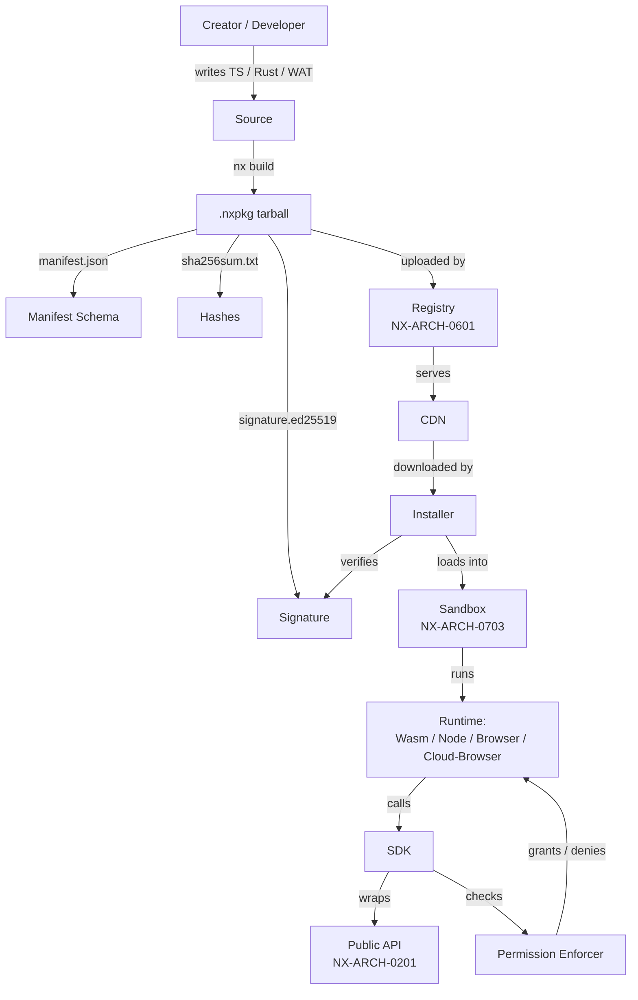
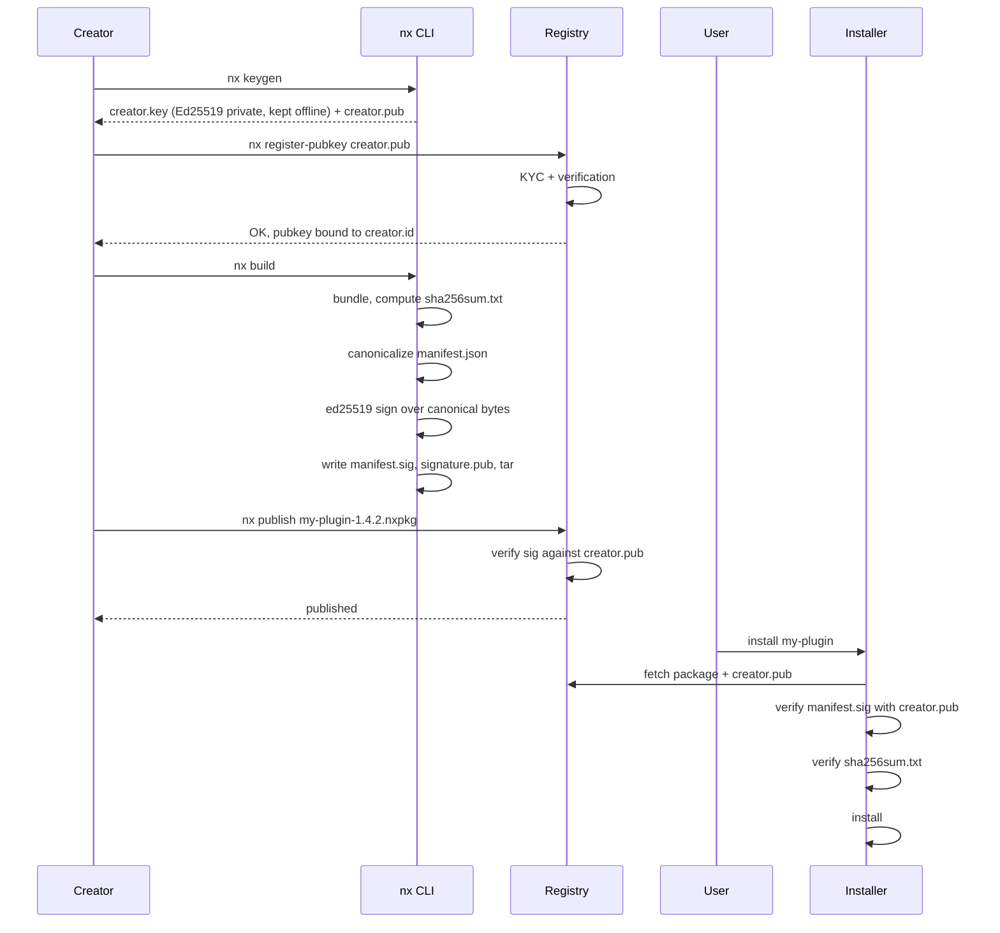
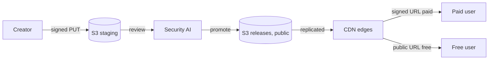

# NX-ARCH-0602 — Plugin SDK & API Contracts

| Field | Value |
|-------|-------|
| **Document ID** | NX-ARCH-0602 |
| **Title** | Plugin SDK & API Contracts |
| **Phase** | 8 — Marketplace |
| **Owner** | Backend AI (NX-AGENT-7055) + Frontend AI (NX-AGENT-7054) + Docs AI (NX-AGENT-7061) |
| **Status** | 🟢 Complete |
| **Version** | 0.1.0 |
| **Created** | 2026-07-03 |
| **Depends on** | NX-ARCH-0004, NX-ARCH-0601 (Agent Store), NX-ARCH-0404 (Plugin Dev Guide), NX-AGENT-7011 (Tool Schema), NX-ARCH-0201 (API Surface) |

---

## 1. Mission

Define the contract split between **developer-facing** (the SDK, the hooks, the local CLI a creator uses) and **platform-facing** (the `.nxpkg` tarball, the manifest, the signature, the runtime sandbox it gets loaded into). The goal is that a creator can ship a single artifact that installs on every NEXUS surface — web, desktop, mobile, and the headless agent runtime — without per-target builds, and that the platform can verify provenance, scope permissions, and bill usage uniformly. The SDK is a thin, generated, strongly-typed wrapper over the public REST/GraphQL API; the manifest is the *real* contract.



| Audience | Artifact they touch | Owned by |
|----------|---------------------|----------|
| Creator (write the plugin) | `nx` CLI, TypeScript SDK, Rust SDK, Wasm ABI | Frontend AI (NX-AGENT-7054) |
| Publisher (ship the plugin) | `manifest.json`, signing key, `.nxpkg` builder | Backend AI (NX-AGENT-7055) |
| Platform (load the plugin) | Installer, verifier, sandbox, runtime, permission enforcer | Backend AI (NX-AGENT-7055) + Security AI (NX-AGENT-7058) |

## 2. The split: SDK vs manifest vs API

The three artifacts are deliberately different. Conflating them is the single most common design mistake in plugin systems.

| Layer | Purpose | Source of truth | Versioned with |
|-------|---------|-----------------|----------------|
| **Public API** (REST + GraphQL) | The platform's external surface; what every client (and every plugin) calls | NX-ARCH-0201 | The platform release |
| **SDK** (`@nexus/sdk`, `nexus-sdk` crate) | Generated, strongly-typed wrapper around the API. Adds retry, idempotency keys, type-safe events. | Codegen from the OpenAPI + GraphQL schemas | The platform release; same cadence as the API |
| **Plugin API** (the contract a plugin *implements*) | The interface a plugin exposes to the host: hooks it subscribes to, tools it provides, the manifest format | This document (NX-ARCH-0602) | The platform release; semver, may add features in minor versions |
| **Manifest** | The static, signed declaration of what a package is and what it needs | This document (NX-ARCH-0602) | The plugin release; semver, breaking changes require major version |

The cardinal rule: **the public API is the source of truth. The SDK is generated. Don't ship an SDK that lags.** Codegen runs on every API release; the SDK is published automatically to npm and crates.io. The Plugin API is a stable interface on top of the SDK; it changes on a slower cadence.

## 3. Package format: the `.nxpkg` tarball

A plugin package is a gzipped tarball with the following layout. The extension is `.nxpkg`; the MIME type is `application/x-nexus-plugin`.

```
my-plugin-1.4.2.nxpkg
├── manifest.json              # required, signed
├── manifest.sig               # required, Ed25519 detached signature
├── signature.pub              # required, the publisher's verifying key
├── sha256sum.txt              # required, hashes of every other file
├── README.md                  # recommended, rendered on the listing
├── LICENSE                    # required, SPDX
├── CHANGELOG.md               # recommended
├── code/                      # required, one or more of:
│   ├── index.wasm             # Wasm binary (if runtime=wasm)
│   ├── index.js               # Node entry (if runtime=node)
│   ├── index.mjs              # Browser entry (if runtime=browser)
│   └── lib/                   # shared libraries
├── assets/                    # optional, ≤ 50 MB
│   ├── icon.png               # 256×256, required
│   ├── banner.jpg             # 1280×640, optional, shown on listing
│   └── ...                    # additional static assets
├── tests/                     # optional
│   ├── manifest.test.ts
│   └── fixtures/
└── tools/                     # optional, AI tool definitions
    └── tools.json             # see NX-AGENT-7011
```

| File | Required | Validated by |
|------|----------|--------------|
| `manifest.json` | yes | Schema validator (JSON Schema 2020-12) |
| `manifest.sig` | yes | Signature verifier (Ed25519 over the canonicalized manifest) |
| `signature.pub` | yes | Key registry; must match the publisher's registered key |
| `sha256sum.txt` | yes | Verifier computes SHA-256 of every other file and compares |
| `icon.png` | yes | Image validator (size, format, dimensions) |
| `LICENSE` | yes | SPDX identifier check (FSF/OSI-approved or custom) |
| `code/` | yes | Runtime-specific loader |
| `tools/tools.json` | no | AI tool schema (NX-AGENT-7011) |

The tarball is deterministic: the same source always produces the same bytes (sorted entries, fixed mtime, normalized permissions). This is required for content-addressing and signature stability.

## 4. The manifest schema

The manifest is JSON, UTF-8, sorted keys on write. The current schema version is `1`. A `manifest_schema` field is required so the platform can negotiate.

```json
{
  "manifest_schema": "1",
  "id": "com.acme.git-pr-reviewer",
  "version": "1.4.2",
  "name": "Git PR Reviewer",
  "description": "Reviews pull requests for style, correctness, and security.",
  "long_description_md": "## What it does\n\n...",
  "publisher": {
    "id": "creator_01HXY...",
    "display_name": "Acme Tools",
    "homepage": "https://acme.example"
  },
  "license": "Apache-2.0",
  "runtime": "node",
  "entry_point": "code/index.js",
  "hooks": [
    "on_install",
    "on_uninstall",
    "on_command"
  ],
  "commands": [
    { "name": "review", "description": "Run a review on the active PR", "args": [] }
  ],
  "permissions": [
    "tabs:read",
    "cloud_browser:spawn:ephemeral",
    "email:send:draft"
  ],
  "dependencies": [
    { "id": "com.acme.git-provider", "version_range": "^2.0.0", "optional": false },
    { "id": "io.nexus.models", "version_range": ">=0.9.0", "optional": true }
  ],
  "pricing_model": "freemium",
  "pricing": {
    "free_tier": { "monthly_runs": 50 },
    "paid_tier": { "price_cents": 1900, "period": "month" }
  },
  "screenshots": [
    "assets/screenshot-1.png",
    "assets/screenshot-2.png"
  ],
  "categories": ["developer", "code-review"],
  "tags": ["git", "pr", "review"],
  "requires_nexus_min": "0.8.0",
  "signature_pubkey": "ed25519:MCowBQYDK2VwAyEA...rest of base64...",
  "signature_alg": "ed25519",
  "regions_allowed": ["us", "eu", "apac"],
  "support_url": "https://acme.example/support",
  "homepage_url": "https://acme.example/git-pr-reviewer"
}
```

| Field | Type | Required | Notes |
|-------|------|----------|-------|
| `manifest_schema` | string | yes | `"1"` today |
| `id` | string | yes | Reverse-DNS, must be unique in the registry; immutable per listing |
| `version` | semver | yes | Major versions install side-by-side; minor/patch replace |
| `name` | string | yes | 3–60 chars |
| `description` | string | yes | 20–140 chars |
| `runtime` | enum | yes | `wasm` \| `node` \| `browser` \| `cloud-browser` |
| `entry_point` | string | yes | Path inside the tarball; runtime-specific |
| `hooks` | array of strings | yes | Subscribed lifecycle events; see §7 |
| `permissions` | array of strings | yes | Capability strings from the registered permission set (NX-ARCH-0703) |
| `dependencies` | array | no | Other plugin ids with semver ranges; resolved at install |
| `pricing_model` | enum | yes | `free` \| `freemium` \| `one_time` \| `subscription` \| `usage_based` |
| `screenshots` | array of strings | no | Paths inside `assets/`; 1–5 recommended |
| `requires_nexus_min` | semver | yes | Oldest platform version that can install this |
| `signature_pubkey` | string | yes | The verifying key (Ed25519 base64) — duplicated from `signature.pub` for offline verification |
| `signature_alg` | string | yes | `"ed25519"` only in H1 |
| `publisher.id` | string | yes | The creator id from the registry; cannot be changed after first publish |

The full JSON Schema is published at `_assets/marketplace/manifest.schema.json` and is the source of truth. This doc is the prose companion.

## 5. The four runtimes

The runtime determines how the platform loads the plugin and what it can do.

| Runtime | What it is | When to pick it | Trust boundary |
|---------|-----------|-----------------|----------------|
| **`wasm`** | A WebAssembly module running in a V8/Wasmtime isolate, with WASI for filesystem and a host-import table for NEXUS APIs | Pure compute, image/audio manipulation, parsers, code analysis, data transforms | Process-level (or isolate-level); the strongest sandbox |
| **`node`** | A Node.js bundle running in a hardened `vm` context with a curated stdlib (no `child_process`, no `fs` outside a workspace tmp dir, no `net`) | Integrations that need npm packages; the most popular runtime in H1 | Process-level; the Node `--frozen-intrinsics` flag plus a custom permission shim |
| **`browser`** | A Web Extension (Manifest V3) loaded into the user's local browser or a Cloud Browser | Anything that needs to interact with web pages (DOM, content scripts) | Browser sandbox (per-origin isolation, content-security-policy) |
| **`cloud-browser`** | A plugin that runs **inside** a Cloud Browser sub-context (per NX-FEAT-1600) | Heavy web automation, logins on third-party sites, scraping | Cloud Browser profile isolation + per-plugin sub-profile |

A plugin declares exactly one runtime in its manifest. Multi-runtime packages (a single artifact that ships both Wasm and Node code, picked at install) are an open question (see §13).

The runtime ABI is stable: every runtime exports the same set of NEXUS SDK functions (§8). A `tabs.list()` call works the same in Wasm, Node, and a Cloud Browser sub-context.

## 6. The manifest signature flow

Every package is signed by its creator. The platform stores the public key, the installer verifies the signature, and rotation is supported.



| Step | Action | Failure mode |
|------|--------|--------------|
| Keygen | Creator generates Ed25519 keypair locally; private key never leaves the creator's machine | Lost key = lost identity; recovery via support (KYC-bound) |
| Register | Creator uploads public key; registry KYC-binds it to the creator id | If creator changes their public key, it's an *addition*; old key continues to verify old versions |
| Build | `nx build` produces a deterministic tarball, canonical manifest, and signature | Build is non-deterministic → build fails (mtime, permissions normalized) |
| Publish | Registry re-verifies the signature; if it fails, the publish is rejected | Registry signature mismatch → silent rejection + audit log entry |
| Install | Installer re-verifies everything; refuses to install on failure | See §11 |

Key rotation: a creator can register a new public key at any time. **Both keys are valid for verification** — old versions are still signed by the old key, new versions by the new key. The creator cannot retroactively re-sign old versions (signatures are immutable; tampering is detectable).

## 7. Hooks and events

A plugin subscribes to a subset of the registered hook set. Each hook is delivered with a typed payload.

| Hook | When it fires | Payload |
|------|---------------|---------|
| `on_install` | After a successful install on a user workspace | `{ install_id, workspace_id, granted_permissions }` |
| `on_uninstall` | Before a plugin is removed | `{ install_id, reason }` |
| `on_update` | After an in-place update (minor/patch only) | `{ install_id, from_version, to_version }` |
| `on_workspace_open` | When the user opens a workspace that has this plugin installed | `{ workspace_id, user_id }` |
| `on_tab_change` | When the active tab in the user's browser changes | `{ tab_id, url, title }` (requires `tabs:read`) |
| `on_command` | When the user types a slash command owned by this plugin | `{ command, args, user_id, workspace_id }` |
| `on_schedule` | When a cron schedule owned by this plugin fires | `{ schedule_id, fire_time }` |
| `on_email_received` | When a new email arrives (gated by `email:read` permission) | `{ message_id, from, subject }` |
| `on_agent_complete` | When a first-party agent finishes a run the plugin owns | `{ agent_id, run_id, output_ref }` |

Hooks are delivered on the runtime's event loop. Long-running work should be moved to a background task and the hook should return within 5 seconds. The platform kills hooks that exceed the time budget; the install is flagged for review.

A plugin's manifest declares which hooks it subscribes to. The platform refuses to deliver events the plugin did not declare. (A plugin may subscribe to fewer hooks than it declares; the union of declared hooks is the maximum set the platform may deliver.)

## 8. The SDK: platform calls a plugin can make

The SDK is a single global object available in every runtime, namespaced as `nexus.*`. Every call is wrapped by the permission enforcer; a plugin that calls a function it didn't declare is denied and logged.

| Namespace | Function | Capability required |
|-----------|----------|---------------------|
| `nexus.tabs` | `list()`, `get(id)`, `open(url)`, `close(id)`, `update(id, props)` | `tabs:read` / `tabs:write` |
| `nexus.cloudBrowser` | `spawn({ profile_id? })`, `destroy(id)`, `list()`, `attach(id)` | `cloud_browser:spawn` / `:destroy` / `:list` |
| `nexus.email` | `send({ to, subject, body, draft? })`, `list(folder)`, `get(id)` | `email:send` / `email:read` |
| `nexus.calendar` | `listEvents(range)`, `createEvent(...)` | `calendar:read` / `:write` |
| `nexus.storage` | `get(key)`, `put(key, value)`, `delete(key)` | `storage:plugin` (per-plugin scope) |
| `nexus.http` | `fetch(url, init)` | `network:outbound` (URL allowlist enforced) |
| `nexus.ui` | `showPanel({ id, html })`, `showToast(text)`, `showModal(...)` | `ui:render` |
| `nexus.events` | `subscribe(hook, handler)`, `unsubscribe(hook, handler)` | Implicit (must be in `hooks`) |
| `nexus.identity` | `getUserId()`, `getWorkspaceId()`, `getPrincipal()` | `identity:read` |
| `nexus.llm` | `complete({ model, messages, tools? })` | `llm:invoke` + per-call credit cost (NX-ARCH-0603) |
| `nexus.audit` | `log(level, message, data)` | `audit:write` (always granted, sandboxed) |

```typescript
// Example: a slash command handler
import { nexus } from "@nexus/sdk";

nexus.events.subscribe("on_command", async (event) => {
  if (event.command !== "review") return;
  const { workspace_id, user_id } = event;
  const tabs = await nexus.tabs.list();
  const prTab = tabs.find((t) => t.url.includes("/pull/"));
  if (!prTab) {
    await nexus.ui.showToast("Open a PR tab first");
    return;
  }
  const result = await nexus.llm.complete({
    model: "nexus/sonnet",
    messages: [{ role: "user", content: `Review the diff at ${prTab.url}` }],
  });
  await nexus.ui.showPanel({ id: "review", html: result.text });
});
```

Every SDK call is async, returns a typed result, and throws a `PermissionDeniedError` (or `QuotaExceededError` for metered calls) when the enforcer refuses. Errors are caught by the host, not by the plugin's promise chain, so a single failure does not crash the runtime.

## 9. Versioning and compatibility

| Concept | Rule |
|---------|------|
| Plugin version | semver. The platform supports `^` and `~` resolution and explicit pinning. |
| `requires_nexus_min` | The minimum platform version that can install this. Enforced by the installer; a user on `0.7.0` cannot install a plugin that declares `0.8.0`. |
| Breaking change | Requires a major version bump. Breaking = (a) removing or renaming a hook, (b) changing a hook payload shape, (c) tightening a permission requirement, (d) dropping Node version support, (e) changing the manifest schema version. |
| New hook, new SDK function, new permission | Minor version bump. |
| Bug fix, dependency bump, internal refactor | Patch version. |
| Major version | Installs side-by-side with the previous major version. The user sees both, picks one, and is migrated explicitly. |
| Channel | `stable` (default), `beta`, `alpha`, `internal`. Beta is opt-in for users; alpha is creator-only; internal is the creator's own workspace. |

The platform itself ships on a semver cadence; the SDK is generated against a pinned platform version. A plugin that targets `requires_nexus_min = 0.8.0` works on `0.8.x`, `0.9.x`, `0.10.x` unless the platform marks a removal in its release notes.

## 10. Distribution via CDN

| Stage | Storage | Access | Cache |
|-------|---------|--------|-------|
| Upload (creator) | S3, `marketplace/staging/{creator_id}/{package_id}/` | Private; creator-only signed URLs | None |
| Staging review (NEXUS) | Same as upload | Security AI reviews via internal signed URLs | None |
| Published (free) | S3, `marketplace/releases/{listing_id}/{version}/`, public bucket | Public CDN URLs (CloudFront + Cloudflare in front) | CDN-cached, immutable, content-addressed by SHA-256 |
| Published (paid) | Same path; CDN is gated by signed URLs that expire after 5 minutes | The user requests a signed URL via the API; the API authorizes and returns a one-shot URL | CDN-side signed cookies for Enterprise tier (H2) |

A listing always points at a single version; previous versions remain downloadable for rollback. Content is addressed by SHA-256 in the URL, so two listings with the same content reuse the cache.



## 11. Failure modes

| Failure | Behavior |
|---------|----------|
| Signature mismatch | Install refused; error code `E_SIGNATURE_INVALID`; user sees "Publisher signature could not be verified"; Security AI notified |
| Missing dependency | Install refused; user shown which dependency and the version range that resolved nothing; offered the closest match |
| `requires_nexus_min` not met | Install refused with `E_PLATFORM_TOO_OLD`; user prompted to update the platform |
| Runtime crash (uncaught exception) | Runtime is restarted up to 3 times; crash count exposed on the install; after 3 in 24h, install is auto-paused and creator notified |
| Version conflict (two installs of the same id at different major versions) | Both install; user can switch the active one; only one runs at a time per workspace |
| SDK call to undeclared permission | Denied; runtime logs `E_PERMISSION_NOT_DECLARED`; user shown "Plugin tried to access X without permission" |
| Outbound HTTP to a non-allowlisted URL | Denied; throws `E_NETWORK_DENIED` |
| Public key not in registry | Install refused; only registered publishers can install; sideloading is a separate flow (Enterprise, H2) |
| CDN 404 on a version | Listing shown as unavailable; user offered to switch to the next-newer version |
| Hash mismatch in `sha256sum.txt` | Install refused; the package has been tampered with; Security AI notified and the version is yanked |

## 12. The public API vs the SDK (a recurring trap)

The platform's public API (NX-ARCH-0201) is the contract. The SDK is generated from it and adds ergonomics (typed responses, retry, idempotency, auth refresh). Three rules keep the two from drifting:

1. **Codegen is in CI.** Every PR to the API repo regenerates `@nexus/sdk` and the Rust crate. A PR cannot merge if the generated code is not committed.
2. **The SDK exposes no new endpoint.** If a feature is in the SDK, it's in the API. The SDK is a thin, strongly-typed wrapper, not a parallel surface.
3. **The plugin API is the platform API plus the manifest.** A plugin can call any public API; it must declare which ones in `permissions`. The SDK is the recommended way; raw `fetch` is allowed and goes through the same enforcer.

## 13. Open questions

- **Federated marketplaces**: should a partner (e.g. an enterprise customer with a private app catalog) be able to run a NEXUS marketplace-compatible registry? Decision in H2; the `.nxpkg` format and Ed25519 signature scheme are designed to be portable.
- **Multi-runtime packages**: a single artifact that ships Wasm + Node code and picks one at install. Pro: simpler for the creator. Con: testing matrix grows; security review harder. Decision: defer to H2.
- **Wasm component model**: should we adopt the Wasm component model and the WASI 0.2 capability set instead of the current custom ABI? Pro: ecosystem. Con: toolchain maturity for plugins; not yet a clear win in 2026.
- **Long-lived OAuth-style delegations**: a plugin installed today can be granted `email:send` for 30 days. Should the user see a "still using X" panel? UX question; deferred to NX-UI-6202 follow-up.
- **Plugin-to-plugin contracts**: when `com.acme.git-pr-reviewer` depends on `com.acme.git-provider`, how does the provider expose its API to the dependent? The SDK has `nexus.plugins.call(listing_id, fn, args)`, gated by a `plugin:invoke` permission. The semantics of that call are an open design point.

## 14. Reading list

- **Marketplace Overview** — NX-ARCH-0004
- **Agent Store & Discovery** — NX-ARCH-0601
- **API Surface** — NX-ARCH-0201
- **Authentication & Authz** — NX-ARCH-0202
- **Tool Schema (agent ↔ plugin)** — NX-AGENT-7011
- **Permissions (capability model)** — NX-ARCH-0703
- **Threat Model** — NX-ARCH-0701
- **Billing, Metering & Subscriptions** — NX-ARCH-0603
- **Plugin Dev Guide (Phase 10)** — NX-ARCH-0404
- **Marketplace anchor (PRD)** — NX-FEAT-1500
- **Technical Principles** — NX-DOC-0011 (P1, P3, P7, P8, P12, P14)

---

*End NX-ARCH-0602.*
