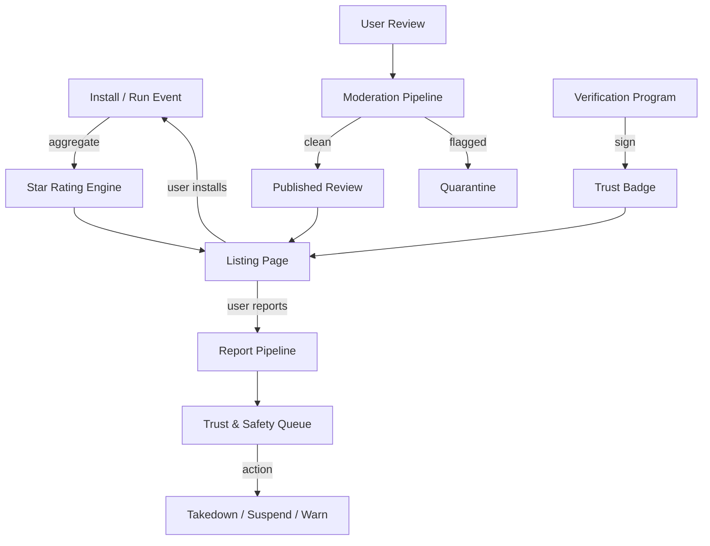

# NX-ARCH-0604 — Ratings, Reviews & Trust

| Field | Value |
|-------|-------|
| **Document ID** | NX-ARCH-0604 |
| **Title** | Ratings, Reviews & Trust |
| **Phase** | 8 — Marketplace |
| **Owner** | Backend AI (NX-AGENT-7055) + Frontend AI (NX-AGENT-7054) + Trust & Safety AI |
| **Status** | 🟢 Complete |
| **Version** | 0.1.0 |
| **Created** | 2026-07-03 |
| **Depends on** | NX-ARCH-0004, NX-ARCH-0601 (Agent Store), NX-ARCH-0602 (Plugin SDK), NX-ARCH-0703 (Permissions), NX-ARCH-0702 (AI Safety) |

---

## 1. Mission

Define how NEXUS's marketplace signals **trust** — through star ratings, written reviews, verification, install counts, security attestations, and abuse-prevention controls — so users can pick agents with confidence, creators are rewarded for quality, and bad actors (scammers, malware authors, review manipulators) are surfaced, downranked, and removed.

A two-sided marketplace without trust is a swamp. This doc is the engineering substrate that keeps the marketplace clean.



| Concept | Definition |
|---------|------------|
| **Star rating** | 1–5 average, derived from verified-install reviews only |
| **Review** | A free-text user review of an agent; can include a star rating |
| **Verified install** | An install that the user actually ran the agent at least once |
| **Trust badge** | A signal of platform confidence: verified, staff-pick, audited, secure, popular |
| **Featured collection** | A curator-assembled bundle; can include any listing |
| **Report** | A user-driven flag of a listing, review, or creator |
| **Takedown** | Removal of a listing or review for cause |
| **Suspension** | Temporary removal of a creator's ability to publish |

## 2. The star rating system

Ratings are the most visible trust signal and the easiest to game. The design must be **gamed-resistant** by construction.

### 2.1 Eligible raters

| Eligible | Not eligible |
|----------|--------------|
| User with a verified install of the agent's current or past major version | Anonymous users |
| User with a real billing relationship (even on Free plan) | Self-reviews (creator reviewing own agent) |
| User with a verified email and ≥ 1 day account age | Reviews by banned creators |
| User who has not been refunded for the install | Bot accounts (see §7) |

A user can submit at most one rating per (user, agent-major-version). Reinstalling after a major version bump unlocks a new rating.

### 2.2 Aggregation

The displayed star rating is a **Bayesian average** that mixes the agent's average with the platform-wide prior. This prevents low-review-count agents from dominating with 5.0 and 1.0 outliers.

```
displayed = (C * m + sum(ratings)) / (C + count)
```

Where:
- `C` = platform-wide review-count prior (default 50)
- `m` = platform-wide mean rating (default 3.8)
- `sum(ratings)` = sum of star ratings
- `count` = number of ratings

This is the same formula used by IMDB; it converges to the raw average as review count grows.

### 2.3 Distribution

The listing page shows the average to one decimal place plus a histogram. The histogram is computed over a 90-day rolling window to surface recent trends.

| Star | % of reviews (example) |
|------|------------------------|
| 5 | 62% |
| 4 | 18% |
| 3 | 8% |
| 2 | 5% |
| 1 | 7% |

Reviews can be sorted by: most recent, most helpful, lowest rating, highest rating, and by reviewer role (verified buyer, creator, etc.).

## 3. Reviews

A review is a free-text response (min 20, max 4000 chars), optionally with a star rating, optionally with a screenshot, and optionally with a "verified outcome" — did the agent complete the task the user expected?

### 3.1 Review schema

```json
{
  "id": "ulid",
  "agent_id": "agent_xxx",
  "agent_version_major": 2,
  "user_id": "user_xxx",
  "rating": 5,
  "title": "Cut my morning briefing from 30 to 4 minutes",
  "body": "I was spending...",
  "outcome": "task_completed",
  "attachments": [
    { "kind": "screenshot", "url": "..." }
  ],
  "language": "en",
  "created_at": "2026-07-03T15:30:00Z",
  "edited": false,
  "moderation_state": "published"
}
```

### 3.2 Moderation

Reviews are first-party content but they are public, so they pass through moderation before publish.

| Layer | What it does |
|-------|--------------|
| **Automated filters** | Block on hard-banned words, PII (SSN, credit card, phone, email), and known scam patterns. Quarantine for review. |
| **AI classifier** | A fine-tuned classifier scores each review for: spam, off-topic, harassment, conflict-of-interest. Score > 0.7 → quarantine. |
| **Trust & Safety AI** | A human-in-the-loop AI reviews the quarantine queue with a 24-hour SLA. Decisions: publish, edit (redact PII), reject, escalate. |
| **Creator reply** | The creator can post one official reply per review; visible inline, also moderated. |
| **User flag** | Any user can flag a review for re-review; ≥ 3 flags triggers T&S AI re-review. |

### 3.3 Edit and delete

- The user can edit their review within 30 days; edits show a small "edited" tag.
- The user can delete their review at any time; the rating is then excluded from the average.
- The platform can edit (redact PII) or remove a review with a visible "removed by Trust & Safety" tag.

## 4. Trust signals and badges

A badge is a platform-issued signal. Badges are earned, not paid for (with the exception of Featured slots in curated collections, which are paid placements; the badge says "Featured", not "Verified").

| Badge | Criteria | Revoked when |
|-------|----------|--------------|
| **Verified** | The creator is identity-verified (KYC passed) and the agent has passed NEXUS automated checks (manifest valid, no banned permissions, sandbox tests pass) | KYC fails, automated check fails, or creator violates ToS |
| **Audited** | A NEXUS human reviewer has inspected the code; this is the strongest trust signal | Audit expires (12 months), or a vulnerability is found |
| **Staff Pick** | A NEXUS editor chose this agent for the staff picks collection | Editor removes it; collection rotates monthly |
| **Popular** | ≥ 1,000 verified installs in 30 days and ≥ 4.0 average rating | Drops below thresholds |
| **Trending** | Install velocity (recent installs / prior period installs) > 3x in last 14 days | Velocity drops |
| **Secure** | Passed the NEXUS security review (NX-ARCH-0702) and has no open critical CVE in dependencies | New CVE is disclosed and not patched within 7 days |
| **Active** | Released an update in the last 90 days | Last release > 90 days ago |

Badges are computed continuously and stored in `agent_badges`. The listing page surfaces up to 3 badges in priority order: Audited > Verified > Secure > Staff Pick > Trending > Popular > Active.

## 5. Featured collections

A **featured collection** is a curated bundle, e.g. "Best for Researchers", "Top 10 Productivity Agents", "New & Noteworthy". Collections are:

- **Editor-curated** (free): the NEXUS editorial team picks; rotates monthly.
- **Sponsor-curated** (paid): a creator can pay for a guaranteed slot in a sponsor collection, clearly labeled "Sponsored". Sponsored slots never affect a non-sponsored collection.
- **Algorithmic** (free): generated by topic similarity and install co-occurrence, e.g. "Users who installed X also installed Y".

Collections have their own ranking signal that biases (but does not override) the per-listing trust signals.

## 6. Reports and Trust & Safety

Any user can report a listing, review, or creator for:

| Reason | Sub-reasons |
|--------|-------------|
| **Malware** | Code is malicious, exfiltrates data, requests excessive permissions |
| **Scam** | Charges for something it doesn't deliver; false advertising |
| **Misrepresentation** | Listing claims don't match behavior |
| **Harassment** | Creator or agent targets a person or group |
| **Stolen IP** | Code, assets, or content copied without permission |
| **Spam** | Listing is low-quality, repetitive, or SEO-spam |
| **Offensive content** | Listing or default output contains hate, NSFW, etc. |
| **Other** | Free text, reviewed by T&S AI |

| Triage level | SLA | Action |
|--------------|-----|--------|
| **Critical** (malware, active exfiltration) | 1 hour | Immediate takedown; creator notified; user bases alerted; security review opened |
| **High** (scam, harassment, stolen IP) | 24 hours | Takedown pending investigation; creator notified; suspend payouts |
| **Medium** (misrepresentation, spam) | 7 days | Creator warned; if not fixed in 7 days, takedown |
| **Low** (off-topic, style) | 30 days | Editorial note; creator asked to fix |

Takedowns are visible to the user (e.g., "This listing was removed for cause") and to the creator (with the full reasoning and an appeal path).

## 7. Anti-abuse

### 7.1 Review manipulation

| Vector | Defense |
|---------|---------|
| **Fake reviews** | AI classifier + behavioral signals (review velocity, account age, install history, IP/device fingerprint) |
| **Review bombs** | Rate-limit per user per agent (1 / major version); detect coordinated campaigns via temporal clustering |
| **Self-reviews** | Block creator accounts from reviewing own agents |
| **Paid reviews** | ToS violation; creators caught are suspended; reviewers are removed |
| **Review swaps** | "Review my agent, I'll review yours" rings detected by graph analysis; both parties suspended |

### 7.2 Install fraud

| Vector | Defense |
|---------|---------|
| **Install farms** | KYC + device fingerprint + install-velocity analysis |
| **Bot installs** | Headless browser detection (NX-ARCH-0701) + behavior-based signals |
| **Stolen payment** | Stripe Radar + 3DS for paid agents |

### 7.3 Listing fraud

| Vector | Defense |
|---------|---------|
| **Typosquatting** | Fuzzy-match check on submission; block names within edit distance 2 of any listing with > 100 installs |
| **Impersonation** | Block creators from using a name that matches a verified brand without brand approval |
| **SEO spam** | Block listings with high keyword density, low content, and off-platform link spam |
| **Malware** | Static + dynamic analysis (sandboxed) of every submission; see NX-ARCH-0702 §4 |

## 8. The reporting UI

The user reports a listing from the listing page. The report form is short (one reason, optional 500-char note, optional screenshot). Submission is one click; an automatic acknowledgment confirms receipt. Critical reports (malware) escalate to T&S AI within minutes; the user gets a status update within the SLA window.

## 9. Data retention

| Data | Retention |
|------|-----------|
| Review text | Until deleted by user or removed by T&S; if removed, the text is retained for 90 days for legal hold, then purged |
| Rating | Retained in aggregate for trust signals; tied to a verified user id, not PII |
| Reports | Retained for 2 years for abuse-pattern analysis; creator sees status and the right to appeal |
| Trust & Safety decisions | Retained for the life of the listing + 7 years for legal/audit |

## 10. Observability

| Metric | Target |
|--------|--------|
| `review.publish_lag_minutes_p95` | < 60 |
| `review.takedown_rate` | < 1% of published reviews per month |
| `report.time_to_triage_hours_p95` | Critical < 1, High < 24 |
| `badge.computation_freshness_minutes_p99` | < 15 |
| `abuse.fake_review_block_rate` | > 95% |
| `install_fraud.catch_rate` | > 99% |

## 11. Acceptance criteria

- [ ] Bayesian rating converges to raw average at 100+ reviews and to prior at < 10.
- [ ] AI classifier catches > 95% of planted malicious reviews in the test set with < 2% false positives.
- [ ] A critical report (malware) leads to a takedown within 1 hour end-to-end.
- [ ] Badges are recomputed continuously; listing page reflects the latest within 15 minutes.
- [ ] A creator with a fresh identity cannot game install counts to reach "Popular" without real installs.
- [ ] Sponsored slots are clearly labeled and do not influence the per-listing trust signals.
- [ ] Every takedown is appealable; the appeal is reviewed by a different T&S reviewer than the original.

## 12. Open questions

- Q: Should we expose a per-user "review karma" (e.g., top reviewers get badges)?
- Q: Should AI-generated reviews (detected via a model fingerprint) be allowed, with a "AI-assisted" tag?
- Q: Should takedown decisions be auditable by the creator's verified auditor (e.g., a third-party security firm)?

## 13. Change log

| Date | Change | Author |
|------|--------|--------|
| 2026-07-03 | Initial spec | Backend AI (NX-AGENT-7055) |

---

*End NX-ARCH-0604.*
