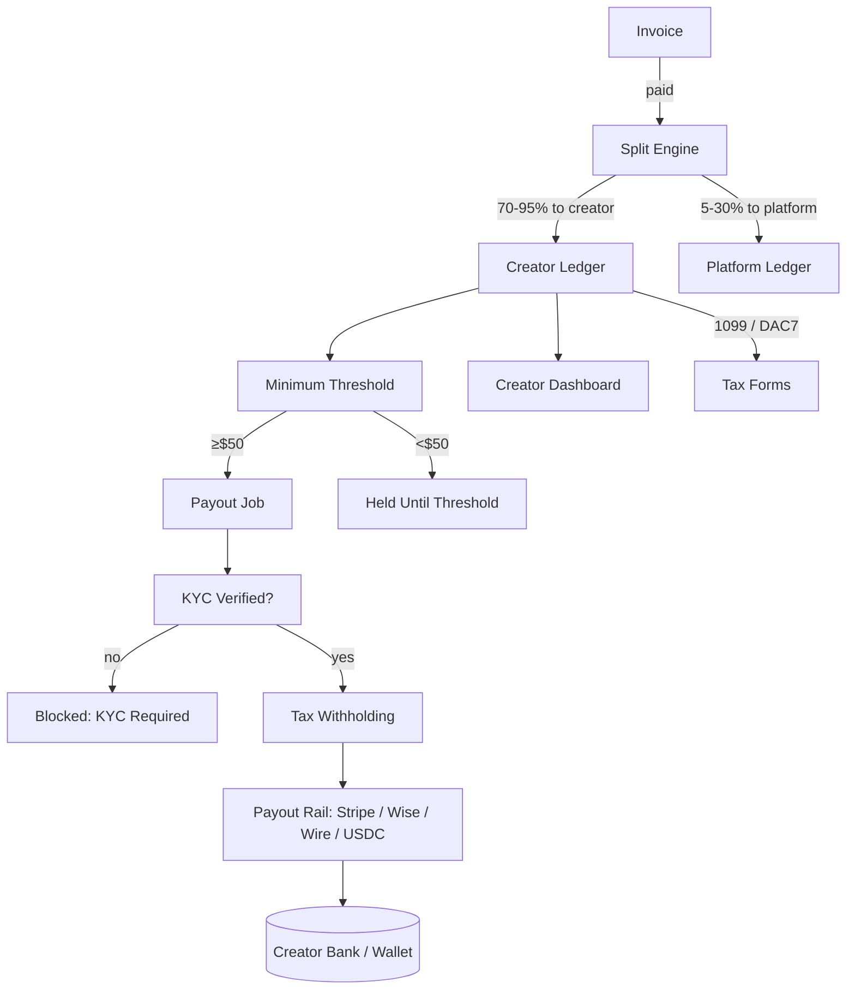

# NX-ARCH-0605 — Revenue Sharing & Payouts

| Field | Value |
|-------|-------|
| **Document ID** | NX-ARCH-0605 |
| **Title** | Revenue Sharing & Payouts |
| **Phase** | 8 — Marketplace |
| **Owner** | Finance AI (NX-AGENT-7063) + Backend AI (NX-AGENT-7055) |
| **Status** | 🟢 Complete |
| **Version** | 0.1.0 |
| **Created** | 2026-07-03 |
| **Depends on** | NX-ARCH-0004, NX-ARCH-0601 (Agent Store), NX-ARCH-0603 (Billing), NX-ARCH-0604 (Ratings) |

---

## 1. Mission

Define how NEXUS splits revenue with third-party creators — the commission schedule, how the share is calculated per invoice, when creator earnings become payable, how payouts are executed, how tax and KYC are handled, and how the creator economy stays solvent and fair as the marketplace scales.

Pricing and tier packaging live in Phase 9. This document is the *ledger* and the *disbursement* layer.



| Concept | Definition |
|---------|------------|
| **Creator** | A publisher with at least one published agent or plugin; identity-verified (KYC) |
| **Gross revenue** | The total the customer paid for a creator's product in a given period |
| **Platform fee** | The platform's cut, expressed as a percentage of gross |
| **Creator share** | `gross × (1 − platform_fee)` |
| **Refund clawback** | A negative creator entry when a customer is refunded within the refund window |
| **Pending balance** | Earnings not yet eligible for payout (refund window not closed) |
| **Payable balance** | Earnings eligible for payout, not yet paid out |
| **Paid balance** | Earnings disbursed to a creator's payout method |
| **Minimum payout** | The smallest amount that triggers a payout (default $50) |

## 2. The commission schedule

The commission is a single percentage per creator, tiered by lifetime gross revenue, with category-specific rates and an opt-in "Verified Partner" track that trades higher visibility for a larger platform cut.

### 2.1 Default schedule

| Creator lifetime gross | Platform fee | Creator share |
|------------------------|--------------|---------------|
| $0 – $10k | 30% | 70% |
| $10k – $100k | 25% | 75% |
| $100k – $1M | 20% | 80% |
| $1M+ | 15% | 85% |

Tiers are evaluated monthly; the creator's lifetime gross rolls forward but the tier can only go *down* if a clawback pushes the lifetime below a threshold. This prevents a bad month from snapping a creator back to a higher fee.

### 2.2 Category-specific rates

Some categories have different rates to reflect cost-to-serve.

| Category | Platform fee | Notes |
|----------|--------------|-------|
| Cloud Browser agents (compute-heavy) | 35% base | Higher infra cost; lower creator share on small creators, equal at scale |
| Local-only agents (low infra) | 25% base | Lower infra cost; better creator share |
| Templates (no execution) | 20% base | Almost no infra cost; best creator share |
| AI model passthrough (token resellers) | 10% base | Margins are thin; we charge for the platform, not the model |
| Data sources (RAG bundles) | 20% base | Storage cost shared |
| Custom (negotiated, $1M+/yr) | 10–15% | Contract-driven, separate from this schedule |

### 2.3 Verified Partner track

A creator can opt into **Verified Partner** for a higher platform cut (default 40%) in exchange for:

| Benefit | Detail |
|---------|--------|
| Higher search ranking | Within their category, Verified Partners are ranked above unverified listings of equal install count |
| Featured slot guarantee | A guaranteed slot in one relevant Featured Collection per quarter |
| Co-marketing | A joint blog post and a tweet from @nexus once per quarter |
| Dedicated success contact | A human account manager for $100k+ creators |

The trade is one-sided only at the platform's expense — a creator can opt out of Verified Partner at any time and revert to the default schedule.

## 3. The split engine

The split engine is a pure function of `(invoice, period) → (creator_entries, platform_entries)`. It runs after the invoice is paid and before the customer's refund window closes.

### 3.1 Inputs

| Input | Source |
|-------|--------|
| `invoice.line_items` | NX-ARCH-0603 |
| `invoice.tax` | NX-ARCH-0603 (creator's tax on the share is computed separately; see §7) |
| `invoice.credits` | NX-ARCH-0603 (credits are split at the same rate as cash) |
| `creator.commission_rate` | This doc §2 |
| `creator.category` | Per-listing category |

### 3.2 Algorithm

For each invoice line item that maps to a creator (an agent install, a subscription tier that includes the creator's product, a paid agent run):

```python
def split(invoice, line):
    creator = line.creator
    gross = line.amount_cents
    fee = creator.commission_rate(line.category)
    platform_cents = round(gross * fee)
    creator_cents = gross - platform_cents
    return LedgerEntry(
        creator_id=creator.id,
        invoice_id=invoice.id,
        line_id=line.id,
        gross_cents=gross,
        platform_fee_cents=platform_cents,
        creator_share_cents=creator_cents,
        status="pending",
        available_at=invoice.paid_at + REFUND_WINDOW,
    )
```

`REFUND_WINDOW` is 14 days for monthly plans, 30 days for annual plans, and 7 days for one-off purchases.

### 3.3 Multi-creator invoices

If a single invoice includes multiple creators' products (e.g., a customer subscribed to a bundle), the engine splits per line, not per invoice. The customer receipt shows one invoice; the creator ledger shows N entries that sum to `creator_share + platform_fee`.

## 4. The refund window and pending balance

Creator earnings are **pending** until the customer's refund window closes. If a refund occurs within the window, the pending entry is reversed and never enters the payable balance.

| Scenario | Behavior |
|----------|----------|
| Customer refunds within window | Pending entry is deleted; no creator charge for the refund itself |
| Customer refunds after window | Refund is processed; a `refund_clawback` entry is created against the creator's payable balance; if balance is insufficient, it goes to negative and is offset against future earnings |
| Chargeback (dispute) | Earnings frozen immediately; if dispute is lost, clawback as above; if dispute is won, earnings unfrozen |
| Pro-rated refund on plan cancellation | Clawback computed on the pro-rated amount; the same window rules apply |

Pending entries are not visible in the creator dashboard as "available to pay out"; they appear as "in review" until the window closes. The dashboard shows the projected payout.

## 5. Minimum payout and schedule

| Property | Default | Notes |
|----------|---------|-------|
| Minimum payout | $50 USD (or equivalent) | Creators can request an off-schedule payout for a $5 fee |
| Schedule | Monthly, on the 15th | For any payable balance ≥ $50 |
| First payout delay | 30 days after first paid invoice | Anti-fraud cooling-off period |
| High-volume schedule | Weekly on Tuesdays | Available to creators with ≥ $10k/month lifetime gross, after 6 months on platform |
| Payout method | Stripe Connect (default), Wise, Wire (>$10k), USDC (wallet) | Set in the creator dashboard |

The creator can hold their balance indefinitely (e.g., to accumulate for a tax bill). There is no inactivity timeout on a creator balance.

## 6. Payout rails

| Rail | Regions | Settlement | Fees |
|------|---------|------------|------|
| **Stripe Connect (Express)** | 47 countries | T+2 to T+5 | 0.25% + $0.20 per payout (creator absorbs) |
| **Wise** | 80+ countries | T+1 to T+3 | $1–$5 per payout (creator absorbs) |
| **Wire (SWIFT)** | Global | T+3 to T+7 | $25 per payout (creator absorbs for amounts > $10k) |
| **USDC (Polygon, then Base, then Ethereum mainnet)** | Global, no KYC friction on-chain | T+15 minutes (Polygon) | Gas only (creator absorbs) |

For all rails, the platform charges the creator a small processing fee (visible on the payout receipt). The platform's cost is ~$0.10 per Stripe Connect payout and $1–$5 per Wise or wire payout.

## 7. Tax and KYC

### 7.1 KYC

| Creator state | Payout state |
|---------------|--------------|
| Unverified | Can publish; earnings accrue; **cannot receive payouts** until verified |
| Verified (Stripe Identity or Persona) | Can receive payouts |
| Verified, business entity (KYB) | Can receive payouts to a business bank |
| Sanctions hit (OFAC, EU, UN lists) | Earnings frozen; manual review |

KYC is required at $0 cumulative payouts (no minimum). The first payout attempt triggers the KYC flow; the creator cannot enable a payout rail until KYC is complete.

### 7.2 Withholding

| Jurisdiction | Rule |
|--------------|------|
| **US creators** | No withholding; creators receive a 1099-NEC if they earned ≥ $600 in the calendar year; 1099-K if they earned ≥ $20k and ≥ 200 transactions (current threshold; tracked against IRS updates) |
| **EU creators (B2B with valid VAT ID)** | Reverse charge; no withholding |
| **EU creators (B2C or no VAT)** | VAT applied at the rate of the creator's country; reported via OSS |
| **India creators** | TDS at 1% under Section 194-O; Form 16A issued quarterly |
| **Other** | Per local law; configured in `tax_rules.yaml` (see NX-ARCH-0603) |

The platform computes and withholds the tax; the creator's payout receipt shows the gross, the withholding, and the net.

### 7.3 Tax forms

- 1099-NEC and 1099-K (US) issued by January 31 of the following year.
- DAC7 reportable creators (EU) flagged by the EU DAC7 thresholds; reported to tax authorities by January 31.
- India TDS certificates (Form 16A) issued quarterly.

The creator dashboard surfaces the form status; forms are PDF-signed and stored for 7 years.

## 8. The creator ledger

The ledger is a double-entry system. Every entry has equal creator-side and platform-side debits and credits. The schema:

```sql
CREATE TABLE creator_ledger (
  id              ULID PRIMARY KEY,
  creator_id      ULID NOT NULL,
  invoice_id      ULID,
  line_id         ULID,
  kind            TEXT NOT NULL,    -- 'earning', 'refund_clawback', 'payout', 'adjustment', 'fee'
  gross_cents     BIGINT NOT NULL,
  platform_cents  BIGINT NOT NULL,
  creator_cents   BIGINT NOT NULL,
  status          TEXT NOT NULL,    -- 'pending', 'payable', 'paid', 'reversed'
  available_at    TIMESTAMPTZ,
  paid_at         TIMESTAMPTZ,
  payout_id       ULID,
  created_at      TIMESTAMPTZ DEFAULT now()
);
```

The `status` transitions are:

```
pending  --(refund window closes)-->  payable
pending  --(refund)-->                reversed
payable  --(payout)-->                paid
payable  --(chargeback)-->            reversed
paid     --(clawback)-->              pending (clawback entry)
```

The ledger is **immutable**; corrections are new entries (an `adjustment` kind), never edits.

## 9. The creator dashboard

The creator dashboard is the operational view: balance, pending, payouts, tax forms, and analytics.

| Tile | What it shows |
|------|---------------|
| Balance | Payable, pending, lifetime paid |
| Next payout | Date, amount, rail |
| Recent invoices | Last 50 invoices that included the creator's products |
| Refunds and clawbacks | All time, with links to the originating invoice |
| Earnings trend | 12-month rolling chart |
| Per-agent breakdown | Top 10 agents by revenue |
| Tax forms | Issued, pending, downloadable |
| Payout settings | Method, schedule, threshold, fee receipt |
| Disputes | Any open or historical disputes |

Access is restricted to the creator and any delegated finance users (NX-ARCH-0202 RBAC).

## 10. Insolvency, fraud, and clawback

| Scenario | Behavior |
|----------|----------|
| Creator account suspended (ToS) | Pending entries are evaluated case-by-case; payable entries are paid out unless fraud is suspected; if fraud, frozen pending legal |
| Creator account closed | Final payout is the sum of all payable entries minus any clawbacks; issued 30 days after closure |
| Creator dies / is incapacitated | Estate can claim with documentation; same as a normal closure |
| Customer chargeback after payout | Clawback entry is created; if creator's payable balance is negative, platform reserves the right to invoice the creator for the difference |
| Refund after refund window | Clawback as above |
| Platform insolvency (extremely unlikely) | Creator ledger is segregated customer money; payouts continue from the segregated account; legal/regulatory framework applies |

## 11. Observability

| Metric | Target |
|--------|--------|
| `split.invoice_lag_seconds_p99` | < 60s from invoice paid |
| `payout.on_time_rate` | > 99% by the 15th |
| `payout.failure_rate` | < 0.5% |
| `kyc.median_completion_minutes` | < 30 |
| `clawback.rate` | < 2% of paid creator earnings per month |
| `creator.dispute_open_count` | < 50 at any time |

## 12. Acceptance criteria

- [ ] A creator at $50k lifetime gross is in the 25% tier automatically.
- [ ] A refund within the window fully reverses the pending entry with no manual intervention.
- [ ] A creator's dashboard matches the ledger to the cent.
- [ ] Stripe Connect, Wise, Wire, and USDC payouts are all tested end-to-end with sandbox and live test accounts.
- [ ] 1099-NEC is generated correctly for all eligible US creators on January 31.
- [ ] A clawback on a creator with $0 balance produces a negative balance; the next payout offsets it; the creator sees a clear clawback line item.
- [ ] A creator's KYC lapse blocks the next payout and surfaces a remediation path.
- [ ] The ledger is append-only; a test attempt to UPDATE an existing row is rejected.

## 13. Open questions

- Q: Should we offer a "revenue advance" product to creators with a track record (a la Pipe)?
- Q: Should the platform subsidize the first $X of Stripe Connect fees for new creators?
- Q: Should Verified Partner be auto-issued to high-revenue creators (opt-out) rather than opt-in?

## 14. Change log

| Date | Change | Author |
|------|--------|--------|
| 2026-07-03 | Initial spec | Finance AI (NX-AGENT-7063) |

---

*End NX-ARCH-0605.*
