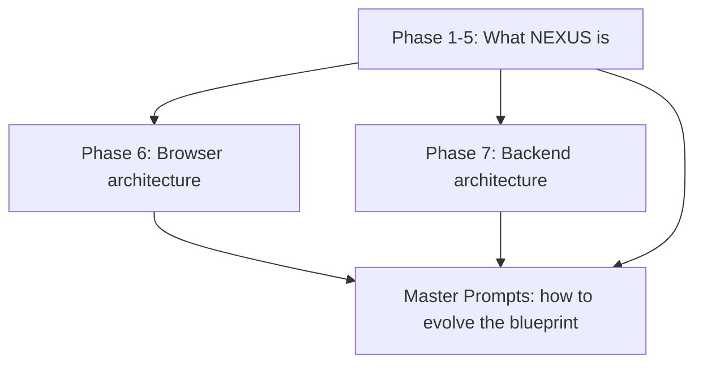
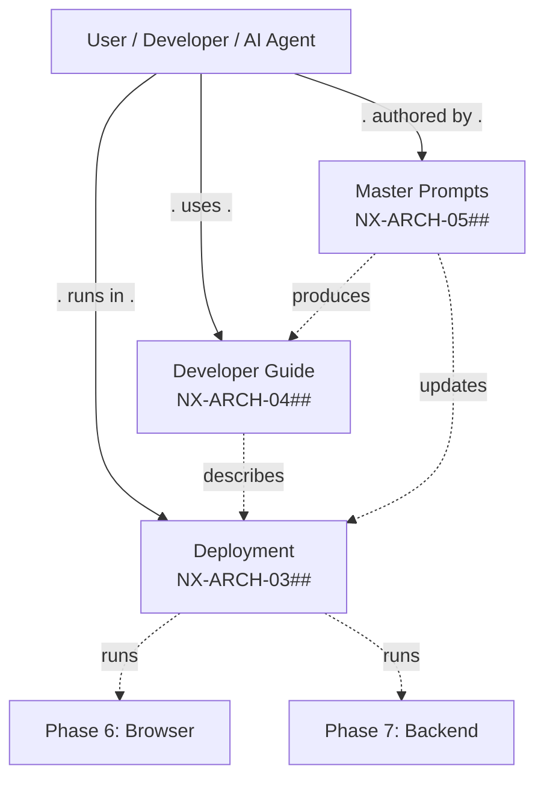

# NX-ARCH-0003 — Future Expansion Overview

| Field | Value |
|-------|-------|
| **Document ID** | NX-ARCH-0003 |
| **Title** | Future Expansion Overview |
| **Phase** | 10 — Future Expansion |
| **Owner** | DevOps AI (NX-AGENT-7060) + Documentation AI (NX-AGENT-7061) |
| **Status** | 🟢 Complete |
| **Version** | 0.1.0 |
| **Created** | 2026-07-03 |
| **Depends on** | NX-DOC-0011 (Tech Principles), NX-ARCH-0001 (Browser), NX-ARCH-0002 (Backend), NX-WF-9001 (Eng Org) |

---

## 1. Mission

Define the operational, developer-facing, and self-referential layers of NEXUS — the parts that aren't product features but are the machinery that ships the product, the surface third-party developers build on, and the prompts the AI engineering org uses to keep this blueprint alive.

## 2. Three buckets, one phase

Phase 10 covers three directory families that don't fit into the product phases (1–5) or the architecture phases (6–7). They are unified by being **enabling** rather than **user-facing**.

| Bucket | Directory | Question it answers | Doc count |
|--------|-----------|---------------------|----------:|
| **Deployment** | `10_DEPLOYMENT/` | How does the code get to production, and how do we keep it healthy? | 6 |
| **Developer Guide** | `12_DEVELOPER_GUIDE/` | How does someone *build on* or *contribute to* NEXUS? | 5 |
| **Master Prompts** | `99_MASTER_PROMPTS/` | How do AI agents (and humans) write more of this blueprint consistently? | 2 |

Total: 14 leaf documents + this overview = 15.

## 3. The boundary with other phases

This phase is downstream of everything else — it is the **last** phase, not because the content is least important, but because it depends on the product and architecture being defined first.

| Phase | Describes | Phase 10 does NOT cover |
|-------|-----------|-------------------------|
| 6 — Browser Architecture | How the browser engine works | The Docker images / K8s manifests that run it (Phase 10) |
| 7 — AI Infrastructure | How the backend services are designed | The CI pipelines that deploy them (Phase 10) |
| 1–5 — Product & org | What we build and who builds it | The coding standards that the team follows (Phase 10) |

There is one exception: **Master Prompts** is self-referential — it's the prompts the AI engineering org uses to *maintain* the blueprint itself. It depends on the rest of the blueprint being stable so the prompts can reference it.

## 4. Deployment (`10_DEPLOYMENT/`)

The deployment bucket covers the operational side: how code becomes a running service, how it stays healthy, how it scales, and what happens when things go wrong.

| Doc | Title | Doc ID |
|-----|-------|--------|
| Docker | Image strategy, base images, build pipeline | NX-ARCH-0301 |
| Kubernetes | Manifests, Helm charts, cluster topology | NX-ARCH-0302 |
| CI/CD | Build, test, deploy pipeline; environments; promotion | NX-ARCH-0303 |
| Monitoring | Metrics, logs, traces, dashboards, alerts | NX-ARCH-0304 |
| Scaling | Capacity planning, autoscaling, load testing | NX-ARCH-0305 |
| Disaster Recovery | Backup, RPO/RTO, game days, runbooks | NX-ARCH-0306 |

These are the **how** to Phase 7's **what**. Phase 7 says "the API monolith runs on Kubernetes with 3 replicas per region"; Phase 10 says "here is the Helm chart, the HPA, the rollout strategy, the dashboards".

## 5. Developer Guide (`12_DEVELOPER_GUIDE/`)

The developer guide is for two audiences:

1. **Third-party developers** who build plugins, agents, or integrations on NEXUS.
2. **Internal developers** (the AI engineering org, and any humans) who contribute to NEXUS's own codebase.

| Doc | Title | Doc ID | Audience |
|-----|-------|--------|----------|
| Coding Standards | Style, types, tests, review | NX-ARCH-0401 | Internal |
| API Docs | OpenAPI conventions, examples, SDK guides | NX-ARCH-0402 | Both |
| SDK | The `@nexus/sdk` package: design, install, usage | NX-ARCH-0403 | Third-party |
| Plugin Development | The plugin SDK: manifest, lifecycle, permissions, publishing | NX-ARCH-0404 | Third-party |
| Contribution Guide | How to submit code, docs, blueprints; review process | NX-ARCH-0405 | Internal |

These docs are the **surface** that the marketplace and integration ecosystem (Phase 8) sit on top of.

## 6. Master Prompts (`99_MASTER_PROMPTS/`)

The master prompt library is the **operating manual** for the AI agents (NX-AGENT-7050..7063) that maintain this blueprint. It contains:

1. **Workflow templates** (NX-ARCH-0501) — the standard sequences an AI agent follows to write a new feature spec, audit a phase, update a manifest, or review a PR.
2. **Diagram library** (NX-ARCH-0502) — canonical Mermaid patterns for the kinds of diagrams NEXUS docs use (architecture, sequence, state, ER, etc.), so every doc renders the same way.

This is the most meta of the three buckets — it's the docs the AI uses to write more docs. It's also the smallest: 2 documents.

## 7. Architectural principles for Phase 10

Same doctrine as Phases 6/7, applied here:

1. **The contract is the source of truth.** Helm values, OpenAPI specs, SDK TypeScript types — generated from schemas, never hand-edited twice.
2. **Reproducible builds.** Every artifact (image, chart, doc) is built from source in CI. No "Bob's laptop builds it" production deploys.
3. **Observability by default.** Every service emits OpenTelemetry; every CI run is logged; every deploy is traceable.
4. **Reversible changes.** Every deploy is roll-back-able in < 5 minutes. Every doc edit is revertable via Git. Every DB migration has a down.
5. **Least privilege.** CI runners get only the secrets they need for their stage. Developers get read-only prod. Third parties get only the API surface they need.
6. **Boring where possible.** GitHub Actions, standard Helm, standard Mermaid. Novel only where NEXUS's uniqueness requires it (plugin manifest format, agent prompt format).
7. **Versioned interfaces.** SDK and plugin API are semver'd. Breaking changes get a major version and a deprecation window.

## 8. Layered view

## 9. What's NOT in Phase 10

- **Specific YAML manifests** (Helm values, K8s deployments) — those live in the `infra/` repo, not the blueprint.
- **The actual SDK code** — `@nexus/sdk` lives in the implementation repo; Phase 10 documents the *interface*, not the implementation.
- **The actual plugin code** — sample plugins live in `examples/` in the implementation repo.
- **The actual prompt contents** — the workflow and diagram prompts are *templates* the AI agents compose from, not a fixed library of "say this exact string". The library is the *schema* of how to construct a prompt.
- **On-call rotation, incident response, postmortem process** — these are operational concerns that emerge once the team is running; they belong in the implementation repo's `runbooks/`.

## 10. Acceptance criteria for the phase

- [ ] All 13 leaf documents complete (6 deployment + 5 developer + 2 master prompts).
- [ ] Every leaf doc cross-references this overview.
- [ ] Every deployment doc cross-references Phase 7's `NX-ARCH-0002` (Backend) and `NX-ARCH-0005` (Infrastructure).
- [ ] Every developer-guide doc cross-references `NX-DOC-0011` (Tech Principles) and the relevant Phase 6/7 architecture.
- [ ] Tech stack matches `NX-DOC-0011` §5.
- [ ] SDK and Plugin Dev docs cross-reference each other and the marketplace anchor (when Phase 8 is written).

## 11. Reading list

- **Technical Principles** — NX-DOC-0011
- **Vision** — NX-DOC-0002
- **Engineering Org Overview** — NX-WF-9001
- **Browser Architecture Overview** — NX-ARCH-0001
- **Backend Architecture Overview** — NX-ARCH-0002
- **Infrastructure** — NX-ARCH-0205
- **All 13 leaf documents** — NX-ARCH-0301..0502

---

*End NX-ARCH-0003.*
