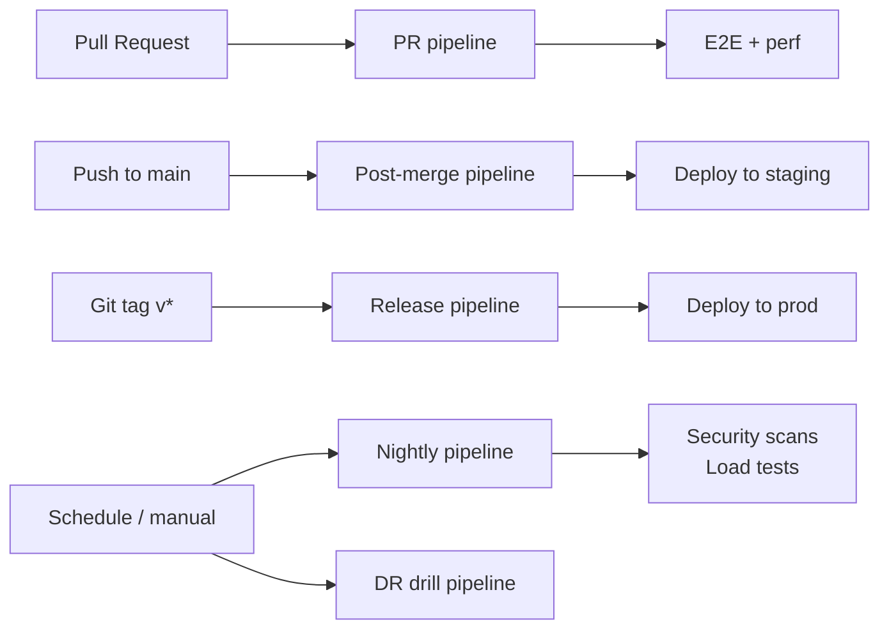
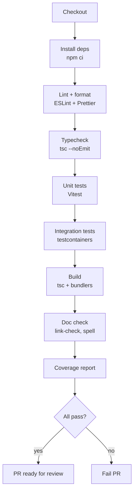
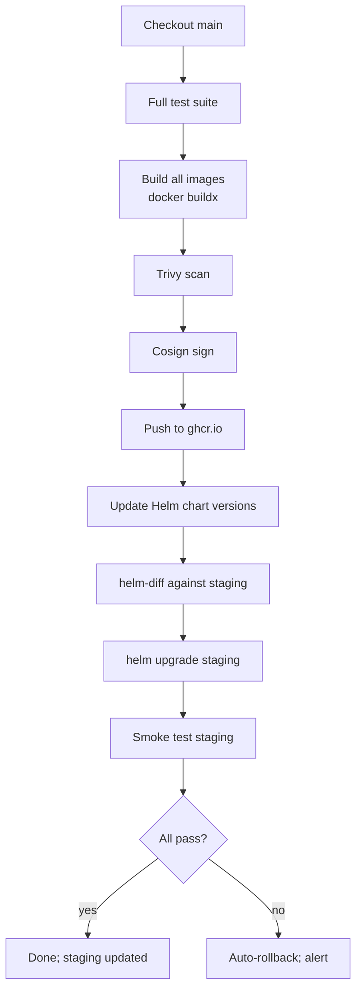
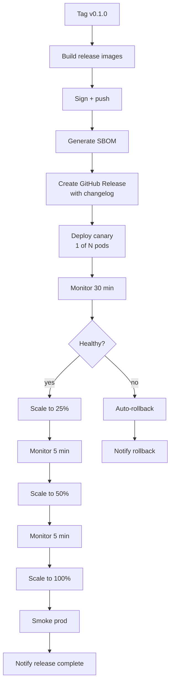

# NX-ARCH-0303 — CI/CD Pipelines

| Field | Value |
|-------|-------|
| **Document ID** | NX-ARCH-0303 |
| **Title** | CI/CD Pipelines |
| **Phase** | 10 — Future Expansion |
| **Owner** | DevOps AI (NX-AGENT-7060) + QA AI (NX-AGENT-7059) |
| **Status** | 🟢 Complete |
| **Version** | 0.1.0 |
| **Created** | 2026-07-03 |
| **Depends on** | NX-ARCH-0003, NX-ARCH-0301 (Docker), NX-ARCH-0302 (K8s), NX-WF-9003 (Quality Gates) |

---

## 1. Mission

Define the continuous integration and continuous delivery pipelines for NEXUS — what runs on every commit, what runs on merges, what runs on releases, and how code reaches production — so the engineering org can ship safely at the cadence the product demands.

## 2. The pipeline shape

NEXUS has one **monorepo** with many packages. There are five pipeline types, each triggered differently.



| Pipeline | Trigger | Duration target | Output |
|----------|---------|-----------------|--------|
| **PR** | Pull request opened/updated | < 10 min | Lint, typecheck, unit, integration, build preview |
| **Post-merge** | Push to `main` | < 20 min | Lint, test, build image, sign, push, deploy to staging |
| **Release** | Git tag matching `v*` | < 45 min | All post-merge steps + canary deploy to prod + smoke |
| **Nightly** | Cron 02:00 UTC | < 90 min | Full E2E, perf regression, security scans, dependency updates |
| **DR drill** | Manual / quarterly | < 4 h | Restore from backup in non-prod; verify RPO/RTO |

## 3. The PR pipeline

Every PR runs on push. The pipeline is the gate for merge.



Properties:

- **Required checks.** Lint, typecheck, tests, and coverage must pass to merge.
- **Coverage threshold.** 80% lines; 70% branches. Tracked per package, not just total.
- **No image build.** PR builds are for verification; images are built post-merge.
- **Cached.** `npm ci` uses dependency cache; `node_modules` is restored on hit.
- **Parallelized.** Lint, typecheck, and tests for different packages run in parallel jobs.

## 4. The post-merge pipeline

Triggered on every push to `main`. This is where images are born and staging is updated.



Key properties:

- **Image tags.** Pushed as `<git-sha>` and `main` (immutable + branch tag).
- **Helm chart updated.** The umbrella chart's `appVersion` is bumped to the new image tag.
- **Auto-deploy to staging.** The pipeline is the only writer to staging; no manual deploys.
- **Smoke test.** A 2-minute E2E check (login, create workspace, run an agent, verify event).
- **Auto-rollback.** If any step fails, `helm rollback` restores the last good release.

## 5. The release pipeline

Triggered by pushing a Git tag matching `v*` (e.g., `v0.1.0`). This is the path to production.



The release pipeline uses **Argo Rollouts** for the canary strategy. The `AnalysisTemplate` runs health checks (error rate, latency p99) at each step; if any step regresses beyond threshold, the rollout aborts and traffic reverts.

## 6. Environment promotion

Code flows through environments in a strict order.

```
PR preview → ephemeral per-PR; auto-destroyed on close
       ↓
staging → long-lived; mirrors prod at lower scale
       ↓
prod-canary → 1 pod of new version
       ↓
prod → full rollout
```

| Environment | Lifecycle | Data | Replicas | Who can deploy |
|-------------|-----------|------|----------|----------------|
| `pr-<n>` | Ephemeral (PR open) | Synthetic | 1 | The PR author (CI auto) |
| `dev` | Persistent | Synthetic | 1 | DevOps AI |
| `staging` | Persistent | Anonymized prod copy | 2 | Post-merge pipeline |
| `prod-<region>` | Persistent | Real | 3+ per service | Release pipeline only |

Direct deploys to prod from outside the release pipeline are blocked at the cluster level (RBAC + admission policy).

## 7. Build matrix

NEXUS supports multiple architectures from H2 (arm64 for cost savings on Graviton/Ampere). H1 is amd64-only.

| Arch | H1 | H2+ | Use case |
|------|:--:|:---:|----------|
| `linux/amd64` | ✅ | ✅ | All services |
| `linux/arm64` | ❌ | ✅ | Worker, API, browser (Graviton cost savings) |
| `linux/arm64` + GPU | ❌ | H3+ | Local model runtime (AWS Graviton + Inferentia) |

The build matrix is defined once in the build pipeline; per-image opt-in via labels.

## 8. Secrets in CI

CI pipelines need secrets (DB URL, signing key, deploy keys). Per NX-ARCH-0205 §6:

- **GitHub OIDC** is used for cloud auth (no long-lived AWS keys in CI).
- **GitHub Actions secrets** store per-environment values; only the `release` workflow can read `PROD_*` secrets.
- **Cosign** uses keyless signing via OIDC.
- **Vault** integration via the `vault-action` for anything that needs a runtime secret.
- **No secret in logs.** Pipeline logs are scanned by a secret-scanner (gitleaks) on every run.

## 9. Test data management

| Test type | Data | Lifecycle | Where |
|-----------|------|-----------|-------|
| Unit | Synthetic | Generated per test | In-test |
| Integration | Synthetic | Generated per test | testcontainers |
| E2E (staging) | Anonymized snapshot of prod | Refreshed weekly | S3 bucket, restored by pipeline |
| Load test | Synthetic at scale | Generated per run | Generated on demand |
| DR drill | Synthetic | Generated per drill | Generated on demand |

PII never reaches CI. The anonymization pipeline (NX-WF-9003 §Privacy) is the only way prod data enters staging.

## 10. Pipeline observability

- **Pipeline duration.** P50, P95 tracked; regression alerts.
- **Flake rate.** Tests that fail then pass on retry are tracked; flake > 1% triggers a fix.
- **Failure modes.** Categorized: code, infra, flaky, timeout. Trending weekly.
- **Mean time to green.** From PR open to first green run. The user-facing dev velocity metric.
- **Deploy frequency.** Per service, per day, per week. From the release pipeline.

Dashboards in Grafana; the engineering org reviews them weekly (per NX-WF-9001 §CEO AI).

## 11. Failure modes

| Failure | Behavior |
|---------|----------|
| CI runner down | GitHub-managed runners auto-recover; self-hosted runners have a standby pool |
| Image registry down | Builds queue; deploys blocked; status page updated |
| Staging deploy fails | Auto-rollback; alert; PR author notified |
| Canary metrics regress | Auto-abort; rollback; incident created |
| Signing key rotated mid-pipeline | Build retries with new key; old signature invalidated |
| Pipeline takes > 30 min | Alert; investigation; usually a test or cache issue |

## 12. Open questions

- Q: How do we handle long-running perf tests in the PR pipeline? (Decision: PR pipeline is correctness-only; perf in nightly. H2: subset of perf in PR for hot paths.)
- Q: Multi-region prod release — sequential or parallel? (Decision: sequential H1; parallel H2 with regional health checks.)
- Q: Hotfix path — does it skip the canary? (Decision: hotfixes can skip the canary with explicit `--hotfix` flag; still go through the release pipeline; documented in the runbook.)

## 13. Reading list

- **Overview** — NX-ARCH-0003
- **Docker Image Strategy** — NX-ARCH-0301
- **Kubernetes & Helm** — NX-ARCH-0302
- **Monitoring & Observability** — NX-ARCH-0304
- **Scaling & Capacity** — NX-ARCH-0305
- **Disaster Recovery** — NX-ARCH-0306
- **Quality Gates** — NX-WF-9003
- **DevOps AI Manifest** — NX-EM-9613
- **QA AI Manifest** — NX-EM-9604
- **Technical Principles** — NX-DOC-0011 (P1, P5, P6)

---

*End NX-ARCH-0303.*
