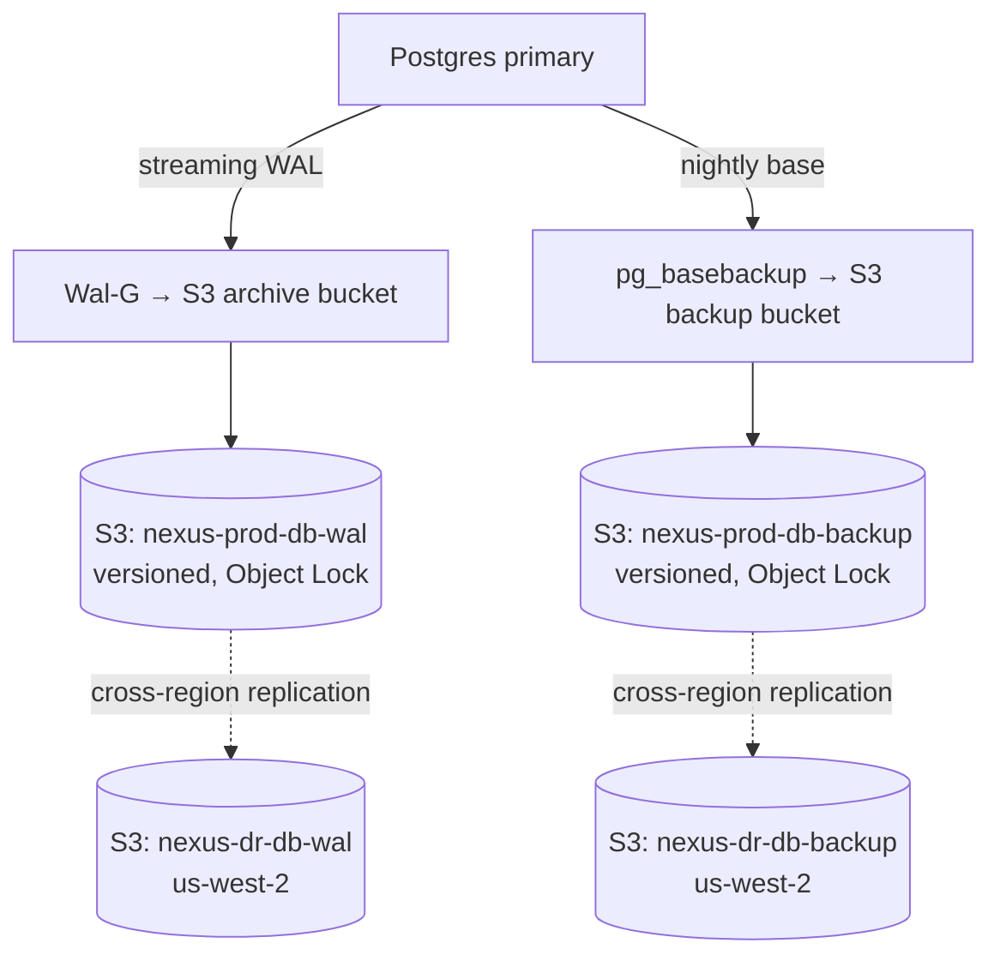
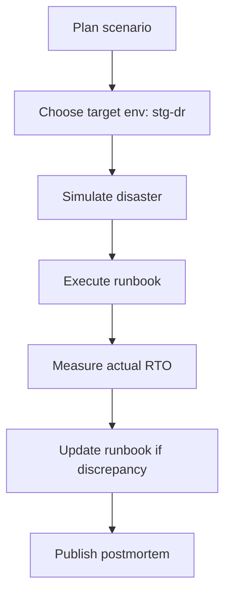

# NX-ARCH-0306 — Disaster Recovery

| Field | Value |
|-------|-------|
| **Document ID** | NX-ARCH-0306 |
| **Title** | Disaster Recovery |
| **Phase** | 10 — Future Expansion |
| **Owner** | DevOps AI (NX-AGENT-7060) + Security AI (NX-AGENT-7058) |
| **Status** | 🟢 Complete |
| **Version** | 0.1.0 |
| **Created** | 2026-07-03 |
| **Depends on** | NX-ARCH-0003, NX-ARCH-0205 (Infrastructure), NX-ARCH-0207 (Storage), NX-ARCH-0305 (Scaling) |

---

## 1. Mission

Define how NEXUS survives a disaster — backup, restore, RPO/RTO targets, runbooks, and game-day practice — so a region-wide outage, a database corruption, or a security incident doesn't take the product (or the data) down.

## 2. The disaster taxonomy

Not all disasters are equal. NEXUS classifies by blast radius and recovery model.

| Class | Example | RPO | RTO | Strategy |
|-------|---------|----:|----:|----------|
| **Single instance failure** | A pod crashes | 0 | < 1 min | K8s reschedules |
| **Single service failure** | API monolith down | 0 | < 5 min | HPA + multiple replicas |
| **Single AZ failure** | One availability zone down | 0 | < 10 min | Multi-AZ deployment |
| **Single region failure** | `us-east-1` down | < 5 min | < 1 h | Multi-region (H2+) |
| **Database corruption** | Accidental drop, ransomware | < 1 h | < 4 h | Point-in-time restore |
| **Whole-cloud failure** | AWS account compromise | < 1 h | < 24 h | Second cloud (H3+) |
| **Data center physical loss** | Fire, flood | < 1 h | < 24 h | Cross-region backup |
| **Ransomware** | Production encrypted | 0 (immutable backups) | < 4 h | Object Lock + restore |

## 3. The RPO/RTO matrix

| System | Class | RPO | RTO | Backup strategy |
|--------|-------|----:|----:|-----------------|
| **Postgres primary** | Database corruption | 5 min | 1 h | Continuous WAL archive + daily base backup |
| **Postgres replicas** | Single replica failure | 0 | < 5 min | Async replication; auto-promote |
| **Redis** | Cache loss | 0 (rebuildable) | < 30 min | AOF every 1s + RDB snapshots; cold start from empty |
| **S3 object storage** | Data corruption | 1 h | < 1 h | Cross-region replication + versioning |
| **User data (workspaces, agents, runs)** | DB corruption | 5 min | 1 h | DB backups (covers S3 metadata too) |
| **Cloud Browser state** | DB corruption | 5 min | 1 h | Same as user data; per-user encryption key in Vault |
| **Encryption keys** | Vault loss | 0 (replicated) | < 15 min | Multi-region Vault with auto-unseal |
| **Configuration** | Repo loss | 0 | < 1 h | Git is the source of truth; multi-region mirror |
| **Container images** | Registry loss | 0 | < 30 min | Multi-registry mirror (H2+) |

The headline targets:

- **RPO 5 min** for the database (matches Phase 7's `NX-ARCH-0205` §7.3).
- **RTO 1 h** for full production restore (matches Phase 7's `NX-ARCH-0205` §7.3).
- **RTO 24 h** for cross-cloud failover (H3+).

## 4. Backup architecture

### 4.1 Database backups

Properties:

- **WAL is shipped continuously** to S3. Target: every WAL segment on S3 within 60 seconds of being written.
- **Base backup is daily**, taken at low-traffic hour (04:00 UTC). Full + incremental via pg_basebackup or WAL-G.
- **Backups are versioned.** S3 versioning enabled.
- **Backups are immutable.** Object Lock in compliance mode, 7-year retention.
- **Backups are replicated cross-region** (H2+). Same-region in H1.

### 4.2 Object storage backups

Per NX-ARCH-0207:

- S3 versioning is on for critical prefixes.
- Cross-region replication is on for all prefixes.
- Lifecycle policies retain deleted objects for 30 days (soft delete) before permanent deletion.

### 4.3 Configuration backups

- **Git is the source of truth.** All infrastructure (Terraform, Helm values) lives in Git.
- **Git is mirrored** to a second provider (H2+). Bitbucket/GitLab mirror or self-hosted Gitea.
- **Secrets** are in Vault, not Git. Vault is multi-region with auto-unseal.

## 5. Restore procedures

### 5.1 Single-row / small-range restore

For a single user, workspace, or table:

1. Identify the target backup (date + time).
2. Spin up a temporary Postgres from that backup in a sandbox namespace.
3. Extract the row/range.
4. Insert into production via the application (with audit log).
5. Tear down the sandbox.

This is the most common restore and is fully scriptable. **Target: < 1 hour from request to restored row.**

### 5.2 Full database restore

For a database corruption or "drop the wrong table" incident:

1. Page on-call; declare incident.
2. Identify last-known-good base backup + WAL position.
3. Provision a new Postgres from the base backup.
4. Replay WAL up to the target time (typically "just before the incident").
5. Verify the data with checksum + spot queries.
6. Promote the new instance to primary.
7. Update DNS / connection strings.
8. Repoint replicas.

**Target: < 1 hour from page to production traffic on the new primary.** This is the headline RTO.

### 5.3 Whole-region failover (H2+)

For a region outage (H2+):

1. Page on-call; declare incident.
2. Verify the secondary region is healthy.
3. Promote the cross-region Postgres replica in the secondary.
4. Update the global load balancer to route to the secondary.
5. Verify health checks pass.
6. Notify users via status page.

**Target: < 1 hour from page to traffic served from secondary.** This is the multi-region RTO.

### 5.4 Ransomware response

For a ransomware attack on production:

1. Page on-call; declare security incident; engage Security AI (NX-EM-9605) + CEO AI (NX-EM-9601).
2. **Do not pay.** Proceed to restore.
3. Isolate the affected systems (network segmentation; revoke credentials).
4. Restore from the most recent clean backup. Backups are immutable (Object Lock) so the attacker cannot have encrypted them.
5. Verify integrity (checksums, signatures).
6. Redeploy from clean Git + clean images.
7. Rotate all secrets, keys, credentials.
8. Postmortem; user notification per the security incident playbook.

**The key property of NEXUS's DR posture: backups are immutable and tested, so a ransomware attack on production cannot destroy recovery capability.**

## 6. Game days

DR is a **muscle**. NEXUS runs game days quarterly.

The game day schedule:

| Quarter | Scenario | Environment |
|---------|----------|-------------|
| Q1 | Single AZ failure (kill all pods in one AZ) | staging-dr |
| Q2 | Database corruption (drop a table) | staging-dr |
| Q3 | Full region loss (disable region ingress) | staging-dr |
| Q4 | Ransomware simulation (encrypt prod-like data) | isolated env |

Game days are scheduled in advance, blocked on the calendar, and treated as P1 work. The actual RTO/RPO is measured and published; deviations from the targets are tracked as bugs.

## 7. Runbooks

A runbook lives for every alert, every recovery procedure, and every incident class. Runbooks are stored in the implementation repo's `runbooks/` directory, indexed from this doc.

Every runbook has:

- **Trigger** — what condition prompts this runbook.
- **Pre-conditions** — what should be true before starting.
- **Steps** — exact commands (copy-pastable), with expected output.
- **Decision points** — what to do if X vs. Y.
- **Escalation** — who to page if the runbook doesn't resolve.
- **Communication** — what to tell users, what to tell the team, when to update the status page.

Runbooks are version-controlled. Every game day finds at least one runbook that needs an update; the update is committed in the same day.

## 8. Communication during incidents

| Severity | Status page | Customer email | Internal |
|----------|-------------|----------------|----------|
| **P1** | Within 5 min of detection | Within 30 min | All-hands in incident channel |
| **P2** | Within 15 min | None (silent fix) | Eng team in incident channel |
| **P3** | None | None | Ticket, no channel |

The status page is public (`status.nexus.ai`); it's the only authoritative source. Customer emails are sent by the Marketing AI (NX-EM-9607) from a template. All-hands in the incident channel is the CEO AI's responsibility.

## 9. Multi-cloud (H3+)

NEXUS does not run multi-cloud in H1 or H2. The H3+ plan:

- **Active-passive.** A second cloud (Azure or GCP) runs warm-stanby: minimal capacity, data replicated asynchronously.
- **DNS failover.** Route 53 / Cloudflare health checks drive failover.
- **Data replication.** Postgres logical replication; S3 cross-cloud replication; Redis rebuilt on failover.
- **Drill.** Twice a year, full multi-cloud failover exercise.

Multi-cloud is expensive; it's the answer to the "what if AWS itself goes down for a day" scenario, which is rare but not zero.

## 10. Data export and portability

NEXUS users can export their data at any time. This is the **individual** disaster recovery story.

- **Full export** (per user): all workspaces, agents, runs, memories, files. A ZIP + JSON, generated on demand, downloadable for 7 days.
- **Per-workspace export**: subset of the above.
- **Self-serve** in H1 (UI); API in H1; scripted via SDK in H1.

This isn't a backup for NEXUS, but it is a backup for the user, and it removes a class of "I want my data out" emergencies.

## 11. Postmortem culture

Every P1 and P2 incident gets a postmortem within 5 business days.

- **Blameless.** The postmortem focuses on systems and decisions, not people.
- **Action items.** Every postmortem has 1–5 action items, each with an owner and a deadline.
- **Tracked.** Action items are GitHub issues with label `postmortem`. Closed within 30 days for P1, 60 days for P2.
- **Published.** Postmortems are public (after redacting customer-impacting specifics) on `postmortems.nexus.ai`. This is the "we are an engineering org that learns" signal.

The QA AI (NX-EM-9604) tracks postmortem completion; the CEO AI (NX-EM-9601) reviews every postmortem.

## 12. Failure modes

| Failure | Behavior |
|---------|----------|
| Backup job fails | Alert fires; next backup window retries; weekly backup-success-rate metric |
| Backup corrupted | Detected by checksum on restore drill; previous-good backup used |
| WAL archive lag > 5 min | Alert; investigation; may need to scale the WAL shipper |
| Object Lock bucket policy change | Audit log; alert on policy modification; cannot be reverted by attackers |
| Vault unavailable | Read-only mode for existing secrets; new secrets blocked; service starts fail |
| Region down (H1) | Service unavailable; status page; engage provider support; manual failover not possible |
| Region down (H2+) | Auto-failover; RTO 1 h; status page |
| Ransomware detected | Engage incident playbook; restore from immutable backups |

## 13. Open questions

- Q: Should NEXUS offer a "backup-as-a-service" for users (e.g., a workspace's data replicated to the user's own S3)? (Decision: H2; SDK method to register an export sink.)
- Q: Active-active multi-region in H2 vs. active-passive? (Decision: active-passive in H2 for simplicity; active-active in H3 for cost-effective traffic distribution.)
- Q: Tabletop exercises for the security team in addition to technical game days? (Decision: yes, twice a year; Security AI leads.)

## 14. Reading list

- **Overview** — NX-ARCH-0003
- **Backend Architecture Overview** — NX-ARCH-0002
- **Infrastructure** — NX-ARCH-0205
- **Storage** — NX-ARCH-0207
- **Database Architecture** — NX-ARCH-0203
- **CI/CD Pipelines** — NX-ARCH-0303
- **Monitoring & Observability** — NX-ARCH-0304
- **Scaling & Capacity** — NX-ARCH-0305
- **DevOps AI Manifest** — NX-EM-9613
- **Security AI Manifest** — NX-EM-9605
- **QA AI Manifest** — NX-EM-9604
- **CEO AI Manifest** — NX-EM-9601
- **Technical Principles** — NX-DOC-0011 (P7, P12)

---

*End NX-ARCH-0306.*
