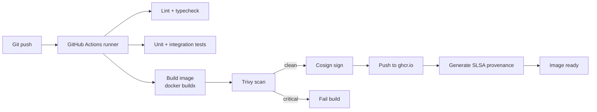

# NX-ARCH-0301 — Docker Image Strategy

| Field | Value |
|-------|-------|
| **Document ID** | NX-ARCH-0301 |
| **Title** | Docker Image Strategy |
| **Phase** | 10 — Future Expansion |
| **Owner** | DevOps AI (NX-AGENT-7060) |
| **Status** | 🟢 Complete |
| **Version** | 0.1.0 |
| **Created** | 2026-07-03 |
| **Depends on** | NX-ARCH-0003, NX-ARCH-0205 (Infrastructure), NX-DOC-0011 (Tech Principles) |

---

## 1. Mission

Define how every NEXUS service is containerized — base images, build pipeline, tagging, signing, and runtime hardening — so images are reproducible, small, secure, and fast to deploy across all environments.

## 2. The image inventory

Per NX-ARCH-0002, NEXUS runs a modular monolith (`nexus-api`), a worker fleet (`nexus-worker`), and a Cloud Browser runtime (`nexus-browser`). Phase 7 lists additional specialty containers (Qdrant, Temporal workers, GPU local-model runtime). Each gets its own image.

| Image | Language | Base | Purpose |
|-------|----------|------|---------|
| `nexus-api` | TypeScript | `distroless/nodejs20-debian12` | API monolith + scheduler |
| `nexus-worker` | TypeScript | `distroless/nodejs20-debian12` | Temporal + BullMQ workers |
| `nexus-bridge` | TypeScript | `distroless/nodejs20-debian12` | Agent ↔ platform bridge |
| `nexus-browser` | Rust + Chromium | `distroless/cc-debian12` | Cloud Browser runtime |
| `nexus-memindex` | TypeScript + Rust | `distroless/nodejs20-debian12` | Memory indexing worker |
| `nexus-localmodel` | Rust + llama.cpp | `distroless/cc-debian12` | Local model runtime (GPU) |
| `nexus-migrate` | TypeScript | `distroless/nodejs20-debian12` | One-shot DB migrations (init container) |

All images are published to `ghcr.io/nexus/<name>:<tag>`.

## 3. Base image strategy

NEXUS uses **Google's distroless** images as the final base. Rationale (per NX-DOC-0011 P1, P7):

- **No shell.** Reduces attack surface; attackers can't `exec` into a container.
- **No package manager.** No `apt`, no `apk`. Forces dependencies to be declared.
- **Minimal OS userspace.** ~2 MB base. Faster pulls, smaller attack surface.
- **CA certificates included.** For outbound TLS.
- **Pinned digests.** No `latest` tags; every image references a specific base image digest (`@sha256:...`) for reproducibility.

Build images are NOT distroless — they need a shell, a compiler, a package manager. They're multi-stage: the build stage uses a full Debian or Alpine, the final stage uses distroless.

## 4. Multi-stage builds

Every image is built with at least two stages. The `COPY --from=...` pattern ensures no build tools end up in the final image.

```dockerfile
# Example: nexus-api
FROM node:20-bookworm AS build
WORKDIR /app
COPY package.json package-lock.json ./
RUN npm ci
COPY . .
RUN npm run build && npm prune --production

FROM gcr.io/distroless/nodejs20-debian12:nonroot@sha256:<digest>
WORKDIR /app
COPY --from=build --chown=nonroot:nonroot /app/dist ./dist
COPY --from=build --chown=nonroot:nonroot /app/node_modules ./node_modules
COPY --from=build --chown=nonroot:nonroot /app/package.json ./
USER nonroot
EXPOSE 3000
CMD ["dist/server.js"]
```

Key properties:

- **Final image is distroless, non-root.** The `nonroot` user (UID 65532) is the runtime user.
- **No build artifacts in final.** No `node_modules/.cache`, no source maps (production), no test files.
- **Reproducible.** The base image digest and the `package-lock.json` together pin every transitive dependency.
- **Layer-cached.** The `npm ci` step runs only when `package*.json` changes; the COPY step runs only when source changes.

## 5. Build pipeline



The build is triggered on every push to a branch and every PR. The pipeline:

1. **Lint + typecheck** — ESLint, Prettier, TypeScript `--noEmit`.
2. **Tests** — Vitest for unit, a test DB for integration. Coverage threshold enforced.
3. **Build** — `docker buildx build` with cache mounts (`--cache-from=type=gha`) for speed.
4. **Scan** — `trivy image` with a fail threshold of `CRITICAL`. High findings warn but don't fail (tracked separately).
5. **Sign** — `cosign sign --keyless` with OIDC identity tied to the GitHub Actions workflow.
6. **Push** — `docker push` to `ghcr.io/nexus/<name>:<sha>` and `:<branch>`.
7. **Attest** — Generate SLSA Level 3 provenance (in-toto + Rekor).

## 6. Tagging scheme

Every image has multiple tags, each for a purpose.

| Tag | Source | Example | Use |
|-----|--------|---------|-----|
| `<git-sha>` | Commit SHA (short) | `a1b2c3d` | Pin to a specific commit; the immutable form |
| `<branch>` | Git branch | `main`, `release/2026-q3` | "Latest" for that branch; updated on every merge |
| `<semver>` | Git tag | `v0.1.0`, `v0.1.0-rc.1` | Releases; only for `main` and release branches |
| `<semver>-<sha>` | Git tag + commit | `v0.1.0-a1b2c3d` | Reproducible release; the canonical release tag |

The **deployable tag** is always `<git-sha>` or `<semver>-<sha>`. Branch tags (`main`) are convenience tags and may move; never deploy them directly to prod.

## 7. Image signing and verification

Every image is signed with **Cosign** in keyless mode (OIDC). The signature:

- Identifies the GitHub Actions workflow that built it.
- Identifies the commit SHA.
- Is published to the public Rekor transparency log.

Verification is enforced:

- **In K8s admission** — only signed images are admitted (via `cosigned` admission controller or Kyverno policy).
- **In deploys** — `kubectl` operations check signature via `cosign verify`.
- **In CI** — every downstream image build verifies its base images are signed.

If an image isn't signed, it doesn't run.

## 8. Vulnerability scanning

Every image is scanned by **Trivy** on every build. Scan results are stored in the GitHub Security tab.

- **CRITICAL**: fails the build. Must be fixed before merge.
- **HIGH**: warns. SLA: fix within 7 days; tracked in a security backlog.
- **MEDIUM**: warns. SLA: 30 days.
- **LOW**: informational.

Trivy is also re-run on a daily schedule against the production image set, to catch newly-disclosed CVEs in unchanged images. Findings are filed as GitHub issues auto-labeled `security/cve`.

## 9. Runtime hardening

Beyond distroless + non-root:

- **Read-only root filesystem.** Containers mount `/` as read-only; writable paths (`/tmp`, `/var/cache`) are tmpfs volumes.
- **No privileged.** `securityContext.privileged: false` always.
- **No host namespace sharing.** No `hostNetwork`, no `hostPID`, no `hostIPC`.
- **Linux capabilities dropped.** All capabilities dropped; only `NET_BIND_SERVICE` added back for services that bind < 1024.
- **Resource limits.** Every container has CPU and memory limits (see NX-ARCH-0305 for sizing).
- **Seccomp profile.** Runtime default; the seccomp profile is `RuntimeDefault` unless a service needs more.
- **AppArmor / SELinux.** Provider-default; the cluster enforces it.

## 10. Performance budgets

- **Image size**: API and worker images < 300 MB. Browser image < 1 GB (includes Chromium). Local-model image < 5 GB.
- **Cold pull time** (from registry to node): < 30s for API/worker; < 2 min for browser.
- **Build time** (cold cache): < 5 min for API/worker; < 15 min for browser.
- **Build time** (warm cache): < 90s for API/worker; < 5 min for browser.

## 11. Failure modes

| Failure | Behavior |
|---------|----------|
| Build fails | Pipeline red; PR blocked; no image pushed |
| Trivy critical CVE | Build fails; PR blocked; security review required |
| Cosign signing fails | Push fails; image not deployable |
| Registry outage | Builds queue in CI; deploys fail (services can't pull new images) |
| Base image CVE | Re-build triggered via Renovate auto-PR; all dependent images rebuild |
| Image pull rate limit (GHCR) | Cached images on nodes; new node provisioning may stall; H2+ uses a second registry |

## 12. Open questions

- Q: Multi-arch builds (amd64 + arm64) — H1 amd64 only, H2 add arm64 for cost savings on Graviton/Ampere? (Decision: H2.)
- Q: SBOM publication — every image ships an SBOM (SPDX format), but where? (Decision: GitHub Releases + in-cluster OCI registry.)
- Q: Base image auto-update strategy — Renovate vs. Dependabot? (Decision: Renovate, single source of truth.)

## 13. Reading list

- **Overview** — NX-ARCH-0003
- **Infrastructure** — NX-ARCH-0205
- **Kubernetes** — NX-ARCH-0302
- **CI/CD** — NX-ARCH-0303
- **DevOps AI Manifest** — NX-EM-9613
- **Security AI Manifest** — NX-EM-9605
- **Technical Principles** — NX-DOC-0011 (P1, P7)

---

*End NX-ARCH-0301.*
