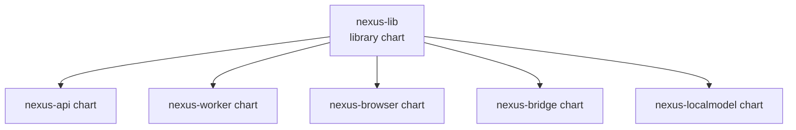
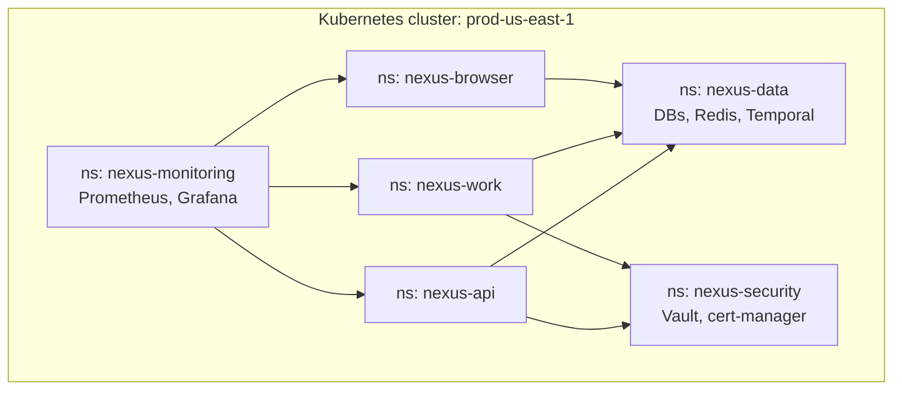

# NX-ARCH-0302 — Kubernetes Manifests & Helm Charts

| Field | Value |
|-------|-------|
| **Document ID** | NX-ARCH-0302 |
| **Title** | Kubernetes Manifests & Helm Charts |
| **Phase** | 10 — Future Expansion |
| **Owner** | DevOps AI (NX-AGENT-7060) |
| **Status** | 🟢 Complete |
| **Version** | 0.1.0 |
| **Created** | 2026-07-03 |
| **Depends on** | NX-ARCH-0003, NX-ARCH-0301 (Docker), NX-ARCH-0205 (Infrastructure), NX-ARCH-0305 (Scaling) |

---

## 1. Mission

Define how NEXUS services are deployed to Kubernetes — the manifest structure, the Helm chart hierarchy, the per-environment values, the rollout strategy, and the cluster topology — so deploys are safe, repeatable, and recoverable across regions and environments.

## 2. Why Helm

Per NX-DOC-0011 P1, NEXUS uses **Helm** for templating K8s manifests. Rationale:

- **Industry standard.** Largest mindshare, most tooling, most examples.
- **Templating.** One chart, many values.
- **Release tracking.** Helm tracks release history; `helm rollback` is a one-liner.
- **OCI distribution.** Helm 3 supports OCI registries, so charts can live in the same registry as images.

Alternatives considered: **Kustomize** (good for overlays, no templating), **Jsonnet** (powerful, niche), **plain YAML + script** (works, no reuse). Helm wins on the templating + rollback combo.

## 3. Chart hierarchy

NEXUS has a two-level chart hierarchy: a **library chart** for shared templates, and **application charts** that use the library.



The library chart (`charts/nexus-lib/`) provides:

- Common labels and annotations.
- Standard pod security context (non-root, read-only root FS, capability drop).
- Standard probes (liveness, readiness, startup).
- Standard service account and RBAC.
- Standard resource defaults (limits and requests).
- Common env-var injection (cluster, region, log level).
- PodDisruptionBudget template.
- HorizontalPodAutoscaler template.

Application charts are thin: they set the image, the replica count, the resource overrides, and any service-specific config.

## 4. The umbrella chart

For per-environment deploys, NEXUS uses an **umbrella chart** that pulls in all the application charts as subcharts.

```yaml
# environments/prod/Chart.yaml
apiVersion: v2
name: nexus-prod
version: 0.1.0
dependencies:
  - name: nexus-api
    version: 0.1.0
    repository: oci://ghcr.io/nexus/charts
  - name: nexus-worker
    version: 0.1.0
    repository: oci://ghcr.io/nexus/charts
  - name: nexus-browser
    version: 0.1.0
    repository: oci://ghcr.io/nexus/charts
  - name: postgres
    version: 12.0.0
    repository: https://charts.bitnami.com/bitnami
    condition: postgres.enabled
```

This gives one command to deploy or upgrade the whole environment:

```bash
helm upgrade --install nexus-prod ./environments/prod \
  --namespace nexus \
  --values ./environments/prod/values-prod-us-east-1.yaml
```

## 5. Per-environment values

Each environment (`dev`, `staging`, `prod-<region>`) has its own values file. The values file overrides image tags, replica counts, resource limits, secrets references, and feature flags.

```yaml
# environments/prod/values-prod-us-east-1.yaml
global:
  cluster: prod-us-east-1
  region: us-east-1
  logLevel: info
  imageRegistry: ghcr.io/nexus
  imageTag: v0.1.0-a1b2c3d

nexus-api:
  replicaCount: 6
  resources:
    requests: { cpu: 500m, memory: 1Gi }
    limits:   { cpu: 2,    memory: 4Gi }
  autoscaling:
    enabled: true
    minReplicas: 6
    maxReplicas: 30
    targetCPUUtilization: 70

nexus-worker:
  replicaCount: 12
  autoscaling:
    enabled: true
    minReplicas: 12
    maxReplicas: 60

nexus-browser:
  replicaCount: 1  # one pod per browser; scaled via browser count
  resources:
    requests: { cpu: 4,   memory: 8Gi }
    limits:   { cpu: 8,   memory: 16Gi }
```

Sensitive values (secrets) come from **external secrets** (HashiCorp Vault or AWS Secrets Manager), not the values file. See NX-ARCH-0205 §6.

## 6. The pod contract

Every NEXUS pod has the same contract (enforced by the library chart).

```yaml
apiVersion: apps/v1
kind: Deployment
metadata:
  name: nexus-api
spec:
  replicas: 6
  selector:
    matchLabels: { app: nexus-api }
  strategy:
    type: RollingUpdate
    rollingUpdate:
      maxSurge: 25%
      maxUnavailable: 0
  template:
    metadata:
      labels: { app: nexus-api, version: v0.1.0 }
    spec:
      securityContext:
        runAsNonRoot: true
        runAsUser: 65532
        runAsGroup: 65532
        fsGroup: 65532
        seccompProfile: { type: RuntimeDefault }
      containers:
        - name: nexus-api
          image: ghcr.io/nexus/nexus-api:v0.1.0-a1b2c3d@sha256:<digest>
          imagePullPolicy: IfNotPresent
          securityContext:
            allowPrivilegeEscalation: false
            readOnlyRootFilesystem: true
            capabilities: { drop: [ALL] }
          ports:
            - name: http
              containerPort: 3000
          env:
            - { name: NODE_ENV, value: production }
            - { name: PORT,     value: "3000" }
          resources:
            requests: { cpu: 500m, memory: 1Gi }
            limits:   { cpu: 2,    memory: 4Gi }
          livenessProbe:
            httpGet: { path: /healthz, port: http }
            initialDelaySeconds: 10
            periodSeconds: 10
            failureThreshold: 3
          readinessProbe:
            httpGet: { path: /readyz, port: http }
            initialDelaySeconds: 5
            periodSeconds: 5
            failureThreshold: 3
          startupProbe:
            httpGet: { path: /healthz, port: http }
            periodSeconds: 5
            failureThreshold: 30  # 150s startup budget
          volumeMounts:
            - { name: tmp, mountPath: /tmp }
      volumes:
        - name: tmp
          emptyDir: { medium: Memory, sizeLimit: 256Mi }
      terminationGracePeriodSeconds: 60
```

Properties:

- **Non-root user.** UID 65532 (`nonroot`).
- **Read-only root FS.** Only `/tmp` is writable (tmpfs).
- **All capabilities dropped.**
- **No privilege escalation.**
- **Seccomp default profile.**
- **Three probes.** Liveness (is it alive), readiness (is it serving), startup (give it time to boot).
- **Resource requests and limits.** Both set (more on autoscaling in NX-ARCH-0305).
- **Graceful shutdown.** `terminationGracePeriodSeconds: 60` gives the app time to drain in-flight requests.

## 7. Rollout strategy

Deploys are **rolling updates** by default. Properties:

- **maxSurge: 25%.** At most 25% extra pods during rollout.
- **maxUnavailable: 0.** No downtime; old pods serve until new ones are ready.
- **PodDisruptionBudget.** Ensures voluntary disruptions (drains) don't take down the service.

```yaml
apiVersion: policy/v1
kind: PodDisruptionBudget
metadata:
  name: nexus-api
spec:
  minAvailable: 4  # at least 4 of 6 must be available
  selector:
    matchLabels: { app: nexus-api }
```

For risky changes (database migrations, breaking config), NEXUS uses a **canary** strategy:

1. Deploy new version to 1 replica.
2. Monitor for 30 minutes.
3. If green, scale to 25% → 50% → 100% with 5-minute holds.
4. If red at any point, auto-rollback via Argo Rollouts.

## 8. Service mesh and ingress

- **Ingress.** Cloud-native (ALB / Cloud Load Balancer) with TLS termination. Cert-manager issues and renews LE certs.
- **East-west.** In H2+, Linkerd provides mTLS between services. In H1, services communicate over private IPs with explicit TLS.
- **Service-to-service auth.** In H2+, SPIFFE identities issued by Linkerd. In H1, shared VPC + private endpoints.

## 9. Cluster topology



Namespaces are separated by concern. NetworkPolicies enforce:

- `nexus-api` and `nexus-work` can talk to `nexus-data`.
- `nexus-browser` is isolated; only `nexus-api` can reach its pod IP.
- `nexus-data` does not initiate connections.
- `nexus-monitoring` is the only namespace that scrapes metrics from all.

## 10. Helm lifecycle

- **Lint.** `helm lint` runs in CI on every PR.
- **Template.** `helm template` renders the manifests for review.
- **Diff.** `helm-diff` plugin shows what would change before apply.
- **Apply.** `helm upgrade --install` with `--wait` and `--atomic` (auto-rollback on failure).
- **History.** `helm history` shows all releases; `helm rollback <rev>` reverts.

## 11. Failure modes

| Failure | Behavior |
|---------|----------|
| Helm install fails | `--atomic` rolls back to last successful release |
| New pod fails readiness | HPA doesn't scale; rollout pauses; alert fires |
| Node failure | Replica reschedules; PodDisruptionBudget limits blast radius |
| Cluster autoscaler can't provision | Pods stay pending; alert fires after 5 min |
| Image pull failure | CrashLoopBackOff; rollout pauses; alert fires |
| ConfigMap/Secret invalid | Pod won't start; rollout pauses; alert fires |
| Canary metrics regress | Argo Rollouts auto-aborts; traffic reverts |

## 12. Open questions

- Q: GitOps (Argo CD) vs. push-based (helm from CI)? (Decision: GitOps from H2; H1 uses push-based for simplicity.)
- Q: Service mesh: Linkerd vs. Istio? (Decision: Linkerd preferred; will re-evaluate at H2.)
- Q: Karpenter vs. cluster-autoscaler? (Decision: Karpenter preferred for H2; H1 uses cluster-autoscaler.)

## 13. Reading list

- **Overview** — NX-ARCH-0003
- **Docker Image Strategy** — NX-ARCH-0301
- **CI/CD Pipelines** — NX-ARCH-0303
- **Monitoring & Observability** — NX-ARCH-0304
- **Scaling & Capacity** — NX-ARCH-0305
- **Infrastructure** — NX-ARCH-0205
- **DevOps AI Manifest** — NX-EM-9613
- **Technical Principles** — NX-DOC-0011 (P1, P7)

---

*End NX-ARCH-0302.*
