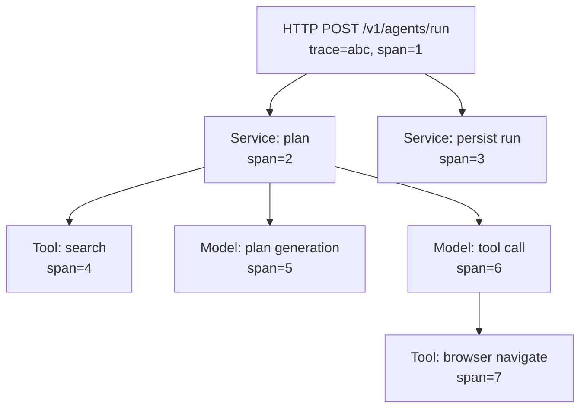

# NX-ARCH-0304 — Monitoring & Observability

| Field | Value |
|-------|-------|
| **Document ID** | NX-ARCH-0304 |
| **Title** | Monitoring & Observability |
| **Phase** | 10 — Future Expansion |
| **Owner** | DevOps AI (NX-AGENT-7060) + QA AI (NX-AGENT-7059) |
| **Status** | 🟢 Complete |
| **Version** | 0.1.0 |
| **Created** | 2026-07-03 |
| **Depends on** | NX-ARCH-0003, NX-ARCH-0205 (Infrastructure), NX-ARCH-0206 (Queues), NX-ARCH-0302 (K8s) |

---

## 1. Mission

Define the observability stack for NEXUS — metrics, logs, traces, dashboards, and alerts — so the engineering org can answer "is it healthy?", "what changed?", "where is the problem?", and "how do users feel it?" without ambiguity.

## 2. The three pillars

Per NX-DOC-0011 P6 and NX-ARCH-0206, NEXUS uses the standard three pillars.

| Pillar | What it answers | Tool | Storage | Retention |
|--------|-----------------|------|---------|-----------|
| **Metrics** | How much / how fast / how many | Prometheus + Grafana Mimir (H2+) | TSDB | 13 months hot |
| **Logs** | What happened in this event | Loki (H1) / OpenSearch (H2+) | Object storage | 30 days hot, 1 year cold |
| **Traces** | Where did the request go | Tempo (H1) / Jaeger (H2+) | Object storage | 14 days |

All three are emitted via **OpenTelemetry** from every service. The OTel SDK is configured once in the library; services inherit the configuration.

## 3. The metrics layer

### 3.1 Cardinality discipline

High cardinality kills Prometheus. NEXUS enforces:

- **Labels are bounded.** `user_id` is never a label; `workspace_id` is; `region`, `service`, `version`, `status_code` are. User-specific metrics are aggregated server-side before labeling.
- **Per-label cardinality budget.** Each metric has a documented max cardinality; CI checks enforce it.
- **Drop rules.** A drop rule strips labels that would explode cardinality before ingestion.

### 3.2 The standard metrics

Every NEXUS service emits:

| Metric | Type | Labels | Source |
|--------|------|--------|--------|
| `http_requests_total` | Counter | service, route, method, status | HTTP middleware |
| `http_request_duration_seconds` | Histogram | service, route, method, status | HTTP middleware |
| `http_requests_in_flight` | Gauge | service, route | HTTP middleware |
| `process_cpu_seconds_total` | Counter | service, instance | Runtime |
| `process_memory_bytes` | Gauge | service, instance | Runtime |
| `nodejs_eventloop_lag_seconds` | Gauge | service, instance | Runtime |
| `nodejs_active_handles_total` | Gauge | service, instance | Runtime |
| `db_query_duration_seconds` | Histogram | service, query_name, table | DB middleware |
| `cache_hits_total` / `cache_misses_total` | Counter | service, cache_name | Cache client |
| `events_produced_total` / `events_consumed_total` | Counter | service, event_type, status | Bus client |
| `workflows_started_total` / `workflows_completed_total` | Counter | service, workflow_type, status | Temporal client |
| `model_requests_total` | Counter | service, model, status | Model gateway |
| `model_tokens_total` | Counter | service, model, type (in/out) | Model gateway |
| `model_request_duration_seconds` | Histogram | service, model | Model gateway |
| `model_cost_usd_total` | Counter | service, model, user | Model gateway |

The model-specific metrics are the answer to P12 (cost understood at scale) for the AI workload.

### 3.3 SLI definitions

NEXUS defines SLIs per service. Every service has at minimum:

- **Availability.** `1 - (sum(rate(http_requests_total{status=~"5..",service=$svc}[5m])) / sum(rate(http_requests_total{service=$svc}[5m])))`
- **Latency.** `histogram_quantile(0.99, sum(rate(http_request_duration_seconds_bucket{service=$svc}[5m])) by (le, route))`
- **Saturation.** `avg(rate(nodejs_eventloop_lag_seconds{service=$svc}[5m]))` and `process_cpu_seconds_total` rate.

SLOs are derived from these SLIs; see §7.

## 4. The logs layer

### 4.1 Log format

Every log is a single-line JSON object with a common envelope.

```json
{
  "ts": "2026-07-03T15:27:00.123Z",
  "level": "info",
  "service": "nexus-api",
  "version": "v0.1.0-a1b2c3d",
  "region": "us-east-1",
  "trace_id": "abc123...",
  "span_id": "def456...",
  "user_id": "u_...",
  "workspace_id": "w_...",
  "request_id": "r_...",
  "route": "/v1/agents/run",
  "method": "POST",
  "status": 200,
  "duration_ms": 142,
  "msg": "agent run completed",
  "agent_id": "NX-AGENT-7003",
  "run_id": "ar_...",
  "ctx": { /* service-specific structured fields */ }
}
```

Key properties:

- **Common envelope.** Every log has `ts`, `level`, `service`, `version`, `region`, `trace_id`.
- **Structured, not string-interpolated.** `"msg": "agent run completed", "agent_id": "..."` is queryable; `"msg": "agent NX-AGENT-7003 completed run ar_..."` is not.
- **No PII.** PII is referenced by ID; the actual PII is in the encrypted store. A linter rejects log lines containing emails, phone numbers, etc.
- **No secrets.** Same linter rejects secret-shaped strings.

### 4.2 Log levels

- `error` — operation failed, user-impacting
- `warn` — operation succeeded but with anomaly (e.g., retry, fallback)
- `info` — significant state transition (e.g., "agent run started")
- `debug` — verbose, sampled at 1% in prod

The library enforces this mapping; services don't get to invent new levels.

### 4.3 Sampling

- **Errors**: 100% retained.
- **Warnings**: 100% retained.
- **Info**: 100% retained for 7 days, then sampled to 10% for retention.
- **Debug**: 1% sampled, retained for 7 days.

## 5. The traces layer

### 5.1 Span structure

NEXUS uses **W3C Trace Context** for propagation. Every request gets a `trace_id`; every operation within is a `span`.



Every span has:

- `name` (operation)
- `service.name`, `service.version`
- `http.method`, `http.route`, `http.status_code` (for HTTP spans)
- `db.system`, `db.statement` (for DB spans)
- `messaging.system`, `messaging.destination` (for bus spans)
- `nexus.tenant_id`, `nexus.user_id` (NEXUS-specific)
- `nexus.cost_usd` (for model spans — feeds cost analytics)

### 5.2 Trace sampling

- **Errors**: 100%.
- **Slow requests** (> 1s p99): 100%.
- **Normal requests**: head-based 1% sampling at the edge.
- **Tail-based**: 100% of traces that contain a span with `error` or `duration > 5s`.

The sampler is consistent (uses `trace_id` hash) so the same trace is sampled or not across services.

## 6. The dashboards

The standard dashboard set, per service:

1. **Golden signals.** Latency, traffic, errors, saturation (per Google SRE).
2. **Service-specific.** Each service has 1–3 dashboards for its specific concerns (e.g., the workflow service has a "Temporal activity health" dashboard).
3. **Cost dashboard.** Per-service cost in USD; per-model token usage; per-user top spenders.
4. **SLO dashboard.** Error budget burn rate, per service.
5. **Dependency map.** A service graph with edge latency and error rate.

The cost dashboard is the operational face of P12 (cost understood at scale).

## 7. The SLOs and error budgets

Every NEXUS service has SLOs derived from its SLIs. The SLOs are set conservatively; the goal is to never burn the budget.

| Service | Availability SLO | Latency SLO (p99) | Error budget (30d) |
|---------|------------------|-------------------|--------------------|
| `nexus-api` (writes) | 99.9% | < 500ms | 43m |
| `nexus-api` (reads) | 99.95% | < 200ms | 21m |
| `nexus-worker` | 99.5% | N/A (async) | 3h 36m |
| `nexus-browser` | 99.0% per browser | N/A | 7h 12m |
| `nexus-bridge` | 99.5% | < 1s | 3h 36m |
| Event bus | 99.95% delivery | < 1s p99 | 21m |
| WebSocket | 99.5% connection success | < 500ms connect | 3h 36m |

Burn rate alerts:

- **2% budget in 1h** — page on-call.
- **5% budget in 6h** — page on-call.
- **10% budget in 24h** — escalate; freeze non-critical deploys.

## 8. The alerts

Alert routing follows the **NX-EM-9613 (DevOps AI)** and **NX-EM-9605 (Security AI)** on-call rotations.

| Severity | Response | Example |
|----------|----------|---------|
| **P1 (page)** | 5 min | API 5xx > 1% for 5 min; data loss; security incident |
| **P2 (alert)** | 30 min | SLO burn rate elevated; queue growing; disk > 80% |
| **P3 (ticket)** | 4 h | Test flake; doc drift; minor degradation |
| **P4 (informational)** | Next business day | Deprecation; suggestion; capacity trend |

Alerts have:

- **A runbook link.** Every alert links to a runbook in `runbooks/`.
- **A clear action.** "Restart pod", "Failover DB", "Page security".
- **A false-positive check.** If the alert fires and the on-call deems it a false positive, the alert is tuned within 24h.

## 9. Health endpoints

Every service exposes three endpoints.

| Endpoint | Purpose | Returns |
|----------|---------|---------|
| `GET /healthz` | Liveness | `200 OK` if the process is alive |
| `GET /readyz` | Readiness | `200 OK` if the service can serve traffic (DB reachable, cache warm, deps OK) |
| `GET /metrics` | Prometheus scrape | Standard Prometheus format |

`/healthz` is **cheap** — no DB call, no auth. It is what the K8s liveness probe uses.
`/readyz` is **expensive but bounded** — DB ping, cache ping, dependency check. K8s readiness probe uses it.
`/metrics` is **auth-gated** to the cluster's Prometheus scraper.

## 10. Tools inventory

| Tool | Purpose | H1 source | H2+ source |
|------|---------|-----------|------------|
| Prometheus | Metrics collection | Self-hosted on K8s | Managed (Grafana Cloud) or Mimir |
| Grafana | Dashboards | Self-hosted | Same, multi-tenant |
| Loki | Logs | Self-hosted | OpenSearch if log volume > 1 TB/day |
| Tempo | Traces | Self-hosted | Jaeger if multi-region tracing needed |
| Alertmanager | Alert routing | Self-hosted | Same |
| Sentry | Error tracking | SaaS | Same |
| PagerDuty | On-call rotation | SaaS | Same |
| OpenTelemetry Collector | Telemetry pipeline | DaemonSet on each node | Same |

## 11. Observability for the engineering org

The engineering org's health is itself observed:

- **Deploy frequency**, **lead time**, **change failure rate**, **MTTR** — the four DORA metrics.
- **Pipeline health** (per NX-ARCH-0303 §10).
- **AI org velocity** — agents deployed, agents re-trained, prompts in production.
- **Cost per service** — tracked weekly; anomalies flagged.

This is the "operational" face of the AI-first engineering company (NX-WF-9001).

## 12. Failure modes

| Failure | Behavior |
|---------|----------|
| Prometheus down | Metrics stop scraping; alerts still resolve from in-memory state; recovery within minutes |
| Loki down | Logs queue on the node (1 GB buffer) and ship when Loki returns |
| Tempo down | Spans queue; no impact on user requests |
| OTel collector down | DaemonSet restarts; in-process SDK buffers (5 min default) |
| Alertmanager down | Alerts queued; re-fire on recovery |
| Dashboard down | Engineers use CLI (`logcli`, `amtool`) |
| Time skew | NTP enforced; skew > 1s triggers investigation |

## 13. Open questions

- Q: Continuous profiling (e.g., Pyroscope, Parca) — H2? (Decision: yes, H2; useful for the Rust and Node paths.)
- Q: Real-user monitoring (RUM) in the desktop app — H1? (Decision: yes, H1; uses OTel JS SDK in the renderer.)
- Q: Synthetic monitoring (probes from outside) for the API — H1? (Decision: yes, H1; Blackbox exporter + per-region probes.)

## 14. Reading list

- **Overview** — NX-ARCH-0003
- **Backend Architecture Overview** — NX-ARCH-0002
- **Infrastructure** — NX-ARCH-0205
- **Queues & Workflows** — NX-ARCH-0206
- **Kubernetes & Helm** — NX-ARCH-0302
- **CI/CD Pipelines** — NX-ARCH-0303
- **Scaling & Capacity** — NX-ARCH-0305
- **Disaster Recovery** — NX-ARCH-0306
- **DevOps AI Manifest** — NX-EM-9613
- **QA AI Manifest** — NX-EM-9604
- **Security AI Manifest** — NX-EM-9605
- **Technical Principles** — NX-DOC-0011 (P6, P12)

---

*End NX-ARCH-0304.*
