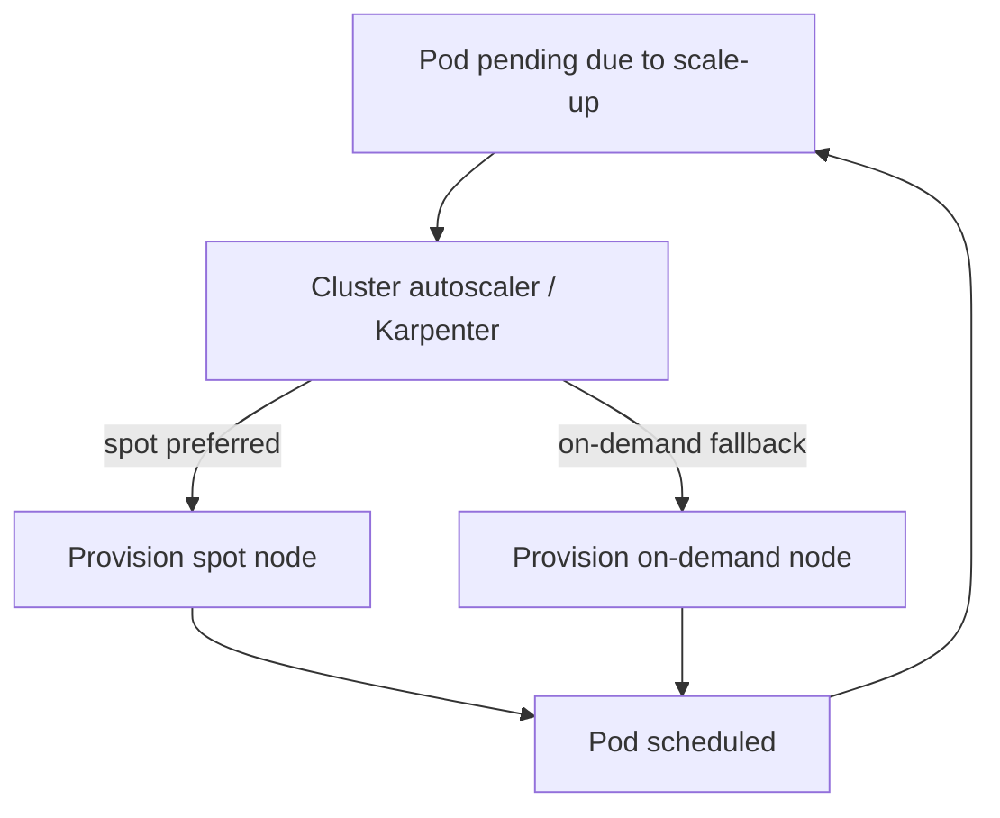
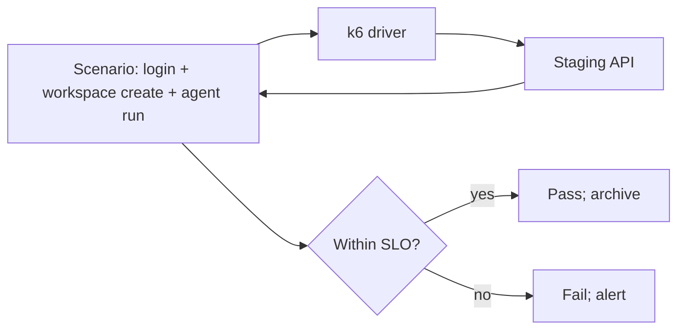

# NX-ARCH-0305 — Scaling & Capacity Planning

| Field | Value |
|-------|-------|
| **Document ID** | NX-ARCH-0305 |
| **Title** | Scaling & Capacity Planning |
| **Phase** | 10 — Future Expansion |
| **Owner** | DevOps AI (NX-AGENT-7060) + Finance AI (NX-AGENT-7063) |
| **Status** | 🟢 Complete |
| **Version** | 0.1.0 |
| **Created** | 2026-07-03 |
| **Depends on** | NX-ARCH-0003, NX-ARCH-0205 (Infrastructure), NX-ARCH-0302 (K8s), NX-ARCH-0304 (Monitoring) |

---

## 1. Mission

Define how NEXUS scales — horizontal pod autoscaling, cluster autoscaling, database scaling, capacity planning models, and load-testing discipline — so the platform absorbs growth without surprise and without overspending.

## 2. The scaling dimensions

NEXUS scales on three independent axes.

| Axis | Knob | When |
|------|------|------|
| **Pod** | HPA on CPU, memory, custom metrics | Seconds to minutes |
| **Cluster** | Karpenter / cluster-autoscaler on node pool utilization | Minutes |
| **Database** | Vertical scale (CPU/RAM), read replicas, partitioning, sharding | Days to weeks |

The first two are automated and immediate. The third is a planned activity, not an autoscale knob.

## 3. Horizontal Pod Autoscaler

Every NEXUS workload that can scale horizontally has an HPA. The library chart ships an HPA template; each service tunes its thresholds.

```yaml
apiVersion: autoscaling/v2
kind: HorizontalPodAutoscaler
metadata:
  name: nexus-api
spec:
  scaleTargetRef:
    apiVersion: apps/v1
    kind: Deployment
    name: nexus-api
  minReplicas: 6
  maxReplicas: 60
  metrics:
    - type: Resource
      resource:
        name: cpu
        target: { type: Utilization, averageUtilization: 70 }
    - type: Pods
      pods:
        metric: { name: http_requests_in_flight }
        target: { type: AverageValue, averageValue: "100" }
  behavior:
    scaleUp:
      stabilizationWindowSeconds: 30
      policies:
        - type: Percent
          value: 100
          periodSeconds: 30
    scaleDown:
      stabilizationWindowSeconds: 300  # wait 5 min before scaling down
      policies:
        - type: Percent
          value: 10
          periodSeconds: 60
```

Properties:

- **Two metrics.** CPU and a custom in-flight metric. Either can drive scaling.
- **Asymmetric.** Scale-up is fast (100% per 30s); scale-down is slow (10% per 60s, 5-min stabilization). This avoids thrash.
- **Bounded.** `minReplicas` and `maxReplicas` are always set; an HPA without bounds is a bug.

### 3.1 Per-workload HPA configuration

| Workload | Metric | Min | Max | Rationale |
|----------|--------|----:|----:|-----------|
| `nexus-api` | CPU 70% OR in-flight 100 | 6 | 60 | Burst-heavy; cap to avoid stampede on bad deploys |
| `nexus-worker` | CPU 70% OR Temporal poll latency > 200ms | 12 | 200 | Workflow backlog is the real signal |
| `nexus-browser` | None (manual) | 0 | 5000 | One pod per browser; HPA doesn't fit |
| `nexus-bridge` | CPU 70% | 2 | 20 | Steady traffic |
| `nexus-memindex` | Queue depth | 2 | 30 | Backlog is the signal |

## 4. Cluster autoscaling

NEXUS uses **Karpenter** in H2+; in H1, **cluster-autoscaler**.



Properties:

- **Spot preferred.** 70%+ of capacity runs on spot. Spot interruptions are absorbed by the HPA's rapid scale-up.
- **On-demand fallback.** For nodes that can't run on spot (GPU, specific instance type).
- **Consolidation.** Karpenter consolidates underutilized nodes; cluster-autoscaler does not.
- **Diverse instance types.** The autoscaler chooses from a set of instance types per pool, optimized for cost and availability.

### 4.1 Node pools

| Pool | Instance type | Use | % of fleet |
|------|---------------|-----|-----------|
| `general` | m6i / m7i / equivalent | API, bridge, schedulers | 40% |
| `compute` | c6i / c7i | Workers, batch | 30% |
| `memory` | r6i / r7i | Memory Engine, Qdrant, Postgres replicas | 20% |
| `gpu` | g5 / p4d (H2+) | Local model runtime | 5% |
| `browser` | c6i / c7i, large | Cloud Browser pods | 5% |

## 5. Database scaling

Postgres is the hardest part to scale. NEXUS uses three strategies, applied in order.

### 5.1 Vertical scale (H1)

Increase the primary's CPU and RAM. Postgres is single-writer; bigger box = more writes.

H1: `db.r6i.4xlarge` (16 vCPU, 128 GB RAM) for the primary. Sufficient for the first ~10K MAU.

### 5.2 Read replicas (H1)

Reads scale horizontally. NEXUS runs 2 read replicas in H1, behind a read-write splitter in the application.

```typescript
// TypeScript pseudo-code
const isReadQuery = (q) => q.type === 'SELECT' && !q.inTransaction;
const conn = isReadQuery(q) ? readPool.pick() : primaryPool;
```

The application is responsible; there is no transparent proxy (e.g., PgBouncer transaction mode) because it breaks `nextval` semantics and some pgcrypto functions.

### 5.3 Connection pooling (H1)

PgBouncer in front of the primary, transaction mode. Pool size = 100 per app pod; primary can handle 500 concurrent. The application uses `pg` (node-postgres) with prepared statements disabled in transaction mode.

### 5.4 Partitioning (H2+)

For high-volume tables (events, audit logs, agent runs), NEXUS partitions by time (range partition by `created_at` per month) and by tenant (hash partition by `workspace_id`).

### 5.5 Sharding (H3+)

If a single primary is exhausted, NEXUS shards by `workspace_id`. The application routes shards; no global coordinator. This is the answer to the "exabyte-scale" version of the problem, which is H3+.

## 6. The cache layer

NEXUS uses Redis as a cache. Properties:

- **Read-through pattern.** The application checks Redis before Postgres; on miss, read DB, populate Redis with TTL.
- **Cache-aside for writes.** Writes go to DB, then invalidate Redis.
- **TTL discipline.** No `infinite` TTLs. Defaults: 5 min for hot reads, 1 h for warm.
- **Stampede prevention.** A single-flight lock ensures only one DB read per key in flight.
- **Negative caching.** 404s and "not found" responses are cached for 30s.

Redis is scaled by **sharding** (in H1, 1 node + 1 replica; H2, 3-node cluster with hash sharding).

## 7. Capacity planning model

Capacity is planned **quarterly** by DevOps AI + Finance AI. The model:

```
required_capacity = f(MAU, DAU, agent_runs_per_DAU, cloud_browsers_per_DAU, storage_per_user)
                  = (current_baseline) * (1 + growth_rate) * (1 + buffer)
```

Where:

- `MAU` is the user forecast from the product org.
- `agent_runs_per_DAU` is measured (current = 8.4 daily).
- `cloud_browsers_per_DAU` is a target ratio.
- `storage_per_user` is measured (current = 1.2 GB avg).
- `growth_rate` is the historical 3-month MAU CAGR.
- `buffer` is 30% (above forecast, below the autoscaler's headroom).

The model outputs:

- **Per-region node count** by pool.
- **Database sizing** (primary + replicas).
- **Storage** (GB and IOPS).
- **Egress** (GB/month, the silent killer).
- **Estimated cost** (USD/month).

The output is reviewed by the CEO AI; the approved plan drives the quarterly capacity reservation (Savings Plans / Reserved Instances / Committed Use Discounts).

## 8. Load testing

Load tests run **nightly** (per NX-ARCH-0303 §2) and **before every major release** (manually triggered).



Tools:

- **k6** for HTTP/WebSocket load (per the existing `Performance/08_Performance_Architecture.md` budget).
- **Playwright** for browser-load (driving 100s of Cloud Browsers in parallel).
- **Custom Temporal load gen** for workflow throughput.

The nightly load test runs at 2× current prod traffic for 30 minutes. A regression > 10% on any SLO fails the build.

## 9. Cost optimization

Per P12, cost is a first-class concern. NEXUS applies the following optimisations continuously:

| Technique | Applied to | Savings |
|-----------|------------|---------|
| **Spot instances** | Workers, browsers (interruptible) | 60–80% |
| **Reserved instances / Savings Plans** | Primary, control plane | 30–50% |
| **Right-sizing** | All pods (monthly review) | 10–20% |
| **Lifecycle policies** | S3 storage tiers | 50–80% on cold data |
| **Cache hit rate tuning** | Redis | Reduces DB load → fewer replicas |
| **Image size optimization** | Docker images | Faster deploys, less bandwidth |
| **CDN** | Static assets | Reduces egress |
| **Compression** | HTTP responses, gRPC | 30–50% bandwidth |

A weekly cost review (DevOps AI + Finance AI) identifies the top 5 optimization opportunities and tracks them.

## 10. Burst handling

NEXUS expects bursts (viral tweet, scheduled task firing at 9 AM, end-of-month billing).

- **Headroom:** Always run at < 70% average utilization. The HPA has room to grow.
- **Pre-warming:** For known events (scheduled tasks at 9 AM), the autoscaler pre-scales 10 min before.
- **Rate limits:** Protect the platform from runaway clients (NX-ARCH-0201 §Rate limits).
- **Graceful degradation:** If the platform is at max, lower-priority features degrade first (per the Priority doctrine in NX-AGENT-7015).

## 11. Failure modes

| Failure | Behavior |
|---------|----------|
| HPA misconfig (maxReplicas too low) | Pods pending; 503s; alert fires; HPA increased |
| Cluster autoscaler slow | New nodes take minutes; pre-warming helps |
| Spot reclamation | Karpenter migrates pods; brief latency spike; HPA absorbs |
| DB primary overloaded | Read traffic shifted to replicas; cache hit rate must hold; alert fires |
| Cache down | Reads fall through to DB; DB load spikes; circuit breaker trips on slow queries |
| Load test reveals regression | Block release; perf fix required |
| Cost overrun | Auto-scaling stops scaling; alert; manual review |

## 12. Open questions

- Q: Predictive scaling (HPA v2 with predictive metric) — H2? (Decision: yes, H2; for known periodic patterns like scheduled tasks.)
- Q: Multi-region active-active (H2) — what's the conflict-resolution strategy for shared resources? (Last-writer-wins for ephemeral; CRDT for collaborative state.)
- Q: DB sharding trigger — what's the threshold? (Decision: primary at > 70% CPU sustained for 7 days triggers a sharding review.)

## 13. Reading list

- **Overview** — NX-ARCH-0003
- **Backend Architecture Overview** — NX-ARCH-0002
- **Infrastructure** — NX-ARCH-0205
- **Database Architecture** — NX-ARCH-0203
- **Kubernetes & Helm** — NX-ARCH-0302
- **CI/CD Pipelines** — NX-ARCH-0303
- **Monitoring & Observability** — NX-ARCH-0304
- **Disaster Recovery** — NX-ARCH-0306
- **DevOps AI Manifest** — NX-EM-9613
- **Finance AI Manifest** — NX-EM-9614
- **Technical Principles** — NX-DOC-0011 (P1, P6, P12)

---

*End NX-ARCH-0305.*
