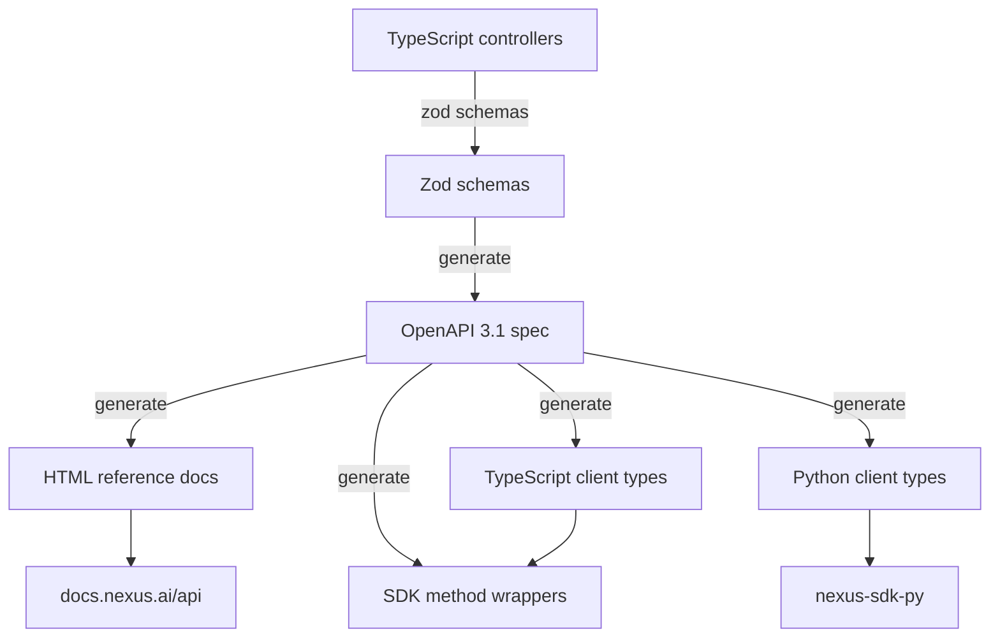

# NX-ARCH-0402 — API Documentation Standards

| Field | Value |
|-------|-------|
| **Document ID** | NX-ARCH-0402 |
| **Title** | API Documentation Standards |
| **Phase** | 10 — Future Expansion |
| **Owner** | Documentation AI (NX-AGENT-7061) + Backend AI (NX-AGENT-7055) |
| **Status** | 🟢 Complete |
| **Version** | 0.1.0 |
| **Created** | 2026-07-03 |
| **Depends on** | NX-ARCH-0003, NX-ARCH-0201 (API Surface), NX-ARCH-0401 (Coding Standards) |

---

## 1. Mission

Define how NEXUS APIs are documented — the source-of-truth artifact (OpenAPI), the writing style, the examples, the SDK sync — so any developer can pick up the docs and ship a working integration without asking questions.

## 2. The source of truth

Per NX-DOC-0011 P10 and the API Surface (NX-ARCH-0201), the **OpenAPI 3.1 spec is the source of truth**. Everything else (HTML docs, TypeScript types, SDK methods) is generated from it.



Properties:

- **One source.** The OpenAPI spec at `services/api/openapi.yaml` is the only place the API shape is described.
- **Generated, not hand-edited.** The Zod schemas in the controllers are the human-edited input; the OpenAPI YAML is generated.
- **CI-validated.** The spec is validated on every PR; a PR that breaks the spec fails the build.
- **Versioned.** The spec version matches the API version (`v1`, `v2`).

## 3. The OpenAPI spec structure

```yaml
openapi: 3.1.0
info:
  title: NEXUS API
  version: 1.0.0
  description: |
    The NEXUS public API. See https://docs.nexus.ai/api for the rendered reference.
  contact:
    name: NEXUS Developer Relations
    url: https://nexus.ai/support
  license:
    name: Proprietary
servers:
  - url: https://api.nexus.ai/v1
    description: Production
  - url: https://api.staging.nexus.ai/v1
    description: Staging
security:
  - bearerAuth: []
tags:
  - name: agents
  - name: workspaces
  - name: cloud-browsers
  # ... one per resource group
paths:
  /agents:
    get: ...
    post: ...
  /agents/{id}:
    get: ...
    patch: ...
    delete: ...
components:
  schemas: ...
  securitySchemes: ...
  parameters: ...
  responses: ...
```

Properties:

- **One file per resource group** (`agents.yaml`, `workspaces.yaml`, etc.) composed into one root `openapi.yaml`.
- **Schemas are named with the resource prefix** (`Agent`, `AgentRun`, not just `Run`).
- **Every operation has a `summary`, `description`, and `tags`.**
- **Every response has a schema, even errors.**

## 4. The per-operation contract

Every operation documents:

- **`summary`** — one-line summary.
- **`description`** — multi-line description; what it does, when to use it, edge cases.
- **`operationId`** — unique ID; used for SDK method names.
- **`tags`** — resource group.
- **`parameters`** — path, query, header.
- **`requestBody`** — for write operations; describes the schema and gives an example.
- **`responses`** — at minimum: `200`, `400`, `401`, `403`, `404`, `429`, `500`. Each with a schema (or `$ref` to an error schema).
- **`security`** — overrides the global if needed.
- **`x-codeSamples`** — code samples in TypeScript, Python, cURL. (Custom OpenAPI extension; supported by Redoc, Stoplight, ReadMe.)
- **`x-side-effects`** — NEXUS extension: "idempotent", "creates-billing-event", "starts-workflow", etc. (Used by the SDK to pick the right client behavior.)

## 5. The schema contract

Every schema documents:

- **`description`** — what the field means.
- **`type`** — the JSON Schema type.
- **`format`** — where applicable (date-time, email, uri, uuid).
- **`example`** — a realistic example.
- **`nullable`** — explicit, not implicit.
- **`enum`** — for fixed sets, with descriptions per value.
- **`readOnly`** / **`writeOnly`** — for fields that only appear in one direction.
- **`deprecated`** — with a `description` pointing to the replacement.

```yaml
AgentRun:
  type: object
  required: [id, agent_id, status, created_at]
  properties:
    id:
      type: string
      format: uuid
      description: Unique identifier for the run.
      readOnly: true
      example: "ar_01H8B2C..."
    agent_id:
      type: string
      description: The ID of the agent that ran (e.g., NX-AGENT-7003).
      example: "NX-AGENT-7003"
    status:
      type: string
      enum: [pending, running, succeeded, failed, canceled]
      description: |
        The current status of the run.
        - `pending`: queued, not yet started
        - `running`: actively executing
        - `succeeded`: completed without error
        - `failed`: completed with error
        - `canceled`: canceled by user or system
    created_at:
      type: string
      format: date-time
      readOnly: true
    completed_at:
      type: string
      format: date-time
      readOnly: true
      nullable: true
    output:
      type: object
      description: The agent's final output. Type depends on the agent.
      additionalProperties: true
      nullable: true
```

## 6. The error contract

All errors share a common envelope (NX-API-8001–8099 range; see NX-ARCH-0201).

```yaml
Error:
  type: object
  required: [error]
  properties:
    error:
      type: object
      required: [code, message]
      properties:
        code:
          type: string
          description: |
            A machine-readable error code from the NEXUS error catalog.
            See https://docs.nexus.ai/errors for the full list.
          example: "NX-ERR-1004"
        message:
          type: string
          description: |
            A human-readable message. Safe to show to end users.
          example: "Workspace not found"
        details:
          type: object
          description: |
            Optional structured details. Schema depends on the error code.
          additionalProperties: true
        request_id:
          type: string
          description: |
            The request ID for tracing. Include this when reporting issues.
          example: "req_01H8B2C..."
```

Errors are documented per status code in the `responses` section:

```yaml
responses:
  '404':
    description: The workspace does not exist or the user does not have access.
    content:
      application/json:
        schema:
          $ref: '#/components/schemas/Error'
        example:
          error:
            code: "NX-ERR-1004"
            message: "Workspace not found"
            request_id: "req_01H8B2C..."
```

## 7. The example contract

Every operation has at least one example per language:

```yaml
x-codeSamples:
  - lang: TypeScript
    source: |
      import { Nexus } from '@nexus/sdk';
      const nx = new Nexus({ apiKey: process.env.NEXUS_API_KEY });
      const run = await nx.agents.run({
        agent: 'NX-AGENT-7003',
        input: { task: 'Research quantum computing' },
      });
      console.log(run.output);
  - lang: Python
    source: |
      from nexus import Nexus
      nx = Nexus(api_key=os.environ['NEXUS_API_KEY'])
      run = nx.agents.run(
        agent='NX-AGENT-7003',
        input={'task': 'Research quantum computing'},
      )
      print(run.output)
  - lang: cURL
    source: |
      curl -X POST https://api.nexus.ai/v1/agents/run \
        -H "Authorization: Bearer $NEXUS_API_KEY" \
        -H "Content-Type: application/json" \
        -d '{"agent": "NX-AGENT-7003", "input": {"task": "Research quantum computing"}}'
```

The examples are:

- **Syntactically valid** — verified by CI (the code samples are parsed and type-checked).
- **Realistic** — actual agent IDs, real-looking task descriptions.
- **Complete** — show imports, auth, error handling for at least one example per resource.

## 8. The changelog contract

Every breaking change is documented in:

- The OpenAPI `description` of the deprecated field (with a `deprecated: true` and a pointer).
- A migration guide in `docs/migrations/`.
- A `CHANGELOG.md` entry.

The deprecation window per NX-DOC-0011 P13: at least 6 months for SDK, 12 months for the REST API.

## 9. The hosting

API docs are hosted at `docs.nexus.ai/api`. The site is built from the OpenAPI spec using:

- **Redoc** for the reference (renders OpenAPI 3.1 beautifully).
- **Custom MDX** for guides, tutorials, and concepts.
- **Algolia DocSearch** for search.

The site is rebuilt on every PR that touches the OpenAPI spec; the dev preview is a per-PR URL.

## 10. The style guide for prose

- **Direct, present tense.** "Returns the run." Not "Will return the run."
- **Second person.** "You can pass..." Not "The user can pass..."
- **Active voice.** "The agent runs the task." Not "The task is run by the agent."
- **No marketing.** "Powerful" is not a technical term.
- **Sentence-case headings.** "Run an agent" not "Run An Agent".
- **Code in backticks** for inline, fenced for blocks.
- **JSON examples are valid.** Tested in CI.

## 11. The review

Every PR that touches the OpenAPI spec is reviewed by:

1. The author (their own code sample must work).
2. The relevant agent (Backend, Frontend, etc.).
3. The Documentation AI (NX-EM-9606) — final read for prose quality.
4. A human (for changes to the public API surface).

The review checks:

- Spec is valid OpenAPI 3.1.
- All new operations have summaries, descriptions, and code samples.
- All new fields have descriptions and examples.
- Deprecations follow the contract.
- No PII or secrets in examples.

## 12. Failure modes

| Failure | Behavior |
|---------|----------|
| OpenAPI spec invalid | CI fails; PR blocked |
| Code sample doesn't compile | CI fails; PR blocked (catches drift) |
| Missing description on a field | Lint fails; PR blocked |
| Doc site broken | Build fails; PR blocked |
| Deprecation window missed | Documented exception; emergency release |
| Search index stale | Auto-rebuild; if it fails, alert |

## 13. Open questions

- Q: Move from Redoc to Mintlify for the docs site? (Decision: H2; Redoc is fine for H1, Mintlify has better DX for guides.)
- Q: AsyncAPI for the WebSocket API? (Decision: yes, H2; the WS schema is documented in prose today.)
- Q: Auto-generate tutorials from the OpenAPI + user journeys? (Decision: H3; too brittle in H1.)

## 14. Reading list

- **Overview** — NX-ARCH-0003
- **API Surface** — NX-ARCH-0201
- **Coding Standards** — NX-ARCH-0401
- **SDK Design** — NX-ARCH-0403
- **Plugin Development** — NX-ARCH-0404
- **Contribution Guide** — NX-ARCH-0405
- **Documentation AI Manifest** — NX-EM-9606
- **Backend AI Manifest** — NX-EM-9603
- **Technical Principles** — NX-DOC-0011 (P10, P13)

---

*End NX-ARCH-0402.*
