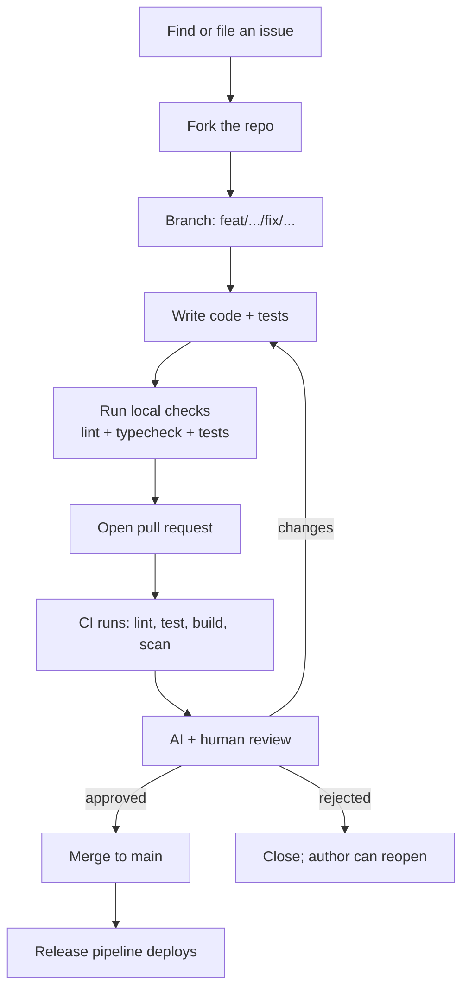
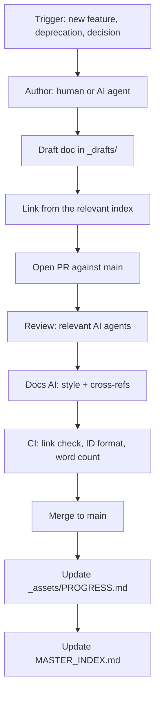

# NX-ARCH-0405 — Contribution Guide & Governance

| Field | Value |
|-------|-------|
| **Document ID** | NX-ARCH-0405 |
| **Title** | Contribution Guide & Governance |
| **Phase** | 10 — Future Expansion |
| **Owner** | CEO AI (NX-AGENT-7050) + Documentation AI (NX-AGENT-7061) |
| **Status** | 🟢 Complete |
| **Version** | 0.1.0 |
| **Created** | 2026-07-03 |
| **Depends on** | NX-ARCH-0003, NX-ARCH-0401 (Coding Standards), NX-WF-9001 (Eng Org), NX-WF-9003 (Quality Gates) |

---

## 1. Mission

Define how contributions to the NEXUS codebase and the NEXUS blueprint are made, reviewed, merged, and governed — so the engineering org (human and AI) operates on a clear, public contract, and the barrier to contributing is low while the bar is high.

## 2. The two contribution surfaces

NEXUS has two distinct contribution surfaces, each with its own flow.

| Surface | What it is | Audience | Repo |
|---------|------------|----------|------|
| **The codebase** | The implementation repos (frontend, backend, browser, SDK) | Employees, core contributors, AI agents | `github.com/nexus/*` |
| **The blueprint** | This repository (the NEXUS Blueprint) | Engineering org, AI agents, future contributors | `github.com/nexus/blueprint` |

This document covers **both**. The blueprint surface is unusual: it's a Markdown-only repo maintained primarily by AI agents, with human review and override.

## 3. The codebase contribution flow



### 3.1 Finding work

- **GitHub Issues** is the system of record. Issues are triaged by the relevant AI agent (e.g., Backend AI triages `services/api/*` issues).
- **Good first issues** are labeled `good-first-issue`; these are scoped for new contributors.
- **Bounties** are tagged `bounty/$<amount>`; the issue is closed by the PR that resolves it, and the bounty is paid via the contributor's GitHub Sponsors.

### 3.2 The branch and commit

See `NX-ARCH-0401` §9.1 and §9.2.

### 3.3 The PR

The PR description must include:

- **What** changed.
- **Why** it changed (link to the issue).
- **How to test** (steps a reviewer can follow).
- **Screenshots** for UI changes.
- **Migration notes** for breaking changes.
- **Risk** assessment (low / medium / high).

The PR template is enforced via `.github/pull_request_template.md`.

### 3.4 The CI

Every PR runs the full CI:

- Lint, typecheck, format check.
- Unit, integration, contract tests.
- Build (image, chart).
- Trivy scan.
- Code coverage diff.
- License check (no GPL-incompatible code in proprietary modules).
- Doc link check.
- A11y check for UI changes (axe-core).
- Bundle size check for frontend (regression > 5% blocks).

The CI must be green for merge; admins can override only with a written reason and a follow-up issue.

### 3.5 The review

Reviewers are assigned by CODEOWNERS. The relevant AI agent **must** review; a human **may** review additionally.

| Change scope | Required reviewers |
|--------------|---------------------|
| `services/api/**` | Backend AI + 1 human |
| `services/worker/**` | Backend AI |
| `services/browser/**` | Browser AI + 1 human |
| `services/ai-platform/**` | AI Platform AI + 1 human |
| `apps/desktop/**` | Frontend AI + 1 human |
| `packages/sdk/**` | Backend AI + Docs AI |
| `plugins/official/**` | Backend AI + Security AI |
| `infra/**` | DevOps AI + Security AI |
| `auth/**`, `billing/**`, `agent-runtime/**` | Security AI + 1 human (CTO) |
| `docs/**` | Docs AI |
| `*.md` (README, etc.) | Docs AI |

The AI agents review with the prompts in `99_MASTER_PROMPTS/Workflows/`. They look for:

- Correctness (does it do what it claims?).
- Tests (are the tests meaningful? coverage dropped?).
- Security (any new attack surface? auth checked? PII handled?).
- Performance (any new hot path? latency impact?).
- Style (matches `NX-ARCH-0401`).
- Doc (README updated? API doc updated? changelog entry?).
- Backwards compatibility (deprecation followed?).

A PR is merged when:

- All required reviewers approve.
- CI is green.
- The PR has no unresolved conversations.
- The branch is up to date with `main`.

## 4. The blueprint contribution flow

The blueprint is a Markdown-only repo. It is **not** the implementation; it's the source of truth for *what NEXUS is and why*.



### 4.1 The triggers

A blueprint change is triggered by:

- A new feature, anchor, or agent (Phase 2–4 work).
- A new phase starting.
- An architecture decision.
- A deprecation or removal.
- A correction of fact, link, or style.

### 4.2 The author

- The **AI engineering org** is the primary author (per `NX-WF-9001`).
- A **human founder or contributor** can author or co-author.
- A **community contributor** can open a PR; the AI agents review and adopt or decline.

### 4.3 The doc template

Every blueprint doc follows the structure of its phase (per Phase 1/2/3/4/5/6/7/8/9/10 conventions). The common header is the identity table:

```markdown
# NX-XXX-NNNN — <Title>

| Field | Value |
|-------|-------|
| **Document ID** | NX-XXX-NNNN |
| **Title** | <Title> |
| **Phase** | N — <Phase Name> |
| **Owner** | <Role> (<Agent ID>) |
| **Status** | ⚪ / 🟡 / 🟢 / 🔵 / 🔴 |
| **Version** | 0.1.0 |
| **Created** | YYYY-MM-DD |
| **Depends on** | NX-XXX-NNNN, ... |
```

The ID is assigned in order from the registry (`_assets/DOCUMENT_REGISTRY.md`); cross-references use the format `NX-XXX-NNNN`.

### 4.4 The review

Blueprint reviews check:

- **ID is registered** in the doc registry.
- **Cross-references resolve** (the link checker runs in CI).
- **Word count is within budget** (per phase).
- **Mermaid diagrams render** (rendered in CI with `mmdc`).
- **Prose matches the style guide** (Docs AI reviews).
- **Technical content is correct** (relevant AI agent reviews).
- **No PII or secrets** in any doc.

## 5. The governance model

NEXUS's governance is dual-track: AI-led, human-overridden.

### 5.1 Authority

| Decision | Authority |
|----------|-----------|
| Daily engineering work | AI engineering org |
| Roadmap within a quarter | CEO AI (NX-AGENT-7050) |
| Cross-quarter strategy | Human founder + CEO AI |
| Pricing, business model | Human founder |
| Security incident response | Security AI + human founder |
| Breaking API change | CTO AI + human founder |
| Deprecation of a public feature | CPO AI + human founder |
| A doc in the blueprint | AI engineering org + Docs AI |
| Adding a new phase | Human founder |

### 5.2 The override

A human can override any AI decision, with a written reason. The override is logged in the decisions log of the relevant doc or in `_assets/PROGRESS.md`.

An AI can defer a decision to a human when:

- The decision is irreversible.
- The decision involves values (e.g., content moderation).
- The decision is above its cost threshold.
- The decision conflicts with another AI's domain.

The human founder is the final escalation.

### 5.3 The advisory board

An **advisory board** of 3–5 humans meets quarterly to review strategy, product direction, and the AI org's performance. The board:

- Has access to metrics, financials, and roadmaps.
- Can recommend changes; the founder decides.
- Is published on the website (with permission).

The board is **advisory**, not governing; the founder is the final authority.

## 6. Code of conduct

NEXUS has a [Code of Conduct](https://nexus.ai/code-of-conduct) based on the Contributor Covenant. It applies to:

- All GitHub repositories.
- The Discord community.
- The community calls.
- In-person events.

Violations are reviewed by the CEO AI + 1 human; enforcement is graduated (warning → temp ban → permanent ban).

## 7. Recognition

NEXUS recognizes contributors publicly:

- **Contributors list** in the repo and on the website.
- **Per-release credits** in the changelog.
- **Hall of fame** for sustained, high-impact contributions.
- **Bounties** for specific issues (paid via GitHub Sponsors).
- **Equity grants** for the most impactful contributors (H2 program).

The recognition is granted by the CEO AI; the human founder approves.

## 8. Security disclosures

Security issues are reported via `security@nexus.ai` (encrypted, per the disclosure policy in `NX-EM-9605` §Security). Reporters are credited in the security advisory if they consent. The policy:

- **Acknowledgment** within 24 hours.
- **Triage** within 3 business days.
- **Fix** within SLA per severity (CRITICAL: 24h; HIGH: 7d; MEDIUM: 30d).
- **Disclosure** 90 days after the fix ships, or sooner if mutually agreed.
- **Bounty** for valid reports, scaled by severity (range: $100–$50,000).

## 9. The CLA

External contributors sign a **Contributor License Agreement** (CLA) on their first PR. The CLA:

- Grants NEXUS a license to use the contribution.
- Confirms the contributor has the right to grant the license.
- Does **not** transfer copyright (the contributor keeps it).
- Is signed via a GitHub Action (CLA Assistant).

The CLA is enforced by CI; a PR from an unsigned contributor is blocked.

## 10. Failure modes

| Failure | Behavior |
|---------|----------|
| PR template missing info | Bot prompts the author |
| CI fails | PR blocked; author fixes |
| Reviewer doesn't respond | 3 business days → escalate to the reviewer's manager AI |
| Conflict between AI reviewers | Docs AI arbitrates; escalates to CTO AI |
| Conflict between human and AI | Human override logged; decision recorded |
| Contributor Code of Conduct violation | CEO AI + 1 human review; action |
| Security report | Engages `security@nexus.ai`; follows the disclosure policy |

## 11. Open questions

- Q: Should the advisory board be paid? (Decision: H2; small equity grants for H1.)
- Q: How do we onboard new external contributors efficiently? (Decision: "Good first issues" + a 30-min video + the `CONTRIBUTING.md` walkthrough.)
- Q: How do we prevent AI agents from rubber-stamping each other's PRs? (Decision: random sampling by Docs AI; review quality is itself reviewed.)

## 12. Reading list

- **Overview** — NX-ARCH-0003
- **Coding Standards** — NX-ARCH-0401
- **API Documentation** — NX-ARCH-0402
- **SDK Design** — NX-ARCH-0403
- **Plugin Development** — NX-ARCH-0404
- **Engineering Org Overview** — NX-WF-9001
- **Quality Gates** — NX-WF-9003
- **Escalation Paths** — NX-WF-9004
- **CEO AI Manifest** — NX-EM-9601
- **Documentation AI Manifest** — NX-EM-9606
- **Security AI Manifest** — NX-EM-9605
- **Technical Principles** — NX-DOC-0011 (P10)

---

*End NX-ARCH-0405.*
