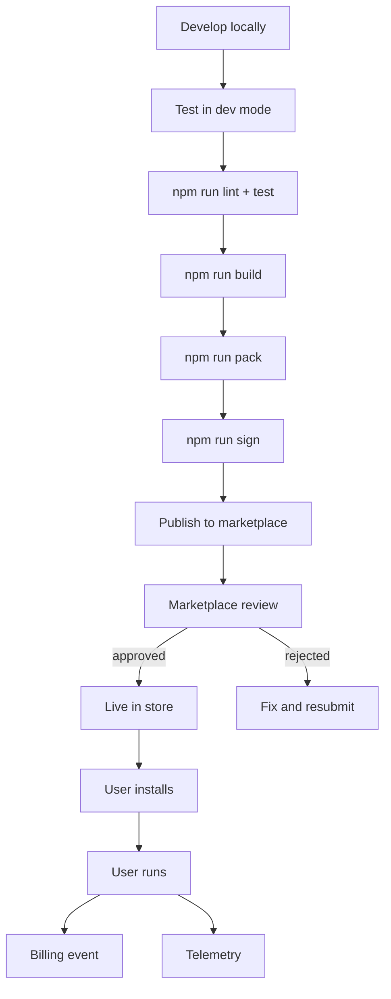
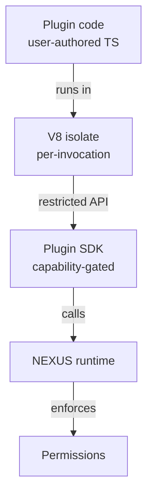
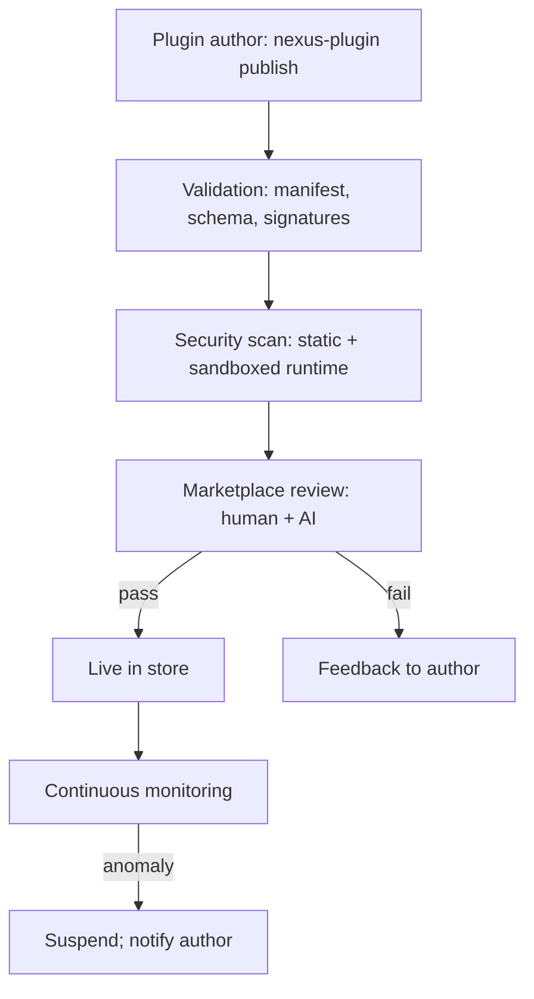

# NX-ARCH-0404 — Plugin Development Guide

| Field | Value |
|-------|-------|
| **Document ID** | NX-ARCH-0404 |
| **Title** | Plugin Development Guide |
| **Phase** | 10 — Future Expansion |
| **Owner** | Backend AI (NX-AGENT-7055) + Frontend AI (NX-AGENT-7054) + Docs AI (NX-AGENT-7061) |
| **Status** | 🟢 Complete |
| **Version** | 0.1.0 |
| **Created** | 2026-07-03 |
| **Depends on** | NX-ARCH-0003, NX-ARCH-0201 (API Surface), NX-ARCH-0403 (SDK), NX-FEAT-1500 (Marketplace anchor) |

---

## 1. Mission

Define how third-party developers build NEXUS plugins — the manifest format, the lifecycle, the API surface, the permissions model, the publishing flow, and the SDK — so anyone can extend NEXUS with a new agent, integration, or UI surface, and ship it to the marketplace in days, not months.

## 2. What a plugin is

A **NEXUS plugin** is a packaged, signed, versioned unit of behavior that extends the platform. There are three kinds, each with a different shape.

| Kind | What it adds | Examples | Runtime |
|------|--------------|----------|---------|
| **Agent plugin** | A new AI agent (per NX-AGENT-70## pattern) | "LinkedIn outreach agent", "Legal contract reviewer" | Sandboxed JS / TS execution |
| **Integration plugin** | A connector to an external service | "Gmail", "Notion", "Linear" | OAuth + webhook + SDK |
| **UI plugin** | A new surface in the NEXUS app | "Custom dashboard widget", "Settings panel" | React + NEXUS UI SDK |

This document covers the common machinery. Agent-specific details (tool schema, prompt format) are in `NX-AGENT-7001` (Agent Contract). Integration details (OAuth, webhooks) are in `NX-ARCH-0201` (API Surface) and `NX-ARCH-0204` (Event System).

## 3. The plugin manifest

Every plugin has a `manifest.json` at its root. The manifest is the **only** required file; everything else is conventional.

```json
{
  "id": "com.acme.linkedin-outreach",
  "name": "LinkedIn Outreach",
  "version": "1.2.3",
  "kind": "agent",
  "description": "Finds leads and sends personalized connection requests.",
  "author": {
    "id": "acme",
    "name": "Acme Corp",
    "url": "https://acme.com",
    "support": "support@acme.com"
  },
  "license": "Proprietary",
  "homepage": "https://acme.com/nexus-plugin",
  "repository": "https://github.com/acme/nexus-plugin-linkedin",
  "icon": "icon.png",
  "screenshots": ["screen1.png", "screen2.png"],
  "permissions": [
    "agents:run",
    "cloud-browsers:use:linkedin.com",
    "memory:read:workspace",
    "memory:write:workspace",
    "events:subscribe:agent.run.completed"
  ],
  "agent": {
    "id": "NX-AGENT-XXXX",
    "entry": "dist/agent.js",
    "model": "claude-opus-4.5",
    "tools": [
      { "name": "linkedin_search", "schema": "./tools/search.json" },
      { "name": "linkedin_connect", "schema": "./tools/connect.json" }
    ]
  },
  "integrations": {
    "linkedin": {
      "oauth": {
        "authorizationUrl": "https://www.linkedin.com/oauth/v2/authorization",
        "tokenUrl": "https://www.linkedin.com/oauth/v2/accessToken",
        "scopes": ["r_liteprofile", "r_emailaddress", "w_member_social"]
      }
    }
  },
  "events": {
    "subscribes": ["contact.created"],
    "publishes": ["lead.qualified"]
  },
  "ui": {
    "settings": "ui/Settings.tsx",
    "widget": "ui/Widget.tsx"
  },
  "pricing": {
    "model": "free" | "freemium" | "paid" | "usage",
    "trialDays": 14
  },
  "minNexusVersion": "1.0.0"
}
```

Properties:

- **Reverse-DNS `id`.** Globally unique; used as the directory name in the marketplace and the npm scope.
- **Semver `version`.** Breaking changes bump major; marketplace enforces upgrade flow.
- **Strict `permissions` list.** Each permission is a string; the runtime enforces.
- **Tool schemas are referenced by path.** The schemas are validated at publish time and at install time.
- **`minNexusVersion`** prevents installing a plugin on an incompatible host.

## 4. The plugin lifecycle



## 5. The local development loop

```bash
# 1. Scaffold
npx create-nexus-plugin my-plugin --kind=agent
cd my-plugin

# 2. Develop
$EDITOR src/agent.ts

# 3. Run in dev mode (live-reload against your local NEXUS)
nexus-plugin dev
# ↳ connects to localhost:3000, registers a dev-mode plugin
# ↳ watches files, rebuilds on change

# 4. Test
npm test

# 5. Lint
npm run lint
```

The `nexus-plugin` CLI is the dev tool; it ships with `@nexus/plugin-dev` and provides:

- `dev` — live-reload against a local NEXUS
- `test` — runs unit + integration tests in an isolated sandbox
- `build` — produces the packaged plugin
- `sign` — signs with the developer's key
- `publish` — uploads to the marketplace
- `logs <plugin-id>` — tails the plugin's logs
- `info <plugin-id>` — shows installed version, permissions, status

## 6. The execution sandbox

Agent plugins run in a **double-sandboxed** environment.



Properties:

- **V8 isolate per invocation** (or per session, depending on the agent's needs). Memory and CPU are bounded.
- **No direct network.** The plugin calls NEXUS APIs through the SDK; raw fetch is blocked.
- **No filesystem.** All I/O goes through NEXUS (storage, attachments).
- **No process spawning.** No `child_process`, no `eval` of dynamic code.
- **Per-invocation timeout** (default 5 minutes; configurable per plugin).
- **Per-invocation cost cap** (default $1; configurable per plugin; the user is warned at 80%).

The V8 isolate is provided by the Browser AI manifest's runtime (NX-EM-9611); the agent framework (NX-AGENT-70##) is the host.

## 7. The permissions model

Every action a plugin takes is gated by a permission. The permissions are declared in the manifest, approved at install time by the user, and enforced at runtime.

Permission strings have the form `<resource>:<action>[:<scope>]`.

| Permission | Effect |
|------------|--------|
| `agents:run` | Can invoke agents |
| `cloud-browsers:use:<domain>` | Can drive a Cloud Browser on the given domain |
| `memory:read:workspace` | Can read this workspace's memory |
| `memory:write:workspace` | Can write to this workspace's memory |
| `events:subscribe:<event_type>` | Can subscribe to events |
| `events:publish:<event_type>` | Can publish events |
| `webhooks:receive` | Can register webhook endpoints |
| `billing:read:user` | Can read the user's billing info |
| `storage:read:workspace` / `storage:write:workspace` | Can read/write files in workspace storage |
| `ui:show:<surface>` | Can show UI in a named surface (e.g., `home.widget`, `workspace.panel`) |

A user installing a plugin sees the permission list and must accept. The user can later revoke a permission; revoking a permission causes the plugin to be notified and may cause some features to stop working (the plugin must handle this gracefully).

## 8. The marketplace publishing flow



The review checks:

- **Manifest is valid.** All referenced files exist; tool schemas are valid; permissions are reasonable.
- **Static analysis** passes (no obvious malware patterns).
- **Sandboxed runtime test** runs the plugin for 1 hour with synthetic data; no resource abuse, no network exfiltration.
- **Documentation** is present and accurate.
- **License and attribution** are clear.
- **Pricing is fair** (per the marketplace's pricing rules).

A plugin can be **suspended** at any time for cause (security incident, ToS violation, user complaints). The author is notified; the plugin can request reinstatement after fixes.

## 9. Versioning and upgrades

- **Semver.** Breaking changes to the plugin's manifest or tool schemas bump major.
- **Per-user version.** A user can have multiple versions of the same plugin installed in different workspaces.
- **Auto-upgrade opt-in.** By default, plugins auto-upgrade to the latest patch and minor; major upgrades require user approval.
- **Changelog required.** Every new version has a changelog; the user sees it before upgrading.

## 10. Telemetry and observability

The plugin runtime emits (per `NX-AGENT-7013` and `NX-ARCH-0204`):

- `plugin.installed`
- `plugin.uninstalled`
- `plugin.invocation.started`
- `plugin.invocation.completed` (with `status`, `duration_ms`, `cost_usd`)
- `plugin.error` (with `code`, `message`, `stack`)

The author sees their plugin's metrics in the marketplace dashboard (per `NX-FEAT-1500`): installs, active users, invocations, error rate, revenue.

The **plugin author never sees user data** in the telemetry. Metrics are aggregate only; individual invocations are visible to the plugin author for their own testing, not for other users.

## 11. Billing and revenue

Per `NX-FEAT-1500` (Marketplace anchor) and the Phase 8 docs:

- **Free** — no charge; author gets visibility only.
- **Freemium** — free tier + paid upgrade.
- **Paid** — one-time or subscription.
- **Usage** — per-invocation or per-token.

The marketplace takes a 30% cut (industry standard, per Phase 8). Payments via Stripe Connect; the author receives payouts monthly.

## 12. Example: a minimal agent plugin

```typescript
// src/agent.ts
import { defineAgent, tool } from '@nexus/plugin-sdk';

export default defineAgent({
  id: 'com.acme.hello-world',
  model: 'claude-opus-4.5',
  prompt: `You are a friendly greeter. Greet the user by name.`,
  tools: [
    tool({
      name: 'get_time',
      description: 'Get the current time',
      input: { type: 'object', properties: {} },
      run: async () => ({ time: new Date().toISOString() }),
    }),
  ],
  run: async ({ input, tools, llm }) => {
    const { time } = await tools.get_time();
    const text = await llm.complete({
      prompt: `Greet ${input.user_name}. Current time: ${time.time}.`,
    });
    return { greeting: text };
  },
});
```

The minimal plugin: one file, one tool, one run. The CLI scaffolds the manifest, the tests, the build, and the publish.

## 13. Failure modes

| Failure | Behavior |
|---------|----------|
| Manifest invalid | CLI refuses; specific error |
| Sandbox resource cap hit | Invocation canceled; user notified; plugin author notified |
| Permission denied | SDK call throws `PermissionError`; plugin must handle |
| Network blocked | Raw fetch is blocked; SDK calls work |
| Plugin crashes | Isolated; user sees error; plugin author sees stack in dashboard |
| Marketplace rejection | Author gets feedback; can resubmit |
| Auto-upgrade breaks user | Rollback to last working version; user notified |

## 14. Open questions

- Q: Should plugins be able to ship their own Rust extensions (for performance)? (Decision: H2; "native" plugin kind.)
- Q: Cross-workspace plugins? (Decision: H2; "global" permission requires enterprise tier.)
- Q: Can plugins define their own UI surfaces, or only use the built-in ones? (Decision: H1: built-in only. H2: custom surfaces via the UI plugin kind.)
- Q: Plugin-to-plugin communication? (Decision: H2; via events.)

## 15. Reading list

- **Overview** — NX-ARCH-0003
- **API Surface** — NX-ARCH-0201
- **Authentication** — NX-ARCH-0202
- **Event System** — NX-ARCH-0204
- **SDK Design** — NX-ARCH-0403
- **Coding Standards** — NX-ARCH-0401
- **Contribution Guide** — NX-ARCH-0405
- **Agent Contract** — NX-AGENT-7001
- **Tool Schema** — NX-AGENT-7011
- **Memory Schema** — NX-AGENT-7010
- **Agent Marketplace anchor** — NX-FEAT-1500
- **Backend AI Manifest** — NX-EM-9603
- **Frontend AI Manifest** — NX-EM-9608
- **Documentation AI Manifest** — NX-EM-9606
- **Technical Principles** — NX-DOC-0011 (P1, P4, P7, P11)

---

*End NX-ARCH-0404.*
