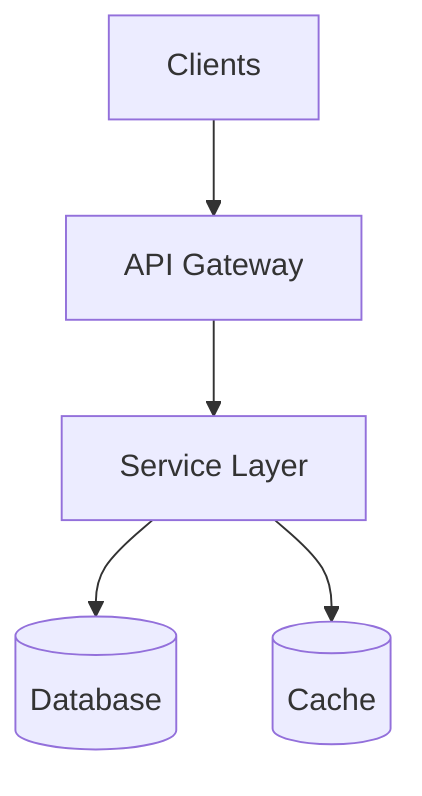
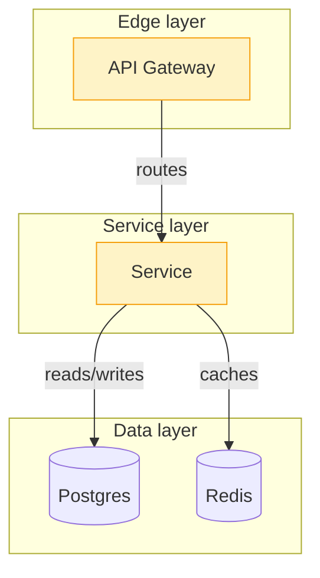
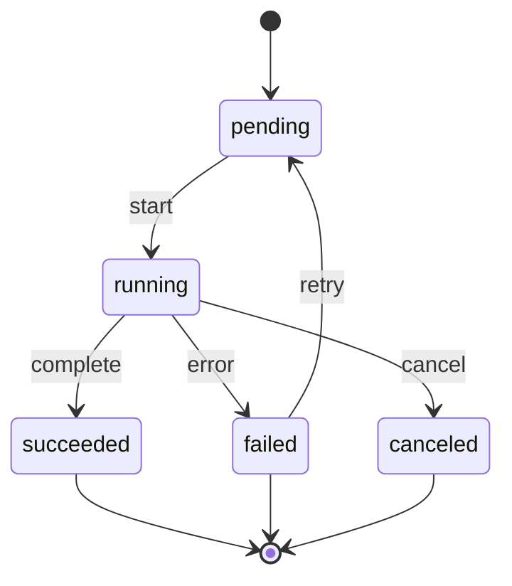
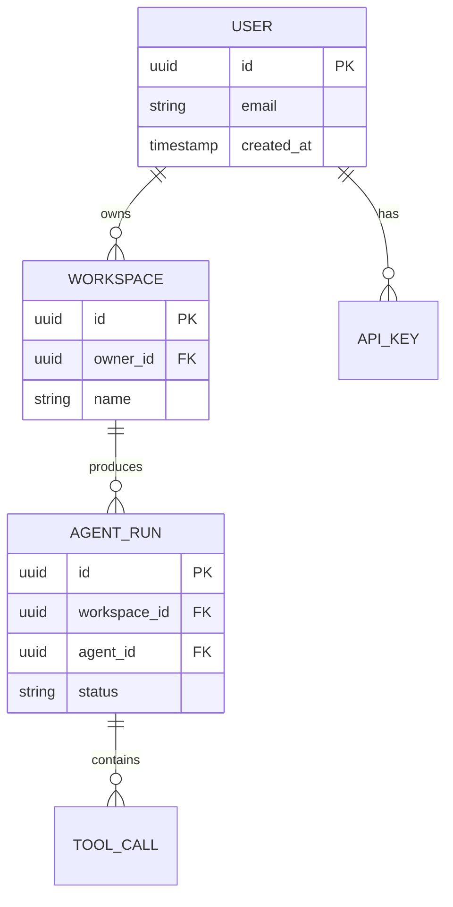
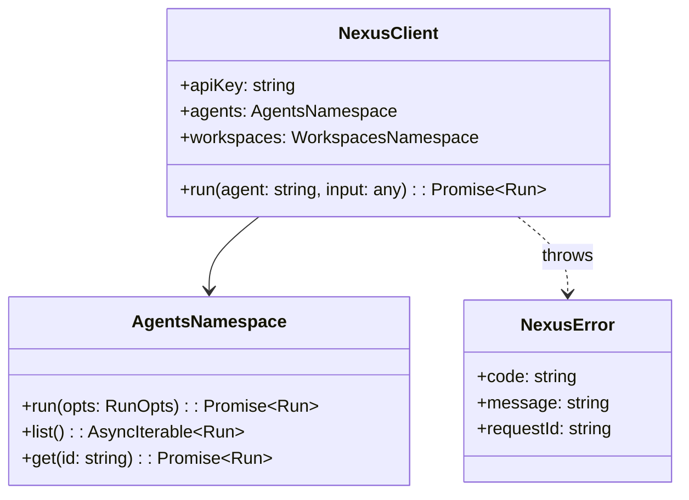
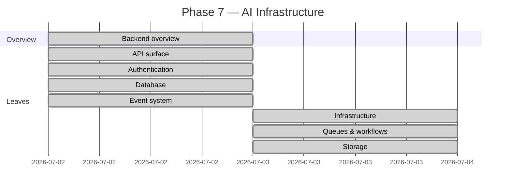
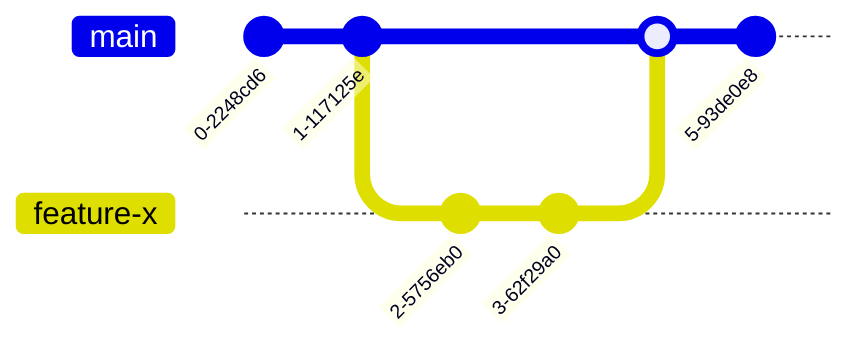
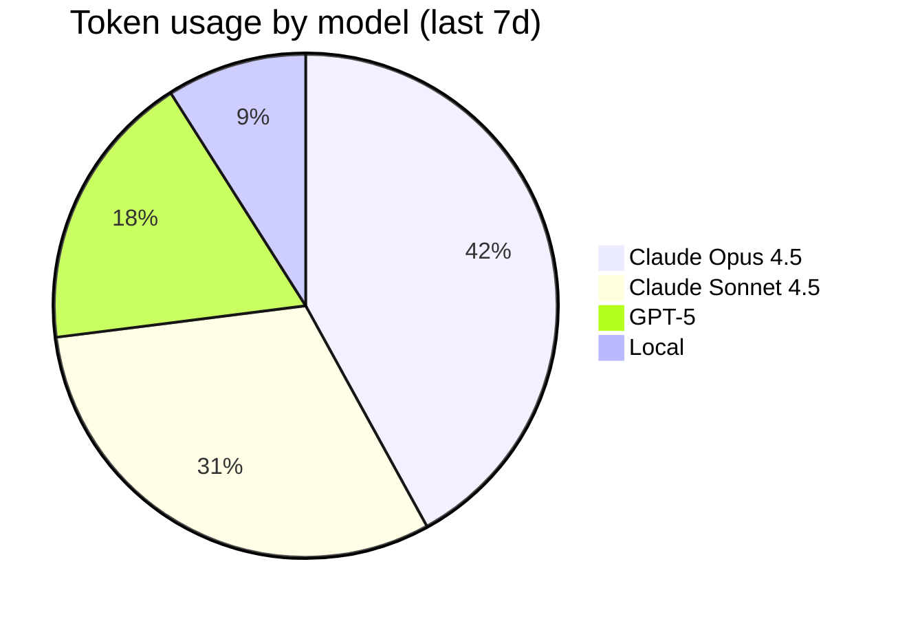
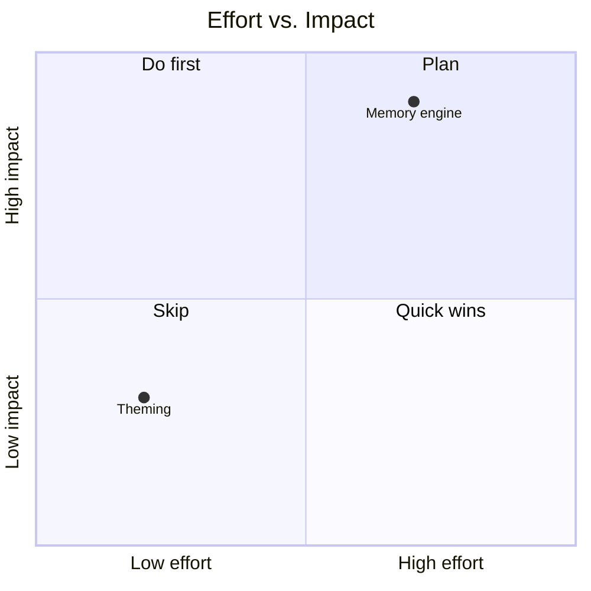
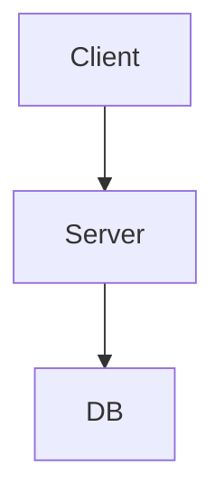

# NX-ARCH-0502 — Diagram Library & Conventions

| Field | Value |
|-------|-------|
| **Document ID** | NX-ARCH-0502 |
| **Title** | Diagram Library & Conventions |
| **Phase** | 10 — Future Expansion |
| **Owner** | Documentation AI (NX-AGENT-7061) |
| **Status** | 🟢 Complete |
| **Version** | 0.1.0 |
| **Created** | 2026-07-03 |
| **Depends on** | NX-ARCH-0003, NX-ARCH-0501 (Workflows) |

---

## 1. Mission

Define the canonical diagram patterns NEXUS uses in the blueprint and the broader docs — Mermaid syntax, naming, styling, and per-diagram-kind conventions — so every doc renders consistently, every diagram is legible, and the AI agents that produce diagrams do so predictably.

## 2. The diagram tool

All diagrams are **Mermaid**. Rationale (per NX-DOC-0011 P1):

- Renders natively in GitHub, GitLab, VS Code, most Markdown viewers.
- Text-based → version-controlled, diff-able, reviewable.
- No external tool needed.
- Supports the diagram kinds NEXUS uses (flowchart, sequence, state, ER, class, gantt).

Specific Mermaid configuration is applied via a `_config.yml` (or per-doc frontmatter if supported). The default is:

```yaml
---
mermaid:
  theme: neutral
  flowchart:
    htmlLabels: true
  sequence:
    mirrorActors: false
---
```

The theme is `neutral` for portability. Color is used sparingly to highlight a specific node or path; not for decoration.

## 3. The diagram kinds

NEXUS uses a small, well-defined set of diagram kinds. Each has a canonical pattern.

| Kind | Mermaid | When to use |
|------|---------|-------------|
| **Flow / architecture** | `flowchart` | Layered systems, request paths, component relationships |
| **Sequence** | `sequenceDiagram` | Time-ordered interactions between actors |
| **State machine** | `stateDiagram-v2` | Lifecycle of a resource, an agent, a workflow |
| **ER** | `erDiagram` | Database schema, entity relationships |
| **Class** | `classDiagram` | Type relationships, plugin classes |
| **Gantt** | `gantt` | Roadmaps, schedules, timelines |
| **Git graph** | `gitGraph` | Branch and merge topology (used sparingly) |
| **Pie / quadrant** | `pie` / `quadrantChart` | Metrics dashboards, prioritization matrices |

The next sections give the canonical pattern for each.

## 4. Flow / architecture diagrams

The most common NEXUS diagram kind. **Top-to-bottom** (TD) by default; left-to-right (LR) for time-ordered pipelines.



**Conventions:**

- **Square brackets `[]`** for processes and services.
- **Parentheses `()`** for external actors (`U[User]` or `EXT[External System]`).
- **Double parentheses `(())`** for databases and persistent storage.
- **Curly braces `{}`** for decisions and diamond shapes (use `{}` only when needed).
- **Stadium `([text])`** for start/end.
- **Subgraph `subgraph`** to group related nodes; give the subgraph a name and a meaningful label.
- **Direction `TD`** for layered architectures; `LR` for pipelines and timelines.
- **Edges labeled with verbs**: `-->|publish|`, `-->|reads|`, `-->|authenticates|`.
- **Edge styles**: solid for primary, dashed for secondary, thick for hot path.



**Naming:** node labels are nouns (a thing) or noun-phrases ("API Gateway", "Outbox relay"). Edges are verbs or verb-phrases.

## 5. Sequence diagrams

For time-ordered interactions. **Always include actors** (even if "User" is implicit).

```mermaid
sequenceDiagram
    participant U as User
    participant API as API
    participant DB as Postgres
    participant CACHE as Redis
    U->>API: POST /v1/agents/run
    API->>CACHE: get(user_session)
    CACHE-->>API: session
    API->>DB: BEGIN; INSERT run
    API->>DB: COMMIT
    API-->>U: 200 { run_id, status: 'pending' }
    API->>Worker: dispatch
    Worker->>DB: SELECT run
    Worker-->>API: events (streaming)
    API-->>U: events (WebSocket)
```

**Conventions:**

- **`participant` aliases** are short (2–6 chars).
- **Arrows**:
  - `->>` solid: synchronous request
  - `-->>` dashed: response
  - `->>` with `+`: async (use sparingly)
- **`alt` / `else` / `end`** for branches.
- **`loop`** for repeated sections.
- **`Note over X`** for inline annotations.
- **`activate` / `deactivate`** for lifelines (optional, used for emphasis).

## 6. State diagrams

For lifecycles. Use **`stateDiagram-v2`** (the modern syntax).



**Conventions:**

- **`[*]`** for start and end.
- **Transitions labeled with the trigger** (`start`, `complete`, `error`).
- **Composite states** with `state Foo { ... }` for nested states.
- **No colors** in state diagrams (Mermaid doesn't support it well; rely on layout).

## 7. ER diagrams

For database schemas.



**Conventions:**

- **Cardinality symbols**:
  - `||` exactly one
  - `o|` zero or one
  - `}|` one or more
  - `}o` zero or more
- **PK / FK** markers in the entity block.
- **Verb in the relationship**: `USER ||--o{ WORKSPACE : owns`.

## 8. Class diagrams

For type relationships, plugin classes, and SDK structure.



**Conventions:**

- **`+` public, `-` private, `#` protected.**
- **Generics** use `~T~` syntax (Mermaid's way).
- **Dashed arrow `..>`** for "throws" or "depends on" (not inheritance).
- **Solid arrow `-->`** for composition/association.
- **Open triangle `--|>`** for inheritance.

## 9. Gantt diagrams

For roadmaps and timelines. **Use sparingly** — Gantt diagrams are easy to over-design and hard to maintain.



**Conventions:**

- **`dateFormat`** always set.
- **Status**: `done` (green), `active` (blue), `crit` (red, blocked), or just a bar.
- **Sections** to group related items.

## 10. Git graphs

For branch/merge topology. **Used rarely** — only when the branching strategy is the point.



## 11. Pie and quadrant charts

For metrics dashboards and prioritization.





## 12. Styling

Use `classDef` sparingly. Color is for emphasis, not decoration.

| Color | Hex | Use |
|-------|-----|-----|
| Yellow (hot path) | `#FEF3C7` / `#F59E0B` | Critical path, hot node |
| Red (error / block) | `#FEE2E2` / `#DC2626` | Error state, blocked |
| Green (success) | `#DCFCE7` / `#10B981` | Healthy state, success path |
| Blue (external) | `#DBEAFE` / `#3B82F6` | External system, partner |
| Gray (passive) | `#F3F4F6` / `#6B7280` | Storage, passive component |

Always pair fill with stroke (use a darker shade of the same hue). The `classDef` is applied with `class` to specific nodes.

## 13. Accessibility

- **Don't rely on color alone.** Use shape, position, or label as well.
- **Provide a text description** for complex diagrams. Use the `%%` Mermaid comment + a `**Diagram note:**` line below the diagram.



**Diagram note:** This is a simple 3-node system. The client sends a request to the server, which reads/writes the database.

- **Alt-text is auto-generated** from node labels; keep labels short and meaningful.

## 14. The diagram audit

A diagram is "done" when:

- It renders in GitHub's preview.
- It renders in the docs site.
- It has a short title (`title` or leading sentence).
- It uses the canonical pattern from this doc.
- It is cited in the surrounding prose ("the diagram below shows...").
- It does not duplicate prose (if the diagram is the explanation, the prose is just the intro).

The Docs AI (NX-EM-9606) audits diagrams quarterly and flags drift.

## 15. Anti-patterns

| Anti-pattern | Why |
|--------------|-----|
| Sprawling diagrams with 30+ nodes | Unreadable; split into multiple diagrams |
| Cross-cutting edges (A→B and B→A) | Confusing; use subgraphs or a sequence |
| Unlabeled edges | Unreadable; always label with the verb |
| Inline styles (`style A fill:#fff`) | Not consistent; use `classDef` |
| ASCII art instead of Mermaid | Loses version control benefits; use Mermaid |
| Image of a diagram (PNG, JPG) | Can't be diffed; regenerate from Mermaid |
| Diagram without context | Reader doesn't know what to look at; add a one-line intro |
| Diagram that duplicates the prose | Pick one; usually the diagram wins for structure, prose wins for nuance |

## 16. Failure modes

| Failure | Behavior |
|---------|----------|
| Mermaid syntax error | Doc fails link check in CI; agent fixes |
| Diagram doesn't render in GitHub | Likely a too-new Mermaid feature; use a stable subset |
| Diagram too large | Agent splits into 2+ diagrams with cross-refs |
| Diagram is wrong (misleads the reader) | Reader files an issue; agent redraws |
| Diagram uses a deprecated syntax | CI warns; agent updates |

## 17. Open questions

- Q: Interactive diagrams (clickable nodes) in the docs site? (Decision: H2; Mermaid supports `click` but it's noisy in static GitHub.)
- Q: Should we generate diagrams from a separate DSL? (Decision: no; Mermaid is the contract.)
- Q: Should the diagram library itself be a NEXUS plugin (so authors can ship new diagram kinds)? (Decision: H3; cute but not a H1/H2 priority.)

## 18. Reading list

- **Overview** — NX-ARCH-0003
- **Master Workflow Prompts** — NX-ARCH-0501
- **Coding Standards** — NX-ARCH-0401
- **Contribution Guide** — NX-ARCH-0405
- **Documentation AI Manifest** — NX-EM-9606
- **AI-First Design Philosophy** — NX-DOC-0006

---

*End NX-ARCH-0502.*
