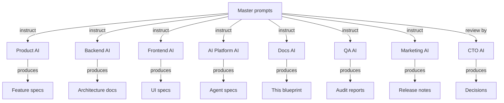

# NX-ARCH-0501 — Master Workflow Prompts

| Field | Value |
|-------|-------|
| **Document ID** | NX-ARCH-0501 |
| **Title** | Master Workflow Prompts |
| **Phase** | 10 — Future Expansion |
| **Owner** | CEO AI (NX-AGENT-7050) + Documentation AI (NX-AGENT-7061) |
| **Status** | 🟢 Complete |
| **Version** | 0.1.0 |
| **Created** | 2026-07-03 |
| **Depends on** | NX-ARCH-0003, NX-WF-9001 (Eng Org), NX-WF-9002 (Workflows), all prior phase docs |

---

## 1. Mission

Define the master workflow prompts — the templates the AI engineering org (NX-AGENT-7050..7063) uses to author, audit, update, and review the NEXUS Blueprint — so the blueprint is generated and maintained consistently, by any agent, in any session, with predictable quality.

## 2. What is a master prompt

A **master prompt** is a structured template that an AI agent composes from to do a specific class of work. It is:

- **Not** a fixed string the agent parrots.
- **A schema** of context + instructions + output format.
- **Composable** with the doc templates (NX-ARCH-0001, NX-ARCH-0002, NX-ARCH-0003) and the diagram library (NX-ARCH-0502).
- **Versioned** with the agent that uses it.

The master prompts live in `99_MASTER_PROMPTS/Workflows/` and are the single source of truth for "how an AI agent does X to the blueprint."

## 3. The workflow catalog

The NEXUS engineering org runs a finite set of workflows. Each is captured as a master prompt.

| ID | Name | Agent | Purpose |
|----|------|-------|---------|
| NX-WFP-0001 | Author New Feature Spec | Product AI (NX-EM-9609) | Write a new NX-FEAT-#### spec from a brief |
| NX-WFP-0002 | Author New Anchor Spec | Product AI + Engineering AI | Write a new anchor (A####) spec |
| NX-WFP-0003 | Author New Architecture Doc | Engineering AI (any) | Write a new NX-ARCH-#### doc |
| NX-WFP-0004 | Author New Agent Spec | AI Platform AI (NX-EM-9612) | Write a new NX-AGENT-#### spec |
| NX-WFP-0005 | Author New Role Manifest | CEO AI (NX-EM-9601) | Write a new NX-EM-#### role manifest |
| NX-WFP-0006 | Audit a Phase | QA AI (NX-EM-9604) | Audit a phase for completeness, cross-refs, style |
| NX-WFP-0007 | Update PROGRESS.md | Docs AI (NX-EM-9606) | After a deliverable, update progress + index |
| NX-WFP-0008 | Cross-Reference Repair | Docs AI | Fix broken or missing cross-refs in a doc |
| NX-WFP-0009 | Diagram Standardization | Docs AI | Convert ad-hoc diagrams to the canonical patterns |
| NX-WFP-0010 | Style Polish | Docs AI | Apply the style guide to a draft |
| NX-WFP-0011 | Code Review (Codebase) | Engineering AI (any) | Review a PR in the implementation repo |
| NX-WFP-0012 | Doc Review (Blueprint) | Docs AI + relevant Engineering AI | Review a blueprint PR |
| NX-WFP-0013 | Decision Record | CTO AI (NX-EM-9602) | Write an ADR from a decision discussion |
| NX-WFP-0014 | Roadmap Update | CPO AI (NX-EM-9609) + CEO AI | Update the roadmap doc after a planning cycle |
| NX-WFP-0015 | Postmortem | DevOps AI (NX-EM-9613) + QA AI | Write a postmortem from an incident |
| NX-WFP-0016 | Release Notes | Marketing AI (NX-EM-9607) | Generate release notes from merged PRs |
| NX-WFP-0017 | ADR Audit | CTO AI | Review all ADRs for staleness |
| NX-WFP-0018 | Phase Kickoff | CEO AI | Bootstrap a new phase: plan, IDs, TODO, first docs |

## 4. The master prompt structure

Every master prompt has the same shape:

```yaml
id: NX-WFP-NNNN
name: <human name>
owner: <agent role>
purpose: <one-line>
inputs:
  - <what the agent must have to start>
outputs:
  - <what the agent must produce>
context_to_load:
  - <doc IDs the agent must read first>
constraints:
  - <hard rules the agent must obey>
steps:
  - <ordered, machine-checkable steps>
output_format: <link to template or schema>
success_criteria:
  - <what "done" looks like>
failure_modes:
  - <what to do if X happens>
```

This is the **schema** of a master prompt. The prompts in the catalog are instances of this schema.

## 5. The five canonical master prompts

Rather than enumerate all 18, here are the five most-used in full.

### 5.1 NX-WFP-0001 — Author New Feature Spec

**Owner:** Product AI
**Purpose:** Write a new NX-FEAT-#### spec from a brief.

**Inputs:**

- A brief (1–3 paragraphs) describing the feature.
- The relevant feature area ID (e.g., `NX-FEAT-A0007`).
- The priority (P0/P1/P2).
- The horizon (H1/H2/H3).
- Adjacent docs the feature relates to (cross-refs).

**Context to load:**

- `NX-PRD-0001` (Master PRD)
- `NX-FEAT-0001` (Feature Inventory)
- The relevant anchor spec (if any).
- The relevant persona docs (from `NX-DOC-0007`).
- The relevant user journeys (from `NX-PRD-0003`).
- The doc template (`99_MASTER_PROMPTS/Diagrams/01_Templates.md`).

**Constraints:**

- Use the standard 12-section feature spec template (from `NX-PRD-0001` §5).
- All `NX-FEAT-####` IDs are assigned; do not invent.
- Every acceptance criterion is testable.
- Every FR/NFR has a measurable target.
- Cross-references use the form `(see NX-FEAT-####)`.
- Word count between 1,500 and 3,000.
- Mermaid diagrams for non-trivial flows.

**Steps:**

1. Read the brief and the cross-refs.
2. Identify the feature area; pick a candidate ID from the inventory.
3. Draft the identity table.
4. Draft the 12 sections in order.
5. Add 2–3 mermaid diagrams.
6. Run the self-review checklist (see §7).
7. Submit for review.

**Success criteria:**

- All 12 sections present.
- All acceptance criteria are testable.
- All cross-refs resolve.
- Word count in range.
- Mermaid renders.

### 5.2 NX-WFP-0003 — Author New Architecture Doc

**Owner:** Engineering AI (Backend, Frontend, Browser, AI Platform, DevOps)
**Purpose:** Write a new NX-ARCH-#### doc.

**Inputs:**

- The phase (6, 7, 10, etc.).
- The topic (e.g., "Storage", "K8s Manifests").
- The upstream context (which feature, agent, or workflow needs this).
- Adjacent architecture docs.

**Context to load:**

- The phase overview doc (e.g., `NX-ARCH-0002` for Phase 7).
- The technical principles (`NX-DOC-0011`).
- The relevant manifest (e.g., `NX-EM-9613` for infra).
- The doc template (`99_MASTER_PROMPTS/Diagrams/01_Templates.md`).

**Constraints:**

- Use the standard 10–15 section architecture doc template.
- The ID is from the registry; do not invent.
- Tech stack matches `NX-DOC-0011` §5.
- Every interface is typed.
- Performance budgets are quantified.
- Failure modes are enumerated.
- Mermaid diagrams for architecture, sequence, and state.

**Steps:** (similar to 5.1; specialized for architecture)

**Success criteria:**

- The doc references its overview at least twice.
- The doc references `NX-DOC-0011`.
- All cross-refs resolve.
- 800–1,500 words.

### 5.3 NX-WFP-0006 — Audit a Phase

**Owner:** QA AI
**Purpose:** Audit a completed phase for completeness, consistency, and quality.

**Inputs:**

- The phase number.
- The expected doc set (from the phase's TODO).
- The PROGRESS.md entry.

**Steps:**

1. List every doc in the phase.
2. For each doc, check: identity table; cross-refs resolve; word count; Mermaid renders; status is 🟢.
3. Check PROGRESS.md totals match the actual word counts.
4. Check DOCUMENT_REGISTRY.md has every doc.
5. Check MASTER_INDEX.md links to every doc.
6. Check for orphan docs (no inbound refs).
7. Check for dangling refs (outbound refs that don't exist).
8. Produce an audit report with findings (P0/P1/P2).

**Success criteria:**

- Every doc passes the per-doc checks.
- No orphan docs.
- No dangling refs.
- The audit report is filed in `_assets/AUDIT_<date>.md`.

### 5.4 NX-WFP-0007 — Update PROGRESS.md

**Owner:** Docs AI
**Purpose:** After a deliverable, keep the progress tracker honest.

**Steps:**

1. Run `wc -w` on every file in the relevant directory.
2. Update the phase's per-doc table.
3. Update the cumulative totals.
4. Add a row to the decisions log if any decision was made.
5. Update the "Last updated" timestamp.

**Constraints:**

- The numbers must be from `wc -w`, not estimated.
- The decisions log is append-only; never edit a past row.

### 5.5 NX-WFP-0018 — Phase Kickoff

**Owner:** CEO AI
**Purpose:** Bootstrap a new phase.

**Steps:**

1. Identify the phase number, title, and target directories.
2. Write `_assets/TODO_phase<N>_<name>.md` with the doc plan.
3. Reserve the ID range in `DOCUMENT_REGISTRY.md`.
4. Write the overview doc.
5. Write the first leaf doc as a template.
6. Update `PROGRESS.md`, `MASTER_INDEX.md`, `README.md`.
7. Hand off to the relevant engineering AI for the rest of the phase.

## 6. The agent-specific overlays

Each AI agent extends the base prompts with its own concerns.

| Agent | Overlay |
|-------|---------|
| **Backend AI (NX-AGENT-7055)** | Tech stack: TypeScript/Node, Fastify, Postgres, Redis. Cross-refs to `NX-ARCH-02##`. |
| **Frontend AI (NX-AGENT-7054)** | Tech stack: React, Next.js, Tailwind. Cross-refs to `NX-UI-####` and `NX-DS-####`. |
| **Browser AI (NX-AGENT-7056)** | Tech stack: Rust, Chromium, CDP. Cross-refs to `NX-ARCH-01##`. |
| **AI Platform AI (NX-AGENT-7057)** | Tech stack: Temporal, Model Gateway, LangGraph. Cross-refs to `NX-AGENT-70##`. |
| **DevOps AI (NX-AGENT-7060)** | Tech stack: K8s, Helm, GitHub Actions, OpenTelemetry. Cross-refs to `NX-ARCH-03##`. |
| **Security AI (NX-AGENT-7058)** | Threat-model overlay on every doc; cross-refs to `NX-EM-9605`. |
| **Product AI (NX-AGENT-7053)** | Persona overlay; cross-refs to `NX-DOC-0007` and `NX-FEAT-####`. |
| **QA AI (NX-AGENT-7059)** | Test coverage overlay; cross-refs to `NX-AT-####`. |
| **Docs AI (NX-AGENT-7061)** | Style and cross-ref overlay; owns the `99_MASTER_PROMPTS/` library. |
| **Marketing AI (NX-AGENT-7062)** | Voice and audience overlay; for user-facing docs. |

## 7. The self-review checklist

Before submitting a doc, the agent runs this checklist (the "rubric"):

- [ ] Identity table is complete and matches the doc registry.
- [ ] All cross-references resolve (link checker passes).
- [ ] Word count is within the doc's range.
- [ ] All Mermaid diagrams render (mmdc in CI).
- [ ] Status is set (🟡 while drafting, 🟢 when complete).
- [ ] Section structure matches the doc template.
- [ ] No PII, no secrets.
- [ ] Style matches `NX-ARCH-0401` §10 prose rules.
- [ ] All acceptance criteria are testable.
- [ ] The doc appears in the right index.

## 8. The review prompts

When an agent reviews another agent's doc or PR, the review prompt includes:

- The doc under review.
- The doc's rubric.
- The agent's overlays (security, perf, etc.).
- The instruction: "Output: approve, request changes (with specific items), or comment."

A good review:

- Cites the specific line or section.
- References a principle, doc, or rubric.
- Suggests a concrete change.
- Distinguishes blocking issues from nits.

## 9. The version of a master prompt

A master prompt has a version. The version is bumped when:

- The steps change.
- The constraints change.
- The output format changes.
- A new context doc is added.

When a master prompt is bumped, all in-flight work using the old version is allowed to complete; new work uses the new version. The version is recorded in the prompt's `id` (`NX-WFP-0001@v3`).

## 10. The library as a system

The master prompt library is itself a NEXUS system:



The library is **self-improving**: every time a workflow produces a better artifact, the prompt is updated to capture the learning. This is the "operational" form of the AI-first design philosophy (`NX-DOC-0006`).

## 11. Failure modes

| Failure | Behavior |
|---------|----------|
| Master prompt produces low-quality output | Prompt is revised; old version archived |
| Agent skips the rubric | QA AI flags; agent retries |
| Cross-ref breaks | Link checker (CI) catches; agent fixes |
| Doc template drift | Docs AI audits quarterly; the template is a doc too |
| Version skew | New work uses the latest; old in-flight uses its version |

## 12. Open questions

- Q: Should master prompts be versioned in a separate repo, or in this repo? (Decision: this repo; the prompts *are* the blueprint's operating manual.)
- Q: Should the master prompts themselves be AI-generated and reviewed, or human-authored? (Decision: human-authored initially; AI-proposed improvements; human-approved.)
- Q: How do we test a master prompt? (Decision: a "regression" set of past briefs + expected outputs; the prompt is run on the set, outputs are diffed.)

## 13. Reading list

- **Overview** — NX-ARCH-0003
- **Diagram Library** — NX-ARCH-0502
- **Engineering Org Overview** — NX-WF-9001
- **Workflow Definitions** — NX-WF-9002
- **Quality Gates** — NX-WF-9003
- **Coding Standards** — NX-ARCH-0401
- **CEO AI Manifest** — NX-EM-9601
- **Documentation AI Manifest** — NX-EM-9606
- **AI-First Design Philosophy** — NX-DOC-0006

---

*End NX-ARCH-0501.*
