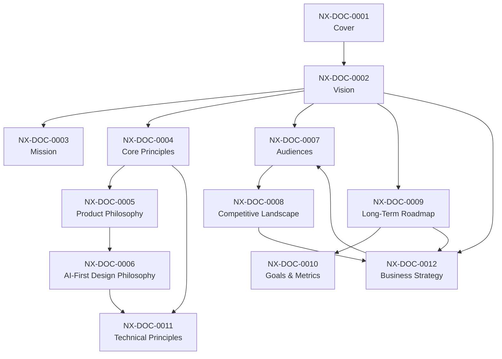

# NEXUS Blueprint — Master Index

This index defines the canonical reading order. Every document in this repository cross-references others; the IDs (NX-DOC-####, NX-FEAT-####, NX-AGENT-####, NX-API-####) make that graph navigable.

## Reading order

### Phase 1 — Master Blueprint (`00_EXECUTIVE/`)

These 12 documents establish the "why" and "what." Nothing else should be written before these are stable.

| Order | ID | Document | Purpose |
|-------|----|----------|---------|
| 1 | NX-DOC-0001 | [Cover & Document Control](00_EXECUTIVE/01_Cover_and_Document_Control.md) | Versioning, authorship, change log |
| 2 | NX-DOC-0002 | [Vision](00_EXECUTIVE/02_Vision.md) | The long-horizon picture |
| 3 | NX-DOC-0003 | [Mission](00_EXECUTIVE/03_Mission.md) | The 1-sentence and 1-paragraph mission |
| 4 | NX-DOC-0004 | [Core Principles](00_EXECUTIVE/04_Core_Principles.md) | Non-negotiable values |
| 5 | NX-DOC-0005 | [Product Philosophy](00_EXECUTIVE/05_Product_Philosophy.md) | How we build product |
| 6 | NX-DOC-0006 | [AI-First Design Philosophy](00_EXECUTIVE/06_AI_First_Design_Philosophy.md) | What "AI-first" actually means |
| 7 | NX-DOC-0007 | [Target Audiences & Personas](00_EXECUTIVE/07_Target_Audiences_and_Personas.md) | Who we serve |
| 8 | NX-DOC-0008 | [Competitive Landscape](00_EXECUTIVE/08_Competitive_Landscape.md) | The market we enter |
| 9 | NX-DOC-0009 | [Long-Term Roadmap](00_EXECUTIVE/09_Long_Term_Roadmap.md) | 10-year horizon |
| 10 | NX-DOC-0010 | [Product Goals & North Star Metrics](00_EXECUTIVE/10_Product_Goals_and_North_Star_Metrics.md) | How we measure success |
| 11 | NX-DOC-0011 | [Technical Principles](00_EXECUTIVE/11_Technical_Principles.md) | How we build software |
| 12 | NX-DOC-0012 | [Business Strategy](00_EXECUTIVE/12_Business_Strategy.md) | How we make money and survive |

### Phase 2 — Complete PRD (`01_PRODUCT/`)

Phase 2 establishes **what NEXUS must do** for users. It decomposes the vision into a feature catalog and detailed specifications.

| Order | ID | Document | Purpose |
|-------|----|----------|---------|
| 1 | NX-PRD-0001 | [Master PRD](01_PRODUCT/00_Master_PRD.md) | Methodology, taxonomy, ID ranges, change process |
| 2 | NX-FEAT-0001 | [Feature Inventory](01_PRODUCT/01_Feature_Inventory.md) | 152 features across 20 areas with NX-FEAT-#### IDs |
| 3 | NX-PRD-0002 | [Persona × Feature Matrix](01_PRODUCT/02_Persona_Feature_Matrix.md) | Every persona ↔ every feature |
| 4 | NX-PRD-0003 | [User Journeys](01_PRODUCT/03_User_Journeys.md) | 20 end-to-end journeys |
| 5 | NX-PRD-0004 | [Onboarding](01_PRODUCT/04_Onboarding.md) | First-run, activation, education |
| 6 | NX-PRD-0005 | [Subscription Model](01_PRODUCT/05_Subscription_Model.md) | Tiers, billing, overages |
| 7 | NX-PRD-0006 | [H1 Roadmap](01_PRODUCT/06_Roadmap.md) | Quarterly milestones |
| 7a | NX-PRD-0007 | [Target Audiences & Personas](01_PRODUCT/08_Target_Audiences_and_Personas.md) | Identity-mapped to `NX-DOC-0007` — see also `00_EXECUTIVE/07_Target_Audiences_and_Personas.md` |
| 7b | NX-PRD-0008 | [Requirements Traceability Matrix](01_PRODUCT/07_Requirements_Traceability_Matrix.md) | Single source of truth for requirement → design → implementation → test links |
| 8 | NX-FEAT-1100 | [Workspace Anchor](01_PRODUCT/Feature_Specifications/01_Workspace.md) | Anchor spec |
| 9 | NX-FEAT-1600 | [Cloud Browser Fleet Anchor](01_PRODUCT/Feature_Specifications/02_Cloud_Browser_Fleet.md) | Anchor spec |
| 10 | NX-FEAT-1500 | [Agent Marketplace Anchor](01_PRODUCT/Feature_Specifications/03_Agent_Marketplace.md) | Anchor spec |
| 11 | NX-FEAT-1700 | [Memory Engine Anchor](01_PRODUCT/Feature_Specifications/04_Memory_Engine.md) | Anchor spec |
| 12 | NX-FEAT-1800 | [Visual Workflow Builder Anchor](01_PRODUCT/Feature_Specifications/05_Visual_Workflow_Builder.md) | Anchor spec |

### Phase 3 — UX Bible

#### Design system (NX-DS-####)

- NX-DS-5001 [Overview](02_DESIGN_SYSTEM/01_Overview.md)
- NX-DS-5002 [Color Tokens](02_DESIGN_SYSTEM/Colors/02_Color_Tokens.md)
- NX-DS-5003 [Typography](02_DESIGN_SYSTEM/Typography/03_Typography.md)
- NX-DS-5004 [Spacing & Layout](02_DESIGN_SYSTEM/04_Spacing_and_Layout.md)
- NX-DS-5005 [Elevation & Shadow](02_DESIGN_SYSTEM/05_Elevation_and_Shadow.md)
- NX-DS-5006 [Motion & Animation](02_DESIGN_SYSTEM/Motion/06_Motion_and_Animation.md)
- NX-DS-5007 [Iconography](02_DESIGN_SYSTEM/Icons/07_Iconography.md)
- NX-DS-5008 [Component Library](02_DESIGN_SYSTEM/Components/08_Component_Library.md)
- NX-DS-5009 [Accessibility Foundations](02_DESIGN_SYSTEM/Accessibility/09_Accessibility_Foundations.md)
- NX-DS-5010 [UX Guidelines](02_DESIGN_SYSTEM/UX_Guidelines/10_UX_Guidelines.md)
- NX-DS-5011 [Responsive Strategy](02_DESIGN_SYSTEM/UX_Guidelines/11_Responsive_Strategy.md)
- NX-DS-5012 [Empty / Loading / Error States](02_DESIGN_SYSTEM/UX_Guidelines/12_Empty_Loading_Error_States.md)

#### Screen specs (NX-UI-####)

- NX-UI-6001 [Home Screen](03_UI_SCREENS/Home/01_Home_Screen.md)
- NX-UI-6002 [Workspace Switcher](03_UI_SCREENS/Workspace/02_Workspace_Switcher.md)
- NX-UI-6003 [AI Command Bar](03_UI_SCREENS/AI_Chat/03_AI_Command_Bar.md)
- NX-UI-6004 [AI Chat](03_UI_SCREENS/AI_Chat/04_AI_Chat.md)
- NX-UI-6005 [Agent Marketplace](03_UI_SCREENS/Marketplace/05_Agent_Marketplace.md)
- NX-UI-6006 [Cloud Browser Fleet](03_UI_SCREENS/Cloud_Browsers/06_Cloud_Browser_Fleet.md)
- NX-UI-6007 [Visual Workflow Builder](03_UI_SCREENS/Workspace/07_Visual_Workflow_Builder.md)
- NX-UI-6008 [Memory Inspector](03_UI_SCREENS/Workspace/08_Memory_Inspector.md)
- NX-UI-6009 [Settings](03_UI_SCREENS/Settings/09_Settings.md)
- NX-UI-6010 [Notifications & Activity](03_UI_SCREENS/Settings/10_Notifications_and_Activity.md)
- NX-UI-6011 [Onboarding](03_UI_SCREENS/Home/11_Onboarding.md)
- NX-UI-6012 [Plugin SDK / Developer](03_UI_SCREENS/Profiles/12_Plugin_SDK_Developer.md)

#### Leaf feature specs (parallel with Phase 3)

All 152 H1 leaf feature specs are in `01_PRODUCT/Feature_Specifications/Leaf_*.md`.

### Phase 4 — AI Brain (`05_AI_PLATFORM/Agent_Framework/`)

- NX-AGENT-7001 [Agent Contract Specification](05_AI_PLATFORM/Agent_Framework/01_Agent_Contract.md)
- NX-AGENT-7002 [Agent Taxonomy](05_AI_PLATFORM/Agent_Framework/02_Agent_Taxonomy.md)
- NX-AGENT-7003 [Planner Agent](05_AI_PLATFORM/Agent_Framework/03_Planner_Agent.md)
- NX-AGENT-7004 [Researcher Agent](05_AI_PLATFORM/Agent_Framework/04_Researcher_Agent.md)
- NX-AGENT-7005 [Coder Agent](05_AI_PLATFORM/Agent_Framework/05_Coder_Agent.md)
- NX-AGENT-7006 [Reviewer Agent](05_AI_PLATFORM/Agent_Framework/06_Reviewer_Agent.md)
- NX-AGENT-7007 [Tester Agent](05_AI_PLATFORM/Agent_Framework/07_Tester_Agent.md)
- NX-AGENT-7008 [Publisher Agent](05_AI_PLATFORM/Agent_Framework/08_Publisher_Agent.md)
- NX-AGENT-7009 [Communication Protocol](05_AI_PLATFORM/Agent_Framework/09_Communication_Protocol.md)
- NX-AGENT-7010 [Memory Schema](05_AI_PLATFORM/Agent_Framework/10_Memory_Schema.md)
- NX-AGENT-7011 [Tool Schema](05_AI_PLATFORM/Agent_Framework/11_Tool_Schema.md)
- NX-AGENT-7012 [Reflection & Self-Evaluation](05_AI_PLATFORM/Agent_Framework/12_Reflection_Self_Evaluation.md)
- NX-AGENT-7013 [Agent Lifecycle](05_AI_PLATFORM/Agent_Framework/13_Agent_Lifecycle.md)
- NX-AGENT-7014 [Multi-Agent Composition](05_AI_PLATFORM/Agent_Framework/14_Multi_Agent_Composition.md)
- NX-AGENT-7015 [Guardrails & Safety](05_AI_PLATFORM/Agent_Framework/15_Guardrails_Safety.md)
- NX-AGENT-7016 [Agent Fine-Tuning](05_AI_PLATFORM/Agent_Framework/16_Agent_Fine_Tuning.md)
- NX-AGENT-7017 [Agent Evaluation Harness](05_AI_PLATFORM/Agent_Framework/17_Agent_Evaluation.md)
- NX-AGENT-7018 [Model Routing Strategy](05_AI_PLATFORM/Agent_Framework/18_Model_Routing.md)

### Phase 5 — Autonomous Engineering Company (`06_ENGINEERING_TEAM/`)

#### Core (5)

- NX-WF-9001 [Engineering Org Overview](06_ENGINEERING_TEAM/01_Org_Overview.md)
- NX-WF-9002 [Workflow Definitions](06_ENGINEERING_TEAM/02_Workflow_Definitions.md)
- NX-WF-9003 [Quality Gates](06_ENGINEERING_TEAM/03_Quality_Gates.md)
- NX-WF-9004 [Escalation Paths](06_ENGINEERING_TEAM/04_Escalation_Paths.md)
- NX-AT-9501 [Acceptance Test Suite](06_ENGINEERING_TEAM/05_Acceptance_Test_Suite.md)

#### AI role manifests (14) — `NX-EM-96##` — full org-chart coverage

- NX-EM-9601 [CEO AI Manifest](06_ENGINEERING_TEAM/CEO_AI/01_CEO_AI_Manifest.md) — NX-AGENT-7050
- NX-EM-9602 [CTO AI Manifest](06_ENGINEERING_TEAM/CTO_AI/02_CTO_AI_Manifest.md) — NX-AGENT-7051
- NX-EM-9603 [Backend AI Manifest](06_ENGINEERING_TEAM/Backend_AI/03_Backend_AI_Manifest.md) — NX-AGENT-7055
- NX-EM-9604 [QA AI Manifest](06_ENGINEERING_TEAM/QA_AI/04_QA_AI_Manifest.md) — NX-AGENT-7059
- NX-EM-9605 [Security AI Manifest](06_ENGINEERING_TEAM/Security_AI/05_Security_AI_Manifest.md) — NX-AGENT-7058
- NX-EM-9606 [Documentation AI Manifest](06_ENGINEERING_TEAM/Documentation_AI/06_Documentation_AI_Manifest.md) — NX-AGENT-7061
- NX-EM-9607 [Marketing AI Manifest](06_ENGINEERING_TEAM/Marketing_AI/07_Marketing_AI_Manifest.md) — NX-AGENT-7062
- NX-EM-9608 [Frontend AI Manifest](06_ENGINEERING_TEAM/Frontend_AI/08_Frontend_AI_Manifest.md) — NX-AGENT-7054
- NX-EM-9609 [Product AI Manifest (CPO)](06_ENGINEERING_TEAM/Product_AI/09_Product_AI_Manifest.md) — NX-AGENT-7053
- NX-EM-9610 [Research AI Manifest](06_ENGINEERING_TEAM/Research_AI/10_Research_AI_Manifest.md) — NX-AGENT-7052
- NX-EM-9611 [Browser AI Manifest](06_ENGINEERING_TEAM/Browser_AI/11_Browser_AI_Manifest.md) — NX-AGENT-7056
- NX-EM-9612 [AI Platform AI Manifest](06_ENGINEERING_TEAM/AI_Platform_AI/12_AI_Platform_AI_Manifest.md) — NX-AGENT-7057
- NX-EM-9613 [DevOps AI Manifest](06_ENGINEERING_TEAM/DevOps_AI/13_DevOps_AI_Manifest.md) — NX-AGENT-7060
- NX-EM-9614 [Finance AI Manifest](06_ENGINEERING_TEAM/Finance_AI/14_Finance_AI_Manifest.md) — NX-AGENT-7063

### Phase 6 — Browser Architecture (`04_BROWSER_ENGINE/`)

#### Phase overview

- NX-ARCH-0001 [Browser Architecture Overview](04_BROWSER_ENGINE/00_Overview.md)

#### Architecture leaf docs — `NX-ARCH-01##`

- NX-ARCH-0101 [Chromium Integration](04_BROWSER_ENGINE/Chromium_Layer/01_Chromium_Integration.md)
- NX-ARCH-0102 [Rendering Pipeline](04_BROWSER_ENGINE/Rendering/02_Rendering_Pipeline.md)
- NX-ARCH-0103 [Profile System](04_BROWSER_ENGINE/Profiles/03_Profile_System.md)
- NX-ARCH-0104 [History Engine](04_BROWSER_ENGINE/History/04_History_Engine.md)
- NX-ARCH-0105 [Sync Protocol](04_BROWSER_ENGINE/Sync/05_Sync_Protocol.md)
- NX-ARCH-0106 [Download Manager](04_BROWSER_ENGINE/Downloads/06_Download_Manager.md)
- NX-ARCH-0107 [Extension Runtime](04_BROWSER_ENGINE/Extension_API/07_Extension_Runtime.md)
- NX-ARCH-0108 [Performance Architecture](04_BROWSER_ENGINE/Performance/08_Performance_Architecture.md)

### Phase 7 — AI Infrastructure (`07_BACKEND/`)

The server-side substrate that makes every user-facing feature durable, observable, and safe, and that makes AI agents a first-class workload alongside humans.

#### Phase overview

- NX-ARCH-0002 [Backend Architecture Overview](07_BACKEND/00_Overview.md)

#### Architecture leaf docs — `NX-ARCH-02##`

- NX-ARCH-0201 [API Surface](07_BACKEND/APIs/01_API_Surface.md) — REST + GraphQL + WebSocket + gRPC; OpenAPI 3.1; NX-API-#### ID allocation.
- NX-ARCH-0202 [Authentication](07_BACKEND/Authentication/02_Authentication.md) — passkeys, OAuth/OIDC, agent tokens, partner credentials.
- NX-ARCH-0203 [Database Architecture](07_BACKEND/Database/03_Database_Architecture.md) — Postgres + pgvector → Qdrant, Redis, ClickHouse (H2+).
- NX-ARCH-0204 [Event System](07_BACKEND/Event_System/04_Event_System.md) — Redis Streams + outbox; webhook delivery; live UI fanout.
- NX-ARCH-0205 [Infrastructure](07_BACKEND/Infrastructure/05_Infrastructure.md) — K8s + containers, multi-region, networking, secrets.
- NX-ARCH-0206 [Queues & Workflows](07_BACKEND/Queues/06_Queues_and_Workflows.md) — Temporal (durable) + BullMQ (jobs); schedules; idempotency.
- NX-ARCH-0207 [Storage](07_BACKEND/Storage/07_Storage.md) — S3-compatible object storage; per-user encryption for Cloud Browser state.

### Phase 8 — Marketplace (`09_MARKETPLACE/` + `08_SECURITY/`)

The two-sided marketplace and the security substrate that makes it safe — how third-party agents and plugins are discovered, installed, executed, monetized, rated, and audited, and how NEXUS itself stays safe while running untrusted code in customer environments and on customer data.

#### Phase overview

- NX-ARCH-0004 [Marketplace Architecture Overview](09_MARKETPLACE/00_Overview.md)

#### Marketplace leaf docs — `NX-ARCH-06##`

- NX-ARCH-0601 [Agent Store & Discovery](09_MARKETPLACE/Agent_Store/01_Agent_Store_and_Discovery.md) — catalog, search, install, update, uninstall.
- NX-ARCH-0602 [Plugin SDK & API Contracts](09_MARKETPLACE/Plugin_SDK/02_Plugin_SDK_and_API_Contracts.md) — `.nxpkg`, manifest, signing, runtimes, codegen.
- NX-ARCH-0603 [Billing, Metering & Subscriptions](09_MARKETPLACE/Billing/03_Billing_Metering_and_Subscriptions.md) — 5 meters, Stripe, tax, dunning, refunds.
- NX-ARCH-0604 [Ratings, Reviews & Trust](09_MARKETPLACE/Ratings/04_Ratings_Reviews_and_Trust.md) — Bayesian rating, badges, T&S, anti-abuse.
- NX-ARCH-0605 [Revenue Sharing & Payouts](09_MARKETPLACE/Revenue_Sharing/05_Revenue_Sharing_and_Payouts.md) — commission, ledger, KYC, payouts.

#### Security leaf docs — `NX-ARCH-07##`

- NX-ARCH-0701 [Threat Model & Attack Surface](08_SECURITY/Threat_Model/01_Threat_Model_and_Attack_Surface.md) — STRIDE, adversary model, asset model.
- NX-ARCH-0702 [AI Safety & Prompt-Injection Defense](08_SECURITY/AI_Safety/02_AI_Safety_and_Prompt_Injection_Defense.md) — AI attack taxonomy, layered defense.
- NX-ARCH-0703 [Permissions & Capability Model](08_SECURITY/Permissions/03_Permissions_and_Capability_Model.md) — capabilities, grants, enforcement.
- NX-ARCH-0704 [Privacy, PII & Data Residency](08_SECURITY/Privacy/04_Privacy_PII_and_Data_Residency.md) — classification, DSAR, residency, breach response.
- NX-ARCH-0705 [Encryption (at Rest & in Transit)](08_SECURITY/Encryption/05_Encryption_at_Rest_and_In_Transit.md) — algorithms, KMS/HSM, mTLS, post-quantum KEX.
- NX-ARCH-0706 [Zero-Trust Architecture](08_SECURITY/Zero_Trust/06_Zero_Trust_Architecture.md) — SPIFFE, mTLS, microsegmentation, continuous verification.

### Phase 6–10

Phase numbers are thematic. Each phase spans one or more directories.

| Phase | Title | Directories | Status |
|------:|-------|-------------|--------|
| 6 | Browser Architecture | `04_BROWSER_ENGINE/` | 🟢 Complete (2026-07-02) |
| 7 | AI Infrastructure | `07_BACKEND/`, `05_AI_PLATFORM/` (substrate) | 🟢 Complete (2026-07-03) |
| 8 | Marketplace | `09_MARKETPLACE/`, `08_SECURITY/` (security aspect) | 🟢 Complete (2026-07-03) |
| 9 | Enterprise Platform | `11_BUSINESS/` | ⚪ Not started |
| 10 | Future Expansion | `10_DEPLOYMENT/`, `12_DEVELOPER_GUIDE/`, `99_MASTER_PROMPTS/` | 🟢 Complete (2026-07-03) |

### Phase 10 — Future Expansion

The operational, developer-facing, and self-referential layers of NEXUS — the parts that aren't product features but are the machinery that ships the product, the surface third-party developers build on, and the prompts the AI engineering org uses to keep this blueprint alive.

| Order | ID | Document | Purpose |
|-------|----|----------|---------|
| 1 | NX-ARCH-0003 | [Future Expansion Overview](10_DEPLOYMENT/00_Overview.md) | Frames the three-bucket structure |
| 2 | NX-ARCH-0301 | [Docker Image Strategy](10_DEPLOYMENT/Docker/01_Docker_Image_Strategy.md) | Base images, build, signing, runtime hardening |
| 3 | NX-ARCH-0302 | [Kubernetes Manifests & Helm Charts](10_DEPLOYMENT/Kubernetes/02_Kubernetes_and_Helm.md) | K8s topology, Helm chart hierarchy, rollouts |
| 4 | NX-ARCH-0303 | [CI/CD Pipelines](10_DEPLOYMENT/CI_CD/03_CI_CD_Pipelines.md) | Commit → merge → release → production |
| 5 | NX-ARCH-0304 | [Monitoring & Observability](10_DEPLOYMENT/Monitoring/04_Monitoring_and_Observability.md) | Metrics, logs, traces, dashboards, alerts |
| 6 | NX-ARCH-0305 | [Scaling & Capacity Planning](10_DEPLOYMENT/Scaling/05_Scaling_and_Capacity.md) | HPA, cluster autoscaling, load testing |
| 7 | NX-ARCH-0306 | [Disaster Recovery](10_DEPLOYMENT/Disaster_Recovery/06_Disaster_Recovery.md) | Backup, RPO/RTO, game days, runbooks |
| 8 | NX-ARCH-0401 | [Coding Standards & Style Guide](12_DEVELOPER_GUIDE/Coding_Standards/01_Coding_Standards.md) | Languages, types, tests, review |
| 9 | NX-ARCH-0402 | [API Documentation Standards](12_DEVELOPER_GUIDE/API_Docs/02_API_Documentation.md) | OpenAPI conventions, examples, SDK sync |
| 10 | NX-ARCH-0403 | [SDK Design & Usage](12_DEVELOPER_GUIDE/SDK/03_SDK_Design.md) | The `@nexus/sdk` package: design, install, usage |
| 11 | NX-ARCH-0404 | [Plugin Development Guide](12_DEVELOPER_GUIDE/Plugin_Development/04_Plugin_Development.md) | Manifest, lifecycle, permissions, publishing |
| 12 | NX-ARCH-0405 | [Contribution Guide & Governance](12_DEVELOPER_GUIDE/Contribution_Guide/05_Contribution_Guide.md) | Submit code/docs; review process; governance |
| 13 | NX-ARCH-0501 | [Master Workflow Prompts](99_MASTER_PROMPTS/Workflows/01_Master_Workflows.md) | Standard sequences for AI-assisted blueprint authoring |
| 14 | NX-ARCH-0502 | [Diagram Library & Conventions](99_MASTER_PROMPTS/Diagrams/02_Diagram_Library.md) | Canonical Mermaid patterns for blueprint diagrams |

Subdirs and structure exist for Phase 9; content is unstarted. Full detail in `_assets/PROGRESS.md`.

## Cross-reference graph (Phase 1)

## Maintenance rules

1. **Single source of truth.** If a fact appears in two places, the more specific document wins and the other must reference it.
2. **Forward references allowed.** Later-phase documents may reference Phase 1 documents; the reverse is forbidden.
3. **Every change logged.** The change log in `00_EXECUTIVE/01_Cover_and_Document_Control.md` records all material edits.
4. **No silent rewrites.** A change that contradicts a prior document must update both the source and any documents that reference it.
5. **Diagrams must be Mermaid.** PlantUML or ASCII variants are forbidden to keep rendering consistent.

---

Last updated: 2026-07-03 (Phase 8 indexed; Phase 9 remains)